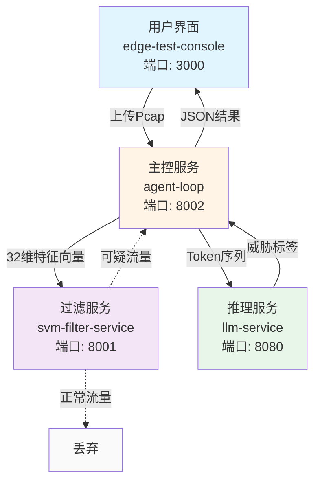

**探微** 是一个面向边缘智能终端的威胁检测与带宽优化平台，通过**四容器微服务架构**实现本地闭环验证。系统采用**四级漏斗过滤机制**——SVM微秒级初筛与LLM深度推理相结合，将原始Pcap流量转换为结构化的JSON威胁情报，实现**70%以上的带宽压降**。项目专为资源受限的边缘设备设计（内存2GB~4GB），在严格遵循物理约束红线的前提下，提供生产级的威胁检测能力与可视化控制台。

Sources: [README.md](README.md#L1-L45), [docker-compose.yml](docker-compose.yml#L1-L10)

## 核心价值主张

传统威胁检测方案依赖云端推理，面临**网络带宽瓶颈**与**隐私合规风险**两大痛点。探微通过**边缘智能**范式重构检测流程：在本地完成所有推理计算，仅输出轻量级的威胁标签与置信度，从根本上消除数据外传需求。系统采用**llama.cpp server**替代PyTorch生态，将Qwen3.5-0.8B INT4量化模型压缩至1GB内存占用，实现纯CPU环境下的百毫秒级推理延迟。**单向调用链**设计保证审计边界清晰，前端控制台仅能访问agent-loop主控服务，禁止跨级调用SVM或LLM服务，确保恶意流量无法绕过安全机制。

Sources: [docs/design-docs/core-beliefs.md](docs/design-docs/core-beliefs.md#L15-L31), [docs/design-docs/architecture.md](docs/design-docs/architecture.md#L38-L51)

## 架构概览与通信拓扑

系统采用**四容器微服务架构**，每个容器承担独立职责并通过HTTP API进行通信。下图展示了完整的拓扑结构与单向调用关系：



**通信边界约束**：edge-test-console只能调用agent-loop（唯一入口），agent-loop可调用svm-filter-service与llm-service，禁止所有反向调用或跨级调用。这种**单向调用链**设计确保每一级都有审计日志，防止恶意流量绕过主控服务直接访问推理引擎。

Sources: [docs/design-docs/architecture.md](docs/design-docs/architecture.md#L10-L36), [docker-compose.yml](docker-compose.yml#L85-L107)

## 五阶段检测工作流

探微的核心检测流程分为五个明确阶段，每个阶段都有严格的性能约束与截断保护机制：

| 阶段 | 名称 | 核心操作 | 性能目标 | 安全约束 |
|------|------|----------|----------|----------|
| 1 | 流重组 | 基于五元组重组双向会话 | - | 时间窗口≤60秒 |
| 2 | 双重截断 | 限制包数量与时间窗口 | 包数≤10个 | 防止内存溢出 |
| 3 | SVM初筛 | 32维特征向量二分类 | <1ms延迟 | 过滤99%正常流量 |
| 4 | 跨模态分词 | TrafficLLM指令格式转换 | - | Token≤690 |
| 5 | LLM推理 | Qwen3.5-0.8B威胁定性 | <100ms延迟 | 输出不含原始载荷 |

**双重截断保护**机制确保系统不会被超大流量包攻击：时间窗口限制为60秒，包数量限制为前10个包，Token序列限制为690个。这些参数通过环境变量配置，在启动时写入容器内存，运行时不可篡改。

Sources: [agent-loop/app/main.py](agent-loop/app/main.py#L54-L58), [docs/design-docs/traffic-tokenization.md](docs/design-docs/traffic-tokenization.md#L12-L18)

## 技术栈与资源规格

系统在**严格资源约束**下完成技术选型，绝对禁止引入PyTorch、TensorFlow、Pandas等重型依赖：

| 容器 | 技术栈 | 内存限制 | 内存预留 | 核心依赖 |
|------|--------|----------|----------|----------|
| llm-service | llama.cpp server | 1GB | 512MB | GGUF模型文件 |
| svm-filter-service | FastAPI + scikit-learn | 300MB | 128MB | joblib, numpy |
| agent-loop | FastAPI + scapy | 500MB | 256MB | httpx, aiofiles |
| edge-test-console | React 18 + FastAPI | 512MB | 256MB | Vite, TypeScript |

**边缘模型部署**采用INT4量化方案：Qwen3.5-0.8B原始模型约1.6GB，经GGUF Q4_K_M量化后约550MB，加载至内存后占用约1GB。模型文件以**只读方式挂载**（`volumes: ./qwen3.5-0.8b:/models:ro`），防止运行时篡改攻击。

Sources: [docker-compose.yml](docker-compose.yml#L17-L80), [docs/design-docs/core-beliefs.md](docs/design-docs/core-beliefs.md#L33-L44)

## 项目结构可视化

项目采用**模块化分层设计**，每个服务拥有独立目录与Dockerfile，通过docker-compose.yml统一编排：

```
/root/anxun/
├── docker-compose.yml          # 四容器编排配置
├── CLAUDE.md                   # AI Agent协作指引
├── README.md                   # 项目主文档
│
├── docs/                       # 文档系统
│   ├── design-docs/            # 架构设计与核心理念
│   ├── exec-plans/             # 执行计划与技术债
│   └── references/             # API规范与部署指南
│
├── llm-service/                # 容器1: LLM推理引擎
│   ├── Dockerfile
│   ├── test_llm.py            # 服务测试脚本
│   └── healthcheck.sh         # 健康检查脚本
│
├── svm-filter-service/         # 容器2: SVM过滤服务
│   ├── app/main.py            # FastAPI应用主体
│   └── models/saved/          # 预训练模型存储
│
├── agent-loop/                 # 容器3: 智能体主控
│   ├── app/main.py            # 五阶段工作流入口
│   ├── app/flow_processor.py  # 流重组逻辑
│   └── app/traffic_tokenizer.py # 分词模块
│
├── edge-test-console/          # 容器4: 测试控制台
│   ├── backend/               # FastAPI后端代理
│   └── frontend/              # React前端界面
│
├── TrafficLLM-master/          # TrafficLLM依赖（外部）
├── qwen3.5-0.8b/               # 边缘基座模型（外部）
└── data/                       # 数据与训练集
```

**外部依赖隔离**：TrafficLLM-master与qwen3.5-0.8b目录需手动下载，通过只读卷挂载方式集成，避免版本冲突与许可证问题。

Sources: [README.md](README.md#L185-L229), [get_dir_structure output](. )

## 关键性能指标与约束红线

系统定义了严格的**性能目标与告警阈值**，任何偏离红线的表现都将触发运维告警：

| 指标类别 | 性能目标 | 告警红线 | 监控方式 |
|----------|----------|----------|----------|
| SVM推理延迟 | <1ms | >10ms | FastAPI中间件计时 |
| LLM推理延迟 | <100ms | >500ms | httpx客户端计时 |
| 端到端检测延迟 | <5s | >30s | 任务生命周期追踪 |
| 带宽压降率 | >70% | <50% | 输入/输出字节数比 |
| 内存占用峰值 | <2.3GB | >2.5GB | Docker stats监控 |

**安全输出约束**：检测结果仅包含五元组、威胁标签、置信度、流元信息，**绝对禁止输出原始Pcap载荷、应用层内容或完整数据包十六进制**。这种设计确保即使检测结果被窃取，也无法还原用户隐私数据。

Sources: [docs/design-docs/core-beliefs.md](docs/design-docs/core-beliefs.md#L46-L55), [docs/design-docs/architecture.md](docs/design-docs/architecture.md#L71-L73)

## 后续阅读路径

作为入门指南，本文档建立了探微系统的整体认知框架。建议按以下顺序深入探索：

1. **实践导向路径**：[快速启动与三步部署](2-kuai-su-qi-dong-yu-san-bu-bu-shu) → [演示样本库使用](3-yan-shi-yang-ben-ku-shi-yong) → 掌握基本操作流程
2. **架构理解路径**：[四容器拓扑与微服务架构](4-si-rong-qi-tuo-bu-yu-wei-fu-wu-jia-gou) → [五阶段检测工作流](5-wu-jie-duan-jian-ce-gong-zuo-liu) → 理解系统设计哲学
3. **服务深入路径**：[Agent-Loop主控服务](7-agent-loop-zhu-kong-fu-wu-yu-gong-zuo-liu-bian-pai) → [SVM过滤服务](8-svm-guo-lu-fu-wu-yu-wei-miao-ji-tui-li) → [LLM推理服务](9-llm-tui-li-fu-wu-yu-bian-yuan-mo-xing-bu-shu) → 掌握核心模块实现

建议初学者优先完成**实践导向路径**，在成功部署并运行演示样本后，再深入理解架构设计与服务细节。所有文档均包含精确的本地文件引用，便于代码溯源与二次开发。