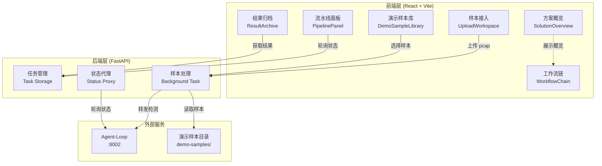
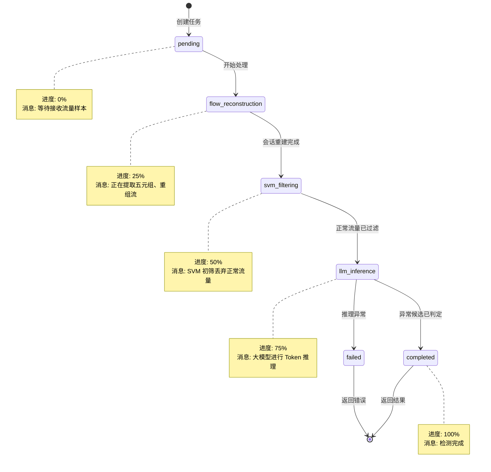

测试控制台是边缘检测系统的交互入口与可视化层，采用前后端分离架构提供流量样本接入、实时流水线监控、检测结果归档等核心能力。前端基于 React + TypeScript + Vite 构建单页应用，后端使用 FastAPI 提供任务管理与状态代理，两者协同形成完整的边缘检测工作台。

## 架构设计与技术栈

系统采用标准的前后端分离架构，前端编译后的静态资源由后端统一托管，实现单容器部署模式。前端技术栈以 React 18 为核心，配合 TypeScript 提供类型安全，使用 Vite 构建工具实现快速热更新与优化的生产构建。后端基于 FastAPI 框架实现异步任务处理，通过内存存储维护任务状态（生产环境建议替换为 Redis 或数据库），并作为代理层转发检测请求到 Agent-Loop 服务。API 设计遵循 RESTful 规范，所有接口返回 JSON 格式数据，前后端通过轮询机制实现任务状态同步。



Sources: [package.json](edge-test-console/frontend/package.json#L1-L28), [main.py](edge-test-console/backend/app/main.py#L1-L50), [App.tsx](edge-test-console/frontend/src/App.tsx#L1-L50)

## 核心组件与职责划分

前端组件按功能域划分为六个核心模块，每个模块独立封装状态逻辑与视图渲染。**样本接入组件**（UploadWorkspace）负责 pcap 文件上传交互，提供客户端文件格式校验（仅接受 .pcap 和 .pcapng 扩展名）和上传状态反馈。**演示样本库**（DemoSampleLibrary）展示平台预置流量样本，通过 `GET /api/demo-samples` 接口获取样本列表，允许用户快速验证检测链路而无需自行准备数据。**流水线面板**（PipelinePanel）可视化五阶段检测流程，实时显示当前阶段、进度百分比和状态消息，通过颜色高亮区分活动阶段与待执行阶段。**结果归档**（ResultArchive）展示检测完成后的威胁档案，包含五元组信息、分类标签、置信度分数、流量元数据和 token 统计，同时展示带宽压降、异常检出率等关键指标。**方案概览**（SolutionOverview）提供系统介绍性内容，展示检测链路流程和架构关键证据。**工作流链**（WorkflowChain）以紧凑形式展示阶段过滤路径，辅助用户理解当前处理位置。

| 组件名称 | 核心职责 | 数据流向 | 状态依赖 |
|---------|---------|---------|---------|
| UploadWorkspace | pcap 文件上传与校验 | 用户 → 后端 → Agent-Loop | `disabled`, `isBusy` |
| DemoSampleLibrary | 演示样本选择与启动 | 样本库 → 后端 → Agent-Loop | `samples[]`, `selectedSampleId` |
| PipelinePanel | 实时流水线状态可视化 | 后端 ← 轮询 → 前端 | `stage`, `progress`, `message` |
| ResultArchive | 检测结果与威胁档案展示 | 后端 → 前端渲染 | `result` |
| SolutionOverview | 系统介绍与架构概览 | 静态配置 | `viewModel` |
| WorkflowChain | 阶段过滤路径展示 | 派生自 `stage` | `activeStage` |

Sources: [UploadWorkspace.tsx](edge-test-console/frontend/src/components/UploadWorkspace.tsx#L1-L80), [DemoSampleLibrary.tsx](edge-test-console/frontend/src/components/DemoSampleLibrary.tsx#L1-L85), [PipelinePanel.tsx](edge-test-console/frontend/src/components/PipelinePanel.tsx#L1-L56), [ResultArchive.tsx](edge-test-console/frontend/src/components/ResultArchive.tsx#L1-L167)

## 五阶段流水线与状态同步机制

检测流程划分为五个明确阶段，每个阶段对应特定的处理逻辑和进度阈值。**待命队列**（pending）阶段标记任务已创建但尚未进入处理链路，对应 0% 进度。**流重组**（flow_reconstruction）阶段对原始包进行会话重建，提取五元组信息，对应 25% 进度。**SVM 初筛**（svm_filtering）阶段快速过滤正常流量，压低后续推理成本，对应 50% 进度。**LLM 推理**（llm_inference）阶段对异常候选进行语义分析与标签判定，对应 75% 进度。**结果归档**（completed）阶段输出威胁档案和压降摘要，对应 100% 进度；若检测失败则进入 **流程中断**（failed）状态。后端通过轮询 Agent-Loop 的 `/api/status/{task_id}` 接口获取实时状态，使用阶段映射表将 Agent-Loop 返回的状态转换为前端显示的阶段名称、进度值和消息文本。前端通过 `window.setTimeout` 实现每秒一次的轮询，在任务完成或失败时停止轮询，最多尝试 120 次（2 分钟超时）。



Sources: [main.py](edge-test-console/backend/app/main.py#L209-L241), [PipelinePanel.tsx](edge-test-console/frontend/src/components/PipelinePanel.tsx#L11-L18), [App.tsx](edge-test-console/frontend/src/App.tsx#L22-L42), [api.ts](edge-test-console/frontend/src/types/api.ts#L10-L14)

## API 接口设计与请求流程

后端提供六个核心 API 端点，覆盖样本上传、状态查询、结果获取等完整生命周期。`POST /api/detect` 接收 multipart/form-data 格式的 pcap 文件上传请求，生成 UUID 作为任务标识符，将文件暂存至 `/app/uploads` 目录，并启动后台任务将文件转发至 Agent-Loop 服务。`GET /api/demo-samples` 扫描演示样本目录（环境变量 `DEMO_SAMPLES_DIR` 指定，默认 `/app/demo-samples`），返回所有 pcap/pcapng 文件的元数据列表（包括文件名、显示名称、文件大小）。`POST /api/detect-demo` 接收 JSON 格式的 `{sample_id: string}` 请求体，从演示样本目录复制指定文件到上传工作区，触发与普通上传相同的后台检测流程。`GET /api/status/{task_id}` 返回任务的实时状态对象，包含 `status`、`stage`、`progress`、`message` 字段。`GET /api/result/{task_id}` 仅在任务状态为 `completed` 时返回完整检测结果，包含威胁档案、统计指标、性能度量等结构化数据。所有未匹配路径返回前端 `index.html`，支持 React Router 的客户端路由模式。

```typescript
// 核心类型定义
interface TaskStatus {
  task_id: string
  stage: PipelineStage  // pending | flow_reconstruction | svm_filtering | llm_inference | completed | failed
  progress: number      // 0-100
  message: string
}

interface DetectionResult {
  meta: {
    task_id: string
    timestamp: string
    agent_version: string
    processing_time_ms: number
  }
  statistics: {
    total_packets: number
    total_flows: number
    normal_flows_dropped: number
    anomaly_flows_detected: number
    svm_filter_rate: string
    bandwidth_reduction: string
  }
  threats: Threat[]
  metrics: {
    original_pcap_size_bytes: number
    json_output_size_bytes: number
    bandwidth_saved_percent: number
  }
}
```

Sources: [client.ts](edge-test-console/frontend/src/api/client.ts#L1-L67), [main.py](edge-test-console/backend/app/main.py#L392-L456), [api.ts](edge-test-console/frontend/src/types/api.ts#L1-L82)

## Mock 降级与演示模式

系统内置完整的 Mock 降级机制，当 Agent-Loop 服务不可用时自动生成模拟检测结果，确保演示环境始终可用。后端在 `process_detection` 函数中捕获 `requests.exceptions.RequestException` 异常，记录警告日志后调用 `generate_mock_result` 函数构造符合接口规范的虚拟数据。Mock 结果模拟 78.5% 的带宽压降比例（通过 `json_size = int(original_size * 0.215)` 计算），生成两个虚拟威胁记录，包含完整的五元组、分类标签、流量元数据和 token 信息。这种设计允许在没有完整微服务集群的情况下独立运行控制台，便于前端开发调试和用户演示。演示样本库通过文件系统扫描实现，支持热加载样本文件而无需重启服务，样本文件的显示名称通过文件名转换生成（替换下划线和连字符为空格，转换为首字母大写格式）。

Sources: [main.py](edge-test-console/backend/app/main.py#L265-L300), [main.py](edge-test-console/backend/app/main.py#L302-L350)

## 视图模型与状态管理

前端采用自顶向下的状态管理模式，根组件（App.tsx）维护全局状态并通过 props 向下传递。`AppState` 类型定义五种应用状态：`idle`（待命）、`uploading`（上传中）、`processing`（分析中）、`completed`（已完成）、`failed`（异常终止），状态转换严格遵循单向数据流。`buildConsoleViewModel` 和 `buildOverviewViewModel` 函数负责将原始状态数据转换为视图友好的格式，例如将字节数转换为可读的单位表示（B/KB/MB），将时间戳转换为本地化字符串格式。进度条、威胁卡片、度量指标等 UI 元素通过派生状态计算，避免冗余状态声明。`requestVersionRef` 引用机制确保异步请求的版本一致性，当用户发起新任务时自增版本号，旧请求的响应会被丢弃，防止状态错乱。任务轮询通过 `activeTaskRef` 引用跟踪当前活动任务，支持用户在轮询过程中取消或重新提交样本。

Sources: [view-models.ts](edge-test-console/frontend/src/lib/view-models.ts#L1-L162), [App.tsx](edge-test-console/frontend/src/App.tsx#L51-L120), [App.tsx](edge-test-console/frontend/src/App.tsx#L122-L200)

## 测试策略与质量保障

系统采用分层测试策略，前端使用 Vitest + React Testing Library 实现组件级单元测试，后端使用 unittest 实现模块导入和配置解析测试。前端测试覆盖关键组件的渲染逻辑、交互行为和边界条件，例如 `DemoSampleLibrary.test.tsx` 验证样本选择、加载状态、错误处理等场景。后端测试重点关注启动引导阶段的依赖隔离，`test_backend_bootstrap.py` 验证模块在无共享包环境下的独立导入能力，以及演示样本目录的回退解析逻辑（当环境变量未设置时正确回退到容器默认路径 `/app/demo-samples`）。测试配置文件 `vite.config.ts` 和 `tsconfig.json` 确保类型检查和构建产物的正确性，测试命令通过 `npm run test` 或 `vitest run` 执行。

Sources: [test_backend_bootstrap.py](edge-test-console/backend/tests/test_backend_bootstrap.py#L1-L32), [package.json](edge-test-console/frontend/package.json#L9-L12)

## 容器化部署与静态资源托管

系统采用单容器部署模式，前端构建产物（HTML、JS、CSS）在构建阶段生成至 `/app/static` 目录，后端启动时检测该目录是否存在并挂载静态文件服务。`GET /` 端点返回 `index.html` 作为应用入口，`GET /{path:path}` 端点充当 SPA 路由的兜底处理器，对于未匹配的路径返回 `index.html` 以支持 React Router 的客户端路由。生产环境通过 `npm run build` 执行 TypeScript 类型检查和 Vite 构建，生成的优化资源文件（包含哈希命名的 JS/CSS bundle）复制到容器静态目录。后端通过 CORS 中间件允许跨域请求（开发环境允许所有源，生产环境应配置具体域名白名单），日志级别通过 `LOG_LEVEL` 环境变量控制（默认 INFO）。演示样本目录通过 `DEMO_SAMPLES_DIR` 环境变量配置，支持灵活的样本库挂载路径。

Sources: [main.py](edge-test-console/backend/app/main.py#L500-L551), [Dockerfile](edge-test-console/Dockerfile#L1-L50), [vite.config.ts](edge-test-console/frontend/vite.config.ts#L1-L10)

## 开发指南与调试建议

本地开发环境启动需要先启动前端开发服务器（`npm run dev`，默认端口 5173），再启动后端服务（`uvicorn app.main:app --reload --port 8000`）。前端通过 Vite 的代理配置将 `/api` 请求转发到后端地址，实现开发环境的前后端独立运行。调试时可利用浏览器开发者工具的 Network 面板观察轮询请求的时序和响应数据，使用 React DevTools 检查组件状态树。当检测到 Agent-Loop 服务异常时，后端日志会记录警告信息并切换到 Mock 模式，可通过设置 `LOG_LEVEL=DEBUG` 查看详细的请求转发和状态轮询日志。演示样本库为空时前端会显示空状态提示，建议在 `data/test_traffic/demo_show/` 目录下放置 pcap 样本文件（命名规范建议使用下划线分隔描述性文本，如 `ssh_brute_force.pcap`）。生产部署前需验证静态资源路径正确挂载，确保 `/app/static` 目录包含构建产物且 `index.html` 存在。