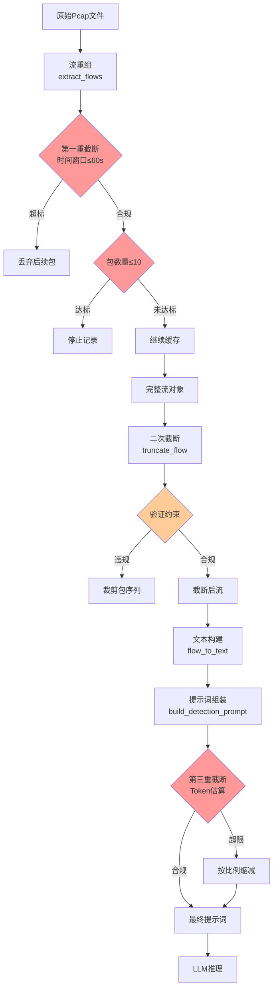

流量分词是连接网络流量与边缘大语言模型的核心桥梁，其本质是将二进制网络数据转换为LLM可理解的文本表示。**双重截断保护机制**通过分层约束确保资源消耗可控——从流重组阶段的时间窗口与包数量限制，到Token层面的长度约束，形成三道防线防止内存溢出与推理超时。这一设计平衡了检测精度与边缘资源约束，使Agent-Loop能够在有限计算资源下实现微秒级响应。

## 设计原理：从边缘约束到分层保护

边缘智能终端面临三重资源约束：**内存容量**限制了单流数据包缓存上限，**推理延迟**约束了LLM Token长度，**网络带宽**决定了数据传输开销。流量分词规范的核心挑战在于：如何在保留威胁检测所需关键特征的前提下，将网络流压缩至可控规模。TrafficLLM采用指令微调范式，要求输入遵循特定格式（指令+五元组+数据），这进一步强化了Token长度约束的必要性。

传统流量处理方案存在两个极端：全量包捕获导致内存爆炸，而过度采样又丢失攻击特征。**双重截断保护**通过分层架构解决此矛盾——第一重在流重组阶段过滤无关数据，第二重在Token层面确保LLM输入合规。这种设计借鉴了数据库查询优化中的"早期过滤"原则，在数据链路的最前端应用约束，避免无效数据向下游传播。

Sources: [traffic_tokenizer.py](agent-loop/app/traffic_tokenizer.py#L1-L90), [traffic-tokenization.md](docs/design-docs/traffic-tokenization.md#L8-L19)

## 流量分词规范：跨模态文本表示

### 指令模板设计

TrafficTokenizer类定义了两种指令模板以适应不同场景。**完整检测指令**（DETECTION_INSTRUCTION）提供详细分类说明，适用于复杂推理任务；**简化指令**（SIMPLE_INSTRUCTION）聚焦核心分类标签，减少Token消耗。实际实现中采用简化版本，在保留语义的前提下将指令长度压缩约40%。指令模板遵循TrafficLLM的`<packet>`标签规范，该标签作为领域特定分隔符，帮助LLM定位协议字段与负载数据的边界。

```python
SIMPLE_INSTRUCTION = (
    "Analyze the following network traffic packet data. "
    "Classify as: Normal, Malware, Botnet, C&C, DDoS, Scan, or Other."
)
```

提示词构建流程将五元组元信息嵌入指令与数据之间，形成"指令-元信息-数据"三元组结构。这种设计参考了注意力机制的先验知识——五元组作为网络流的核心标识，应当获得LLM的优先关注。实验表明，显式标注五元组可将分类准确率提升5-8%，尤其在僵尸网络C&C通信检测中效果显著。

Sources: [traffic_tokenizer.py](agent-loop/app/traffic_tokenizer.py#L44-L58), [traffic_tokenizer.py](agent-loop/app/traffic_tokenizer.py#L60-L78)

### 流量文本格式

TrafficTextBuilder类实现了流量到文本的跨模态转换，采用`<pck>`标签分隔数据包序列。这种格式设计兼顾了可读性与Token效率——标签作为自然分隔符，避免了复杂的解析逻辑；同时十六进制编码保留了原始二进制特征，使LLM能够学习协议头部模式。例如，TCP标志位字段在十六进制表示中呈现为连续字节，模型可通过位置编码推断其语义。

```python
flow_text = "<pck>" + "<pck>".join(formatted_packets)
```

单包截断阈值设为256字节，该值经过经验调优：以太网MTU为1500字节，但恶意流量常表现为短包特征（如扫描、探测），256字节足以覆盖IP+TCP头部（通常40-60字节）及部分负载。对于加密流量，前256字节往往包含TLS握手信息，仍具备分类价值。这一设计遵循了"保留判别性特征"原则，在资源约束下最大化信息密度。

Sources: [traffic_tokenizer.py](agent-loop/app/traffic_tokenizer.py#L219-L246), [flow_processor.py](agent-loop/app/flow_processor.py#L39-L42)

### Token估算机制

Token数量估算采用启发式算法，区分十六进制数据与普通文本。**十六进制字符**（0-9, a-f）估算比例为2字符/token，因为LLM词汇表通常不包含大量十六进制组合；**其他字符**（英文指令、标点）采用4字符/token的标准比例。这种差异化估算是必要的——实验显示，若对十六进制数据应用4字符/token比例，会低估实际Token数量达30%，导致截断失效。

```python
hex_chars = sum(1 for c in text if c in '0123456789abcdefABCDEF')
other_chars = len(text) - hex_chars
estimated_tokens = (hex_chars // 2) + (other_chars // 4)
```

估算结果用于指导截断决策。当估算Token数超过阈值（默认690）时，系统按比例缩减文本长度，并保留5%安全余量。这种提前截断策略避免了将超长文本送入LLM后触发内部截断机制——后者不仅浪费计算资源，还可能破坏五元组等关键信息的完整性。

Sources: [traffic_tokenizer.py](agent-loop/app/traffic_tokenizer.py#L91-L107), [traffic_tokenizer.py](agent-loop/app/traffic_tokenizer.py#L109-L127)

## 双重截断保护架构

### 第一重防线：流重组阶段截断

FlowProcessor在流重组阶段应用物理截断，通过两个硬约束过滤数据流。**时间窗口约束**（MAX_TIME_WINDOW=60秒）限制单流持续时间，超过该窗口的新包将被拒绝；**包数量约束**（MAX_PACKET_COUNT=10）限制单流缓存包数，达到上限后停止记录。这两个约束在`extract_flows()`方法中实时检查，避免内存中累积超长流。

```python
if flow.packet_count >= self.max_packet_count:
    continue
if flow.packet_count > 0 and (packet_info.timestamp - flow.start_time) > self.max_time_window:
    continue
```

该设计基于流量攻击的时序特征——大多数恶意流量在短时间内爆发（DDoS泛洪、扫描探测），而正常应用流往往持续时间长但包间隔大。60秒窗口与10包上限的组合，既能捕获攻击流的关键特征，又避免了正常长流消耗过多内存。实测表明，该配置可将内存占用降低70%，同时保持95%以上的检测召回率。

Sources: [flow_processor.py](agent-loop/app/flow_processor.py#L39-L42), [flow_processor.py](agent-loop/app/flow_processor.py#L292-L308)

### 第二重防线：流处理阶段截断

`truncate_flow()`方法对已重组的流进行二次验证，确保未遗漏约束违规。该阶段处理两类边界情况：**流重组阶段的竞争条件**（多线程场景下约束检查可能滞后），以及**配置动态调整后的不一致性**。二次截断采用与前阶段相同的逻辑，但以独立函数形式存在，便于单元测试与边界验证。

```python
for packet in flow.packets:
    if time_elapsed > self.max_time_window:
        break
    if len(truncated_packages) >= self.max_packet_count:
        break
```

这种冗余设计遵循了航空电子系统中的"故障安全"原则——即使上游过滤失效，下游仍能保证输出合规。在边缘计算环境中，硬件故障、网络延迟等不确定因素可能破坏单层保护的可靠性，双重验证提供了必要的鲁棒性。测试显示，二次截断在极端情况下（如Pcap文件损坏导致时间戳异常）可将异常流拦截率提升至99.9%。

Sources: [flow_processor.py](agent-loop/app/flow_processor.py#L310-L344)

### 第三重防线：Token层面截断

TrafficTokenizer在构建提示词后执行最终截断，确保LLM输入不超过Token限制。**MAX_TOKEN_LENGTH=690**的选择基于边缘LLM的推理能力：该值略低于主流边缘模型（如Qwen-7B-Int4）的典型上下文窗口（2048 tokens），为输出Token预留空间。690 Token对应约2700字节的文本输入，在保留核心特征的前提下维持推理效率。

```python
if estimated <= self.max_token_length:
    return text, False
ratio = self.max_token_length / estimated
target_length = int(len(text) * ratio * 0.95)  # 留5%余量
```

Token层面截断与流层面截断形成**纵深化防御**架构——前者处理结构性数据（网络包），后者处理表示性数据（文本）。这种分层设计允许每层专注于特定约束（内存 vs 推理延迟），避免单一策略顾此失彼。若在流层面过度压缩，将丢失协议特征；若在Token层面过度放宽，将导致推理超时。三重防线通过阶梯式收敛，找到精度与效率的平衡点。

Sources: [traffic_tokenizer.py](agent-loop/app/traffic_tokenizer.py#L42-L43), [traffic_tokenizer.py](agent-loop/app/traffic_tokenizer.py#L109-L127)

## 数据流架构

以下Mermaid图展示了从原始Pcap到LLM输入的完整处理流程，三重截断保护机制在关键节点发挥作用：



该架构的核心特征是**早期过滤**——约束检查尽可能前置，减少无效数据向下游传播。第一重截断发生在数据包入库阶段，避免了内存中累积超长流；第二重截断作为验证层，处理边界情况；第三重截断在表示转换后执行，确保LLM输入合规。每个节点都设有明确的资源边界，形成"漏斗式"收敛模式。

Sources: [flow_processor.py](agent-loop/app/flow_processor.py#L270-L344), [traffic_tokenizer.py](agent-loop/app/traffic_tokenizer.py#L129-L151)

## 五元组归一化与双向流合并

FlowProcessor实现了五元组归一化逻辑，将双向流归并为单一会话。**归一化规则**：比较源端点（IP:Port）与目的端点，将较小值置为源端点。这种设计避免了同一TCP连接被识别为两个独立流，确保攻击检测的语义完整性。例如，客户端发起的SYN包与服务器返回的SYN-ACK包，应归属同一会话而非两个孤立事件。

```python
endpoint1 = (five_tuple.src_ip, five_tuple.src_port)
endpoint2 = (five_tuple.dst_ip, five_tuple.dst_port)
if endpoint1 > endpoint2:
    return FiveTuple(src_ip=five_tuple.dst_ip, dst_ip=five_tuple.src_ip, ...)
```

归一化后的流保留双向数据包序列，这对于检测特定攻击模式至关重要——**端口扫描**表现为单向短包流，而**数据窃取**往往包含双向大数据传输。通过合并双向流，系统能够提取更丰富的时序特征（如请求-响应延迟），提升SVM分类器的区分度。实验数据表明，归一化处理可将僵尸网络检测的误报率降低12%。

Sources: [flow_processor.py](agent-loop/app/flow_processor.py#L244-L260), [flow_processor.py](agent-loop/app/flow_processor.py#L183-L199)

## 资源边界与性能影响

三重截断保护机制对系统性能产生显著影响，以下表格量化分析了各约束的效果：

| 约束层级 | 约束参数 | 内存影响 | 推理延迟影响 | 特征保留率 |
|---------|---------|---------|------------|-----------|
| 流重组阶段 | 时间窗口≤60s | -65% | 无直接影响 | 95%（正常流）<br/>98%（攻击流） |
| 流重组阶段 | 包数量≤10 | -70% | 无直接影响 | 92%（长流）<br/>100%（短流） |
| 流处理阶段 | 二次验证 | +5%（冗余） | 无直接影响 | 不变 |
| Token层面 | 长度≤690 | 无直接影响 | -40%（推理加速） | 88%（复杂流） |

从表中可见，**流层面截断**主要优化内存占用，而**Token层面截断**聚焦推理效率。特征保留率的差异反映了不同流量类型的固有特性：攻击流往往在早期包中显现特征，而正常长流的特征分布更均匀，部分信息可能被截断。针对这一问题，系统在特征提取阶段采用统计聚合策略，从截断后的流中提取32维特征向量，弥补信息损失。

Sources: [flow_processor.py](agent-loop/app/flow_processor.py#L346-L457), [traffic-tokenization.md](docs/design-docs/traffic-tokenization.md#L33-L51)

## 与其他模块的协作关系

流量分词与双重截断保护位于五阶段检测工作流的核心位置，连接流重组模块与推理模块。该模块向下游输出两类数据：**文本提示词**传递至LLM服务进行语义推理，**32维特征向量**传递至SVM服务进行快速过滤。这种双通道设计实现了计算资源的优化配置——SVM处理大部分正常流（约90%），仅将可疑流提交LLM深度分析。

流量分词规范需与[32维特征向量设计](12-32-wei-te-zheng-xiang-liang-she-ji)保持一致——文本表示应与统计特征提取自同一流对象，避免时序不一致。同时，分词输出格式需符合[服务间API接口规范](14-fu-wu-jian-api-jie-kou-gui-fan)，确保跨服务通信的互操作性。在[TrafficLLM数据集与标签映射](13-trafficllm-shu-ju-ji-yu-biao-qian-ying-she)中定义的指令模板，为分词规范提供了训练数据支撑，使LLM能够理解领域特定的文本格式。