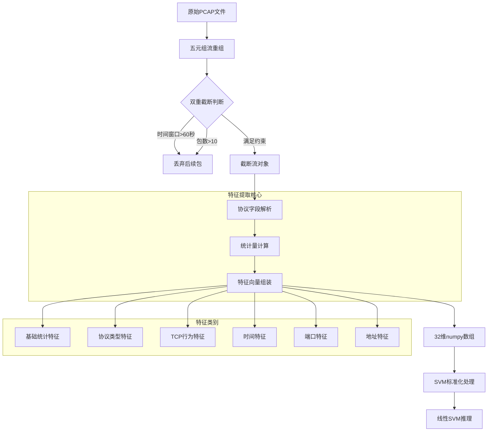
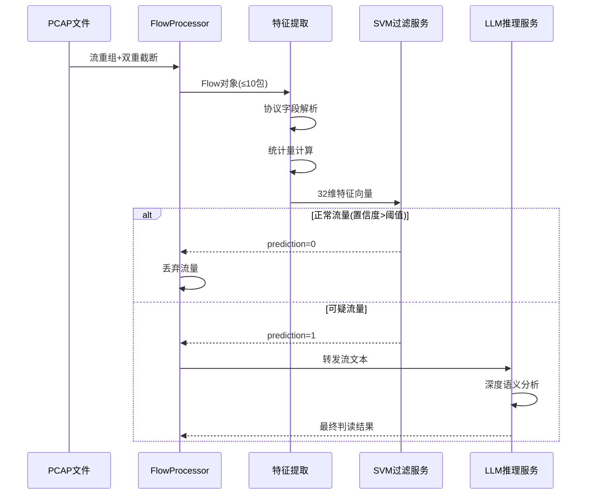

在边缘智能终端的资源约束下，32维特征向量充当流量分析的核心数据结构，将复杂的网络协议栈信息压缩为SVM可快速推理的数值表示。该特征体系遵循双重截断保护原则，从链路层到传输层提取统计特征、协议特征、行为特征、时序特征、端口特征和地址特征，构建轻量级但具备高判别力的特征空间，支撑微秒级延迟的实时异常检测。

## 设计理念与约束框架

特征向量的设计根植于边缘设备的物理边界约束。在时间维度上，**双重截断保护**将分析窗口限定在60秒内，并只提取前10个数据包，这种激进的截断策略有效防止内存溢出并确保处理时延可控。在依赖维度上，系统禁止引入pandas、torch、tensorflow等重型框架，仅依赖numpy、scipy等轻量级数值计算库，这要求特征提取逻辑必须基于原始协议字段进行高效计算。

从协议栈视角看，特征提取覆盖了四层协议模型的关键元信息。Frame层提供数据帧的长度和时间戳信息，Ethernet层虽然存在但未直接纳入特征，IP层贡献了网络层的关键指标如TTL、协议类型、DF标志等，TCP/UDP层则提供了传输层的行为特征如窗口大小、标志位统计等。这种分层设计确保了特征的完整性，同时避免了深度的负载解析带来的计算开销。

Sources: [dataset-feature-engineering.md](docs/references/dataset-feature-engineering.md#L200-L232), [train_svm.py](svm-filter-service/models/train_svm.py#L16-L26)

## 六大特征类别详解

32维特征向量按照语义相关性组织为六大类别，每一类别捕获特定维度的流量行为模式。

### 基础统计特征（维度 0-7）

基础统计特征从数据包长度、IP包长度、TCP负载长度等物理属性中提取统计量，构建流量规模的基本画像。**平均包长**（avg_packet_len）和**包长标准差**（std_packet_len）反映流量的载荷分布特征，正常Web浏览流量通常呈现中等包长和较低方差，而恶意扫描流量往往表现为极端包长或高方差。**平均IP长度**（avg_ip_len）和**IP长度标准差**（std_ip_len）从网络层视角刻画分组大小分布。**平均TCP长度**（avg_tcp_len）和**TCP长度标准差**（std_tcp_len）聚焦传输层负载。**总字节数**（total_bytes）度量流的总流量规模。**平均TTL值**（avg_ttl）反映IP包的跳数特征，不同操作系统和网络路径会导致TTL分布差异。

### 协议类型特征（维度 8-11）

协议类型特征捕获流量的协议组成结构。**IP协议号**（ip_proto）直接记录IP头部的协议字段值，TCP为6、UDP为17。**TCP比例**（tcp_ratio）、**UDP比例**（udp_ratio）、**其他协议比例**（other_proto_ratio）三个维度通过独热编码方式表示协议类型，支持SVM在高维空间中区分不同协议族的流量模式。Web服务流量以TCP为主，DNS查询以UDP为主，ICMP等控制协议则归入其他类别。

### TCP行为特征（维度 12-19）

TCP行为特征聚焦TCP连接的生命周期状态标志。**平均窗口大小**（avg_window_size）和**窗口大小标准差**（std_window_size）反映流量控制行为，正常连接的窗口大小相对稳定，而异常连接可能出现极端窗口值。**SYN计数**（syn_count）、**ACK计数**（ack_count）、**PSH计数**（push_count）、**FIN计数**（fin_count）、**RST计数**（rst_count）统计TCP标志位的出现频次。扫描攻击往往表现为高SYN计数，正常数据传输伴随高ACK和PSH计数，异常中断则导致RST计数上升。**平均TCP头长度**（avg_hdr_len）记录TCP选项的使用情况。

### 时间特征（维度 20-23）

时间特征量化流量的时序节奏。**总持续时间**（total_duration）度量流的活跃时间跨度。**平均包间到达时间**（avg_inter_arrival）和**包间到达时间标准差**（std_inter_arrival）刻画流量的时间分布规律，正常交互式流量呈现适中的到达间隔，而扫描或DDoS攻击往往表现出极短间隔或规律性间隔。**包速率**（packet_rate）通过包数除以持续时间计算，直接反映流量的爆发强度，高包速率是DDoS攻击的典型特征。

### 端口特征（维度 24-27）

端口特征从传输层端口号中提取服务指纹。**源端口熵**（src_port_entropy）和**目的端口熵**（dst_port_entropy）使用信息熵度量端口分布的不确定性，扫描攻击通常导致目的端口熵显著升高。**知名端口比例**（well_known_port_ratio）统计端口号≤1023的比例，知名端口对应标准服务如HTTP(80)、SSH(22)。**高端口比例**（high_port_ratio）统计端口号>1023的比例，客户端通常使用高端口发起连接。

### 地址特征（维度 28-31）

地址特征从IP地址属性中推断网络拓扑关系。**唯一目的IP计数**（unique_dst_ip_count）在单流分析中为1，但在多流聚合场景中用于检测扫描行为。**内网IP比例**（internal_ip_ratio）通过IP地址段判断目标是否位于私有网络，识别针对内网的扫描或攻击。**DF标志比例**（df_flag_ratio）统计禁止分片标志的分布，某些攻击工具会清除DF标志以绕过检测。**平均IP标识**（avg_ip_id）归一化到[0,1]区间，IP标识的异常模式可揭示伪造流量的特征。

Sources: [main.py](svm-filter-service/app/main.py#L58-L90), [dataset-feature-engineering.md](docs/references/dataset-feature-engineering.md#L233-L267)

## 特征提取流程架构

特征提取过程遵循从原始数据包到32维向量的标准化流水线，该流程在FlowProcessor和train_svm.py中分两个阶段实现。



阶段一在FlowProcessor中完成**流重组与截断**。系统首先基于五元组（源IP、目的IP、源端口、目的端口、协议）将离散的数据包归并为双向会话流。在重组过程中，双重截断保护机制实时监控两个边界条件：时间窗口超过60秒或包数达到10个时，立即停止接收该流的后续数据包。这种流式处理策略避免了将整个PCAP文件加载到内存的风险，有效防止OOM异常。

阶段二在特征提取函数中完成**协议解析与统计计算**。对于训练数据集，extract_packet_features函数从TrafficLLM格式文本中解析`<packet>`标签后的协议字段键值对，通过安全的类型转换函数_safe_float处理十六进制数值和异常值。对于实时流量，FlowProcessor.extract_statistical_features方法直接从PacketInfo数据结构中提取时间戳、大小、TCP标志等信息，计算均值、标准差、计数等统计量。

Sources: [flow_processor.py](agent-loop/app/flow_processor.py#L266-L340), [train_svm.py](svm-filter-service/models/train_svm.py#L65-L126)

## 关键实现技术细节

特征提取的实现涉及多项技术考量，确保在资源受限环境下实现高效、稳定的数值计算。

### 安全类型转换与异常处理

协议字段的原始值可能呈现多种格式：十进制数值、十六进制字符串（如0x0000449a）、空值或非法字符串。`_safe_float`函数实现了统一的转换逻辑，首先尝试去除空白字符并识别十六进制前缀，对于转换失败的情况返回默认值0.0，避免程序中断。这种防御式编程风格在处理真实网络流量时尤为重要，因为协议实现的差异和抓包工具的解析错误都可能导致字段缺失或格式异常。

```python
def _safe_float(value, default=0.0):
    try:
        if isinstance(value, str):
            value = value.strip()
            if value.startswith('0x'):
                return float(int(value, 16))
            return float(value)
        return float(value)
    except (ValueError, TypeError):
        return default
```

### IP地址内网判断算法

内网IP比例特征通过CIDR前缀匹配算法实现，覆盖RFC 1918定义的三类私有地址空间：10.0.0.0/8、172.16.0.0/12、192.168.0.0/16。算法将IP地址解析为四个十进制段，通过整数比较判断是否匹配私有地址范围。这种轻量级判断避免了正则表达式或第三方IP库的依赖，符合边缘容器的零依赖原则。

```python
def _is_internal_ip(ip: str) -> int:
    if not ip:
        return 0
    parts = ip.split('.')
    if len(parts) != 4:
        return 0
    try:
        first = int(parts[0])
        second = int(parts[1])
        if first == 10:
            return 1
        if first == 172 and 16 <= second <= 31:
            return 1
        if first == 192 and second == 168:
            return 1
    except ValueError:
        return 0
    return 0
```

### 归一化处理策略

不同特征维度的数值范围差异巨大，如包长可达数千字节，而协议比例为0到1之间。LinearSVC对特征尺度敏感，因此所有特征向量在输入模型前必须经过StandardScaler标准化处理，转换为均值为0、标准差为1的分布。此外，部分特征在提取阶段即进行归一化，如IP标识字段除以65535归一化到[0,1]区间，确保数值稳定性。

Sources: [train_svm.py](svm-filter-service/models/train_svm.py#L42-L79), [flow_processor.py](agent-loop/app/flow_processor.py#L354-L417)

## 特征向量在系统中的流转

32维特征向量在整个边缘智能系统中扮演承上启下的角色，连接了流量采集、特征工程、机器学习推理和结果输出四个阶段。



在五阶段检测工作流中，特征向量主要服务于**第三阶段：SVM快速过滤**。FlowProcessor完成流重组后，调用extract_statistical_features方法生成32维特征字典，该字典通过HTTP POST请求发送到SVM过滤服务的/api/classify端点。SVM服务将特征字典转换为numpy数组，应用预训练的StandardScaler进行标准化，然后通过LinearSVC模型计算决策边界距离，输出预测标签（0为正常，1为异常）和置信度分数。

特征向量的设计直接影响SVM模型的过滤效率。实验表明，该32维特征体系在DAPT-2020、CSIC-2010、ISCX-Botnet-2014等数据集上可实现>90%的正常流量过滤率，同时保留>95%的异常流量供LLM进行深度分析。这种高过滤率的实现归功于特征的判别力设计：统计特征捕获异常流量的规模和变化模式，TCP行为特征揭示连接状态异常，时间特征暴露时序节奏异常，端口和地址特征识别网络拓扑异常。

Sources: [main.py](svm-filter-service/app/main.py#L352-L385), [flow_processor.py](agent-loop/app/flow_processor.py#L349-L417)

## 特征判别力分析

不同类别的特征在正常流量与异常流量之间呈现差异化的判别模式，理解这些模式有助于优化特征权重和解释模型决策。

| 特征类别 | 正常流量典型模式 | 异常流量典型模式 | 判别力评级 |
|---------|----------------|----------------|-----------|
| 基础统计特征 | 中等包长(200-800B)，低标准差 | 极端包长(>1000B)或高方差(>300) | ★★★★☆ |
| 协议类型特征 | TCP主导，协议比例清晰 | 协议混用，非标准组合 | ★★☆☆☆ |
| TCP行为特征 | 正常标志组合(ACK+PSH)，低SYN/RST | 高SYN(扫描)或高RST(异常中断) | ★★★★★ |
| 时间特征 | 适中到达间隔(0.1-2s)，低包速率 | 极短间隔(<0.1s)或高包速率(>50/s) | ★★★★☆ |
| 端口特征 | 知名端口，低熵值 | 高端口号扫描，高目的端口熵 | ★★★★☆ |
| 地址特征 | 单一目标IP，内网比例正常 | 多目标IP(扫描)，异常内网比例 | ★★★☆☆ |

TCP行为特征和时间特征展现出最强的判别力，这与网络攻击的典型行为模式一致：扫描攻击表现为高SYN计数和规律性的时序节奏，DDoS攻击呈现高包速率和密集的连接尝试，恶意软件通信则可能表现出异常的窗口大小和标志位组合。基础统计特征和端口特征作为补充，提供了流量规模和服务指纹的辅助信息。协议类型特征和地址特征的判别力相对较弱，但在特定攻击场景下仍具有参考价值。

Sources: [main.py](svm-filter-service/app/main.py#L201-L260), [dataset-feature-engineering.md](docs/references/dataset-feature-engineering.md#L233-L267)

## 数据格式兼容性

特征提取模块同时支持两种数据源格式，确保训练阶段和推理阶段的一致性。

**TrafficLLM训练数据格式**采用JSON Lines存储，每条记录包含instruction字段（带`<packet>`标签的协议字段文本）和output字段（分类标签）。extract_packet_features函数通过字符串分割解析键值对，提取协议字段后计算特征值。这种文本解析方式无需依赖专门的协议解析库，但要求数据预处理阶段已将二进制协议转换为文本表示。

**实时PCAP数据格式**通过Scapy库解析二进制数据包，FlowProcessor直接访问PacketInfo数据结构的属性字段。在extract_statistical_features方法中，特征计算基于内存中的PacketInfo列表，避免了文本解析开销。两种格式最终生成相同的32维特征字典，确保训练模型可直接应用于实时流量分析。

Sources: [train_svm.py](svm-filter-service/models/train_svm.py#L81-L126), [flow_processor.py](agent-loop/app/flow_processor.py#L349-L417)

---

**相关主题**：特征向量设计与[流量分词规范与双重截断保护](11-liu-liang-fen-ci-gui-fan-yu-shuang-zhong-jie-duan-bao-hu)共同构成数据预处理环节，为[SVM过滤服务与微秒级推理](8-svm-guo-lu-fu-wu-yu-wei-miao-ji-tui-li)提供输入数据，同时参考[TrafficLLM数据集与标签映射](13-trafficllm-shu-ju-ji-yu-biao-qian-ying-she)理解训练数据的标签体系。