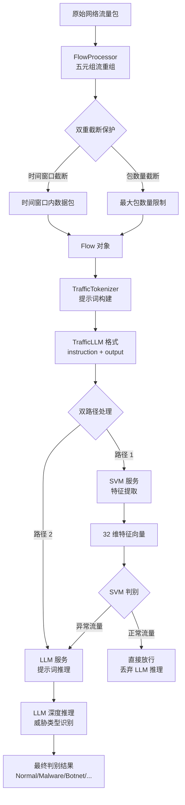
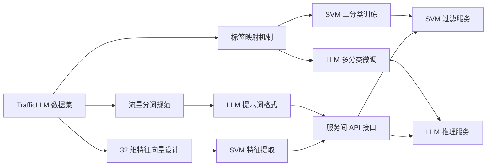

TrafficLLM 数据集是 EdgeAgent 系统的核心训练与推理数据源，采用统一的 JSON Lines 格式存储网络流量样本。该数据集通过标准化的协议元信息编码与多任务标签体系，支撑 SVM 过滤服务与 LLM 推理服务的协同工作。数据集包含 12 个子任务数据集，总计超过 52 万条流量样本，覆盖加密恶意软件检测、僵尸网络识别、APT 攻击检测等关键安全场景。标签映射机制实现了从多分类标签到二分类标签的自动转换，确保 SVM 模型能够在异构数据源上实现统一的正常/异常判别能力。

Sources: [dataset-feature-engineering.md](docs/references/dataset-feature-engineering.md#L1-L33)

## 数据集架构与格式规范

TrafficLLM 数据集采用分任务组织架构，每个子数据集专注于特定的流量分类场景。数据格式遵循统一的 JSON Lines 规范，每行记录包含 `instruction` 与 `output` 两个字段，其中 `instruction` 字段由任务描述、`<packet>` 标识符与协议元信息序列组成，`output` 字段为分类标签文本。这种格式设计使得同一数据集可同时服务于 SVM 特征提取与 LLM 提示词构建，实现了数据复用与处理流程统一。

| 数据集名称 | 训练集记录数 | 测试集记录数 | 任务类型 | 标签体系 |
|-----------|-------------|-------------|---------|---------|
| ustc-tfc-2016 | 48,282 | 2,537 | 加密恶意软件检测 | 20 类（10 恶意/10 正常） |
| cstnet-2023 | 92,822 | 4,885 | 未知 | - |
| app53-2023 | 102,600 | 5,400 | 应用分类 | 53 类应用标签 |
| cw100-2024 | 53,200 | 2,800 | 网站指纹识别 | 63 类网站 |
| iscx-vpn-2016 | 61,609 | 3,242 | VPN 流量分类 | 14 类 VPN 行为 |
| dohbrw-2020 | 47,500 | 2,500 | DoH 浏览检测 | DoH 相关 |
| iscx-tor-2016 | 38,000 | 2,000 | Tor 行为检测 | 8 类 Tor 行为 |
| iscx-botnet-2014 | 23,750 | 1,250 | 僵尸网络检测 | 5 类（3 恶意/2 正常） |
| csic-2010 | 25,953 | 8,651 | HTTP 攻击检测 | 2 类二分类 |
| dapt-2020 | 9,500 | 500 | APT 攻击检测 | 2 类二分类 |

**数据格式示例**：

```json
{
    "instruction": "Given the following traffic data <packet> frame.encap_type: 1, frame.time: Jan 1, 1970 08:13:56.125909000 CST, ip.src: 1.2.196.67, ip.dst: 1.1.219.29, tcp.srcport: 139, tcp.dstport: 50871, ...",
    "output": "Malware"
}
```

Sources: [dataset-feature-engineering.md](docs/references/dataset-feature-engineering.md#L35-L56)

### 协议元信息四层解析模型

`<packet>` 标识符后的协议元信息采用扁平化键值对格式，涵盖从数据链路层到传输层的完整协议栈信息。该设计使得特征提取模块能够通过简单的字符串解析获取所有必要字段，避免了复杂的协议解析开销。四层解析模型包括 Frame 层（数据帧元信息）、Ethernet 层（链路层）、IP 层（网络层）与 TCP/UDP 层（传输层），每层包含的关键字段经过精心筛选，能够有效支撑流量分类任务的决策需求。

**Frame 层元信息**提供数据帧的时间戳、长度与协议栈信息，其中 `frame.time_delta` 字段记录与上一帧的时间差，`frame.time_relative` 字段记录相对于流起始时间的相对时间，这两个字段是计算流量时间特征的关键输入。`frame.protocols` 字段以冒号分隔的形式记录完整协议栈（如 `eth:ethertype:ip:tcp:nbss`），为快速判断流量类型提供依据。

| Frame 字段 | 示例值 | 语义说明 | 特征提取用途 |
|-----------|--------|---------|------------|
| `frame.encap_type` | 1 | 封装类型（1=Ethernet） | 链路层类型识别 |
| `frame.time` | Jan 1, 1970 08:13:56.125909000 CST | 时间戳 | 流重组与排序 |
| `frame.time_epoch` | 836.125909000 | Unix 时间戳 | 绝对时间计算 |
| `frame.time_delta` | 0.000016000 | 与上一帧时间差（秒） | 时间特征提取 |
| `frame.time_relative` | 0.000083000 | 相对流起始时间 | 流持续时间计算 |
| `frame.number` | 6 | 帧序号 | 包序分析 |
| `frame.len` | 1518 | 帧长度（字节） | 大小特征提取 |
| `frame.protocols` | eth:ethertype:ip:tcp:nbss | 协议栈 | 协议类型识别 |

**IP 层元信息**提供网络层的核心字段，包括源目 IP 地址、TTL 值、IP 协议号与分片标志。`ip.proto` 字段为 6 表示 TCP 协议，17 表示 UDP 协议，该字段是区分协议类型的直接依据。`ip.flags.df` 字段表示禁止分片标志，`ip.id` 字段为分片标识，这两个字段在特定攻击检测场景（如 IP 分片攻击）中具有重要价值。`ip.ttl` 字段的统计特征能够反映操作系统指纹特征，不同操作系统的初始 TTL 值存在显著差异。

Sources: [dataset-feature-engineering.md](docs/references/dataset-feature-engineering.md#L58-L97)

**TCP/UDP 层元信息**提供传输层的端口、标志位与负载信息，是流量行为分析的核心数据源。TCP 标志位（SYN、ACK、PSH、FIN、RST）的组合模式能够揭示连接建立、数据传输与连接终止的行为特征，例如 SYN-FIN 组合常用于端口扫描，ACK-PSH 组合表示数据传输阶段。`tcp.window_size` 字段反映接收端缓冲区状态，异常的窗口大小变化可能指示异常流量行为。`tcp.payload` 字段以十六进制格式记录负载数据，为深度包检测提供原始材料。

| TCP 字段 | 示例值 | 语义说明 | 攻击检测用途 |
|---------|--------|---------|------------|
| `tcp.srcport` | 139 | 源端口 | 端口行为分析 |
| `tcp.dstport` | 50871 | 目标端口 | 服务类型识别 |
| `tcp.flags` | 0x00000018 | TCP 标志位组合 | 异常标志检测 |
| `tcp.flags.syn` | 0 | SYN 标志 | 连接建立行为 |
| `tcp.flags.ack` | 1 | ACK 标志 | 确认行为 |
| `tcp.flags.push` | 1 | PSH 标志 | 数据推送行为 |
| `tcp.flags.fin` | 0 | FIN 标志 | 连接终止行为 |
| `tcp.flags.reset` | 0 | RST 标志 | 异常终止行为 |
| `tcp.window_size` | 18824 | TCP 窗口大小 | 缓冲区状态分析 |
| `tcp.payload` | e2:c3:4d:9e:d3:69... | 负载数据（十六进制） | 深度包检测 |

Sources: [dataset-feature-engineering.md](docs/references/dataset-feature-engineering.md#L99-L139)

## 标签映射机制与二分类转换

TrafficLLM 数据集的标签映射机制是 SVM 模型实现跨数据集统一训练的关键设计。由于原始数据集包含多分类标签（如 USTC-TFC 的 20 个类别），而 SVM 过滤服务需要实现二分类判别（正常/异常），系统定义了标准化的标签映射规则，将不同数据集的原始标签统一转换为二分类标签。映射规则基于网络安全领域的领域知识，将已知的恶意软件家族、攻击行为与僵尸网络类型映射为异常标签，将正常应用、协议与行为映射为正常标签。

### 二分类标签定义

SVM 模型训练脚本定义了两个标签集合，`NORMAL_LABELS` 集合包含所有正常流量标签，`ANOMALY_LABELS` 集合包含所有异常流量标签。在数据加载阶段，系统将原始 `output` 字段中的标签文本转换为小写后，与这两个集合进行匹配，匹配成功的样本被赋予二分类标签（正常为 0，异常为 1），匹配失败的样本被跳过，确保训练数据的标签质量。

**正常标签集合**：

```python
NORMAL_LABELS = {
    'normal', 'benign', '0', 'irc',
    'bittorrent', 'ftp', 'facetime', 'gmail', 'mysql', 
    'outlook', 'smb', 'skype', 'weibo', 'worldofwarcraft'
}
```

**异常标签集合**：

```python
ANOMALY_LABELS = {
    'apt', 'malicious', '1',
    'virut', 'neris', 'rbot',
    'cridex', 'geodo', 'htbot', 'miuref', 'nsis-ay', 
    'shifu', 'tinba', 'zeus'
}
```

Sources: [train_svm.py](svm-filter-service/models/train_svm.py#L31-L47)

### 多分类标签映射策略

对于包含多分类标签的数据集，系统采用领域知识驱动的映射策略。以 USTC-TFC-2016 数据集为例，该数据集包含 10 个恶意软件家族与 10 个正常应用标签，映射规则将恶意软件家族统一映射为异常标签，将正常应用统一映射为正常标签。这种映射策略的优势在于能够充分利用多分类数据集的丰富信息，同时避免 SVM 模型处理多分类任务的复杂性。

**USTC-TFC-2016 标签映射示例**：

| 原始标签 | 标签类型 | 二分类映射 | 依据 |
|---------|---------|----------|------|
| Geodo | 恶意软件 | 异常（1） | 银行木马 |
| Cridex | 恶意软件 | 异常（1） | 金融恶意软件 |
| Tinba | 恶意软件 | 异常（1） | 小型银行木马 |
| Shifu | 恶意软件 | 异常（1） | 银行木马 |
| Zeus | 恶意软件 | 异常（1） | 著名银行木马 |
| Virut | 恶意软件 | 异常（1） | 蠕虫病毒 |
| Neris | 恶意软件 | 异常（1） | 僵尸网络 |
| Gmail | 正常应用 | 正常（0） | 邮件服务 |
| SMB | 正常应用 | 正常（0） | 文件共享协议 |
| FTP | 正常应用 | 正常（0） | 文件传输协议 |
| Skype | 正常应用 | 正常（0） | 通信应用 |
| BitTorrent | 正常应用 | 正常（0） | P2P 应用 |

Sources: [dataset-feature-engineering.md](docs/references/dataset-feature-engineering.md#L141-L223)

**ISCX-Botnet-2014 标签映射**展示了僵尸网络检测场景的映射策略。该数据集包含 IRC 协议流量、正常流量与三个僵尸网络家族，映射规则将僵尸网络家族映射为异常标签，将 IRC 协议与正常流量映射为正常标签。这种映射方式使得 SVM 模型能够学习僵尸网络流量的共同特征，而非特定家族的独特特征，提升了模型的泛化能力。

**ISCX-Botnet-2014 标签映射**：

| 原始标签 | 标签类型 | 二分类映射 | 依据 |
|---------|---------|----------|------|
| Virut | 僵尸网络 | 异常（1） | IRC 僵尸网络 |
| Neris | 僵尸网络 | 异常（1） | 垃圾邮件僵尸网络 |
| RBot | 僵尸网络 | 异常（1） | IRC 僵尸网络 |
| IRC | 正常协议 | 正常（0） | IRC 协议流量 |
| normal | 正常流量 | 正常（0） | 正常网络行为 |

Sources: [dataset-feature-engineering.md](docs/references/dataset-feature-engineering.md#L225-L262)

## 数据流处理与特征提取流程

TrafficLLM 数据集的 `instruction` 字段不仅用于 LLM 提示词构建，还作为 32 维特征向量的提取源。系统通过正则表达式从 `<packet>` 标识符后的文本中解析协议字段键值对，按照特征工程规范提取统计特征、协议特征、行为特征、时间特征、端口特征与地址特征，生成用于 SVM 推理的标准化特征向量。这种设计实现了数据源的统一化，一条 TrafficLLM 记录可同时支撑 SVM 快速过滤与 LLM 深度推理。

### 特征提取算法

特征提取函数 `extract_packet_features` 接收 `instruction` 文本作为输入，首先通过字符串分割定位 `<packet>:` 标识符，然后以逗号为分隔符提取键值对，存储为字典结构。该算法的核心优势在于处理速度快，无需依赖复杂的协议解析库，适合边缘设备的资源约束环境。对于单包特征（如 IP 地址、端口号、标志位），直接从字典中提取；对于流级特征（如平均包长、标准差、速率），需要在流重组阶段进行统计计算。

**特征提取核心代码片段**：

```python
def extract_packet_features(instruction_text: str) -> np.ndarray:
    """从 <packet> 描述文本中提取 32 维特征向量"""
    if '<packet>:' not in instruction_text:
        return np.zeros(32)

    # 提取 <packet> 后的内容
    packet_content = instruction_text.split('<packet>:')[-1]

    # 解析键值对为字典
    fields = {}
    for item in packet_content.split(', '):
        if ':' in item:
            key, value = item.split(':', 1)
            fields[key.strip()] = value.strip()

    # 构建 32 维特征向量
    features = np.zeros(32)
    features[0] = _safe_float(fields.get('frame.len', 0))      # 平均包长
    features[7] = _safe_float(fields.get('ip.ttl', 0))         # 平均 TTL
    features[8] = _safe_float(fields.get('ip.proto', 0))       # IP 协议号
    features[9] = 1 if ip_proto == 6 else 0                    # TCP 比例
    features[10] = 1 if ip_proto == 17 else 0                  # UDP 比例
    # ... 其余特征提取逻辑
    return features
```

Sources: [train_svm.py](svm-filter-service/models/train_svm.py#L87-L131)

### 32 维特征向量结构

特征向量采用六类特征分组设计，每类特征针对特定的流量判别维度。**基础统计特征**（维度 0-7）包括包长、IP 包长、TCP 负载长的均值与标准差，以及总字节数与平均 TTL 值，这些特征能够反映流量的大小规模与包长分布特征。**协议类型特征**（维度 8-11）包括 IP 协议号、TCP 包比例、UDP 包比例与其他协议比例，用于快速识别协议类型分布。**TCP 行为特征**（维度 12-19）包括窗口大小统计、标志位计数与平均头长度，用于分析 TCP 连接行为模式。

**时间特征**（维度 20-23）包括流持续时间、包间隔到达时间的均值与标准差、包速率，这些特征能够区分持续性流量与突发性流量，对于检测扫描行为与 DDoS 攻击具有重要价值。**端口特征**（维度 24-27）包括源端口熵、目标端口熵、知名端口比例与高端口比例，端口的分布特征能够揭示服务类型与访问模式。**地址特征**（维度 28-31）包括唯一目标 IP 数、内部 IP 比例、DF 标志比例与标准化 IP ID 均值，地址特征对于检测横向移动与端口扫描具有关键作用。

| 特征类别 | 维度范围 | 特征名称 | 判别价值 |
|---------|---------|---------|---------|
| 基础统计 | 0-7 | avg_packet_len, std_packet_len, avg_ip_len, std_ip_len, avg_tcp_len, std_tcp_len, total_bytes, avg_ttl | 流量规模与包长分布 |
| 协议类型 | 8-11 | ip_proto, tcp_ratio, udp_ratio, other_proto_ratio | 协议类型识别 |
| TCP 行为 | 12-19 | avg_window_size, std_window_size, syn_count, ack_count, push_count, fin_count, rst_count, avg_hdr_len | TCP 连接行为分析 |
| 时间特征 | 20-23 | total_duration, avg_inter_arrival, std_inter_arrival, packet_rate | 时间行为模式 |
| 端口特征 | 24-27 | src_port_entropy, dst_port_entropy, well_known_port_ratio, high_port_ratio | 服务类型与访问模式 |
| 地址特征 | 28-31 | unique_dst_ip_count, internal_ip_ratio, df_flag_ratio, avg_ip_id | 地址行为分析 |

Sources: [main.py](svm-filter-service/app/main.py#L49-L84)

## 数据流架构与处理流程

TrafficLLM 数据集在 EdgeAgent 系统中扮演双重角色：训练阶段作为 SVM 模型与 LLM 微调的数据源，推理阶段作为实时流量处理的数据格式规范。数据流架构采用解耦设计，FlowProcessor 负责从原始网络包重组双向会话流，TrafficTokenizer 负责将流转换为 LLM 提示词，SVM 服务与 LLM 服务分别从不同维度提取特征与推理判别。这种架构设计确保了数据格式的一致性与处理流程的模块化。



Sources: [flow_processor.py](agent-loop/app/flow_processor.py#L1-L88), [traffic_tokenizer.py](agent-loop/app/traffic_tokenizer.py#L1-L100)

### 训练数据加载流程

SVM 模型训练阶段采用多数据集联合训练策略，从四个精选数据集（DAPT-2020、CSIC-2010、ISCX-Botnet-2014、USTC-TFC-2016）中加载训练样本，每个数据集最多加载 15,000 条样本。数据加载函数遍历数据集文件，逐行解析 JSON 记录，通过标签映射机制将原始 `output` 标签转换为二分类标签，同时调用特征提取函数生成 32 维特征向量。加载完成后，特征向量与标签被组织为 NumPy 数组，用于后续的模型训练。

**多数据集加载流程**：

```python
def load_multi_dataset(base_dir: str, max_per_dataset: int = 15000):
    """从多个数据集加载训练样本"""
    datasets = [
        "dapt-2020/dapt-2020_detection_packet_train.json",
        "csic-2010/csic-2010_detection_packet_train.json", 
        "iscx-botnet-2014/iscx-botnet_detection_packet_train.json",
        "ustc-tfc-2016/ustc-tfc-2016_detection_packet_train.json"
    ]
    
    X_list = []
    y_list = []
    
    for rel_path in datasets:
        file_path = base_path / rel_path
        with open(file_path, 'r', encoding='utf-8') as f:
            for line in f:
                data = json.loads(line)
                out_label = data.get("output", "").strip().lower()
                
                # 标签映射
                if out_label in NORMAL_LABELS:
                    label = 0
                elif out_label in ANOMALY_LABELS:
                    label = 1
                else:
                    continue  # 跳过未知标签
                    
                # 特征提取
                feature = extract_packet_features(data.get("instruction", ""))
                X_list.append(feature)
                y_list.append(label)
    
    return np.array(X_list), np.array(y_list)
```

Sources: [train_svm.py](svm-filter-service/models/train_svm.py#L134-L180)

### 推理阶段数据流

推理阶段的实时流量处理流程遵循严格的数据格式约束。FlowProcessor 从网络接口捕获原始数据包，根据五元组（源 IP、目标 IP、源端口、目标端口、协议）重组双向会话流，应用双重截断保护（时间窗口 60 秒、最大包数量 10 个），生成 Flow 对象。TrafficTokenizer 从 Flow 对象构建 TrafficLLM 格式的提示词，包含任务指令、五元组元信息与 `<packet>` 标记的数据内容。该提示词同时被送入 SVM 服务与 LLM 服务，SVM 服务从中提取 32 维特征进行快速判别，LLM 服务直接使用提示词进行深度推理。

**推理阶段核心流程**：

1. **流重组**：FlowProcessor 根据五元组重组双向会话流，应用时间窗口与包数量截断
2. **提示词构建**：TrafficTokenizer 生成 TrafficLLM 格式的提示词
3. **特征提取**：SVM 服务从提示词中解析协议字段，构建 32 维特征向量
4. **快速判别**：SVM 模型在微秒级延迟内完成正常/异常判别
5. **深度推理**：仅对 SVM 判定为异常的流量，LLM 服务进行深度推理

Sources: [flow_processor.py](agent-loop/app/flow_processor.py#L181-L260), [traffic_tokenizer.py](agent-loop/app/traffic_tokenizer.py#L101-L180)

## 标签质量保障与未知标签处理

标签映射机制的质量直接影响 SVM 模型的判别精度。系统采用白名单策略处理标签映射，仅接受预定义的 `NORMAL_LABELS` 与 `ANOMALY_LABELS` 集合中的标签，未知标签的样本被自动跳过。这种严格策略虽然减少了训练样本数量，但有效避免了标签噪声污染。对于新数据集的接入，需要先进行标签审计，确认标签语义后再添加到映射集合中。

### 标签审计流程

新数据集接入前需要进行标签审计，审计内容包括标签语义分析、样本数量统计与标签分布可视化。标签语义分析需要确认标签名称是否能够准确反映流量类型，避免歧义标签（如 IRC 既可能是正常协议也可能是僵尸网络通信信道）。样本数量统计需要检查各类别的样本数量是否均衡，避免类别不平衡导致的模型偏置。标签分布可视化通过柱状图或饼图展示各类别占比，辅助决策标签映射策略。

**ISCX-Tor-2016 数据集的特殊处理**展示了标签审计的重要性。该数据集包含 8 个 Tor 行为标签，但所有样本均为 Tor 网络流量，不存在正常流量样本。若直接使用该数据集训练二分类模型，会导致模型学习到错误的判别边界。系统对该数据集采用排除策略，不将其纳入 SVM 训练数据源，但可作为 LLM 微调的多分类数据集使用。

Sources: [dataset-feature-engineering.md](docs/references/dataset-feature-engineering.md#L264-L290)

### 标签扩展机制

当发现新的恶意软件家族或攻击类型时，需要扩展 `ANOMALY_LABELS` 集合。扩展流程包括威胁情报验证、样本分析验证与模型再训练评估三个步骤。威胁情报验证需要通过 VirusTotal、MITRE ATT&CK 等权威源确认标签的恶意属性。样本分析验证需要通过沙箱环境确认样本的行为特征与流量模式。模型再训练评估需要比较扩展前后的模型性能指标，确保标签扩展带来的性能提升。

**标签扩展决策矩阵**：

| 验证维度 | 验证方法 | 通过标准 | 失败处理 |
|---------|---------|---------|---------|
| 威胁情报验证 | VirusTotal 多引擎检测 | 检出率 > 70% | 排除标签 |
| 样本分析验证 | 沙箱行为分析 | 恶意行为确认 | 重新评估 |
| 模型性能评估 | 准确率/召回率/F1 | 性能提升或持平 | 调整权重 |
| 数据分布评估 | 类别平衡度检查 | 不破坏现有平衡 | 采样调整 |

Sources: [train_svm.py](svm-filter-service/models/train_svm.py#L48-L86)

## 与前后章节的关联

TrafficLLM 数据集与标签映射作为流量处理与特征工程的关键环节，与前后章节形成紧密的技术关联。前序章节 [流量分词规范与双重截断保护](11-liu-liang-fen-ci-gui-fan-yu-shuang-zhong-jie-duan-bao-hu) 定义了从 TrafficLLM 数据格式到 LLM 提示词的转换规则，前序章节 [32 维特征向量设计](12-32-wei-te-zheng-xiang-liang-she-ji) 详细阐述了从协议元信息到特征向量的提取算法，本章在此基础上聚焦于数据集的组织结构与标签映射机制。后续章节 [服务间 API 接口规范](14-fu-wu-jian-api-jie-kou-gui-fan) 将基于本章定义的数据格式，规范 SVM 服务与 LLM 服务的接口契约。

**技术关联图谱**：

