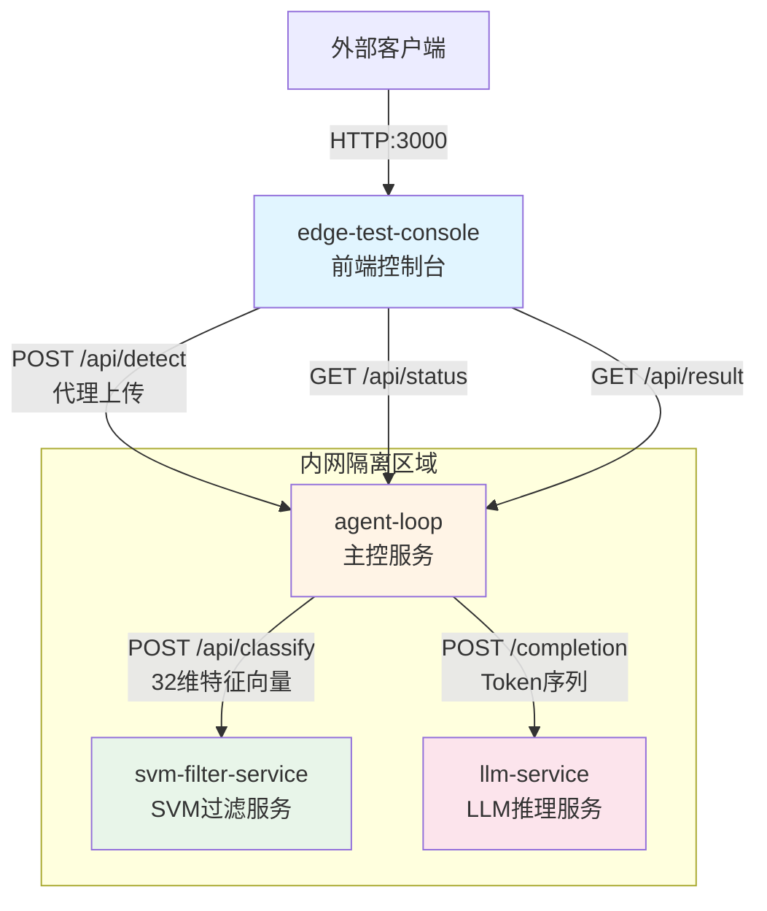
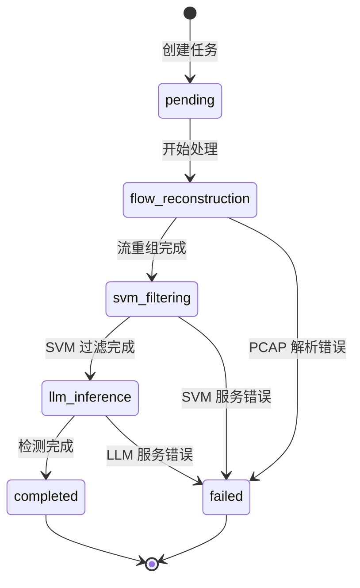

探微系统采用**微服务架构**，四个容器化服务通过 HTTP API 进行通信，形成完整的风险流量检测流水线。本文档详述服务间的通信契约、数据格式与错误处理规范，为开发者提供精确的接口集成指南。

## 通信拓扑与服务边界

系统的通信架构遵循**边缘优先**设计原则：edge-test-console 作为唯一的对外接口，agent-loop 作为核心编排引擎，svm-filter-service 和 llm-service 构成两阶段推理漏斗。这种拓扑设计确保了内网服务的隔离性与外网接口的可控性。



服务间的调用关系形成单向依赖链：edge-test-console 不直接访问推理服务，所有请求必须经过 agent-loop 编排；agent-loop 同时调用 SVM 和 LLM 服务，但不暴露给外部网络。这种**分层网关模式**简化了安全边界管理。

Sources: [docker-compose.yml](docker-compose.yml#L1-L166), [api_specs.md](docs/references/api_specs.md#L1-L30)

## 外部 API 接口

edge-test-console 提供面向用户的检测 API，支持 PCAP 文件上传、任务状态查询与结果获取。该服务同时扮演**前端静态资源托管**与**后端 API 网关**双重角色，统一监听 3000 端口（容器内 8000）。

### 文件上传与任务创建

**POST /api/detect** 接口接收 PCAP 文件并启动异步检测流程。请求采用 multipart/form-data 编码，支持 .pcap 和 .pcapng 两种格式。系统自动生成 UUID 作为任务标识，并在后台启动五阶段检测流水线。

```http
POST /api/detect HTTP/1.1
Content-Type: multipart/form-data; boundary=----WebKitFormBoundary

------WebKitFormBoundary
Content-Disposition: form-data; name="file"; filename="suspicious.pcap"
Content-Type: application/vnd.tcpdump.pcap

<binary pcap data>
------WebKitFormBoundary--
```

成功响应返回任务 ID 与初始状态，客户端应据此轮询 `/api/status/{task_id}` 直到任务完成：

```json
{
  "status": "success",
  "task_id": "550e8400-e29b-41d4-a716-446655440000",
  "message": "Detection task started"
}
```

文件验证失败时返回 400 状态码，错误详情包含文件名与期望格式信息。edge-test-console 后端会验证文件扩展名，若文件类型不符则拒绝上传。

Sources: [edge-test-console/backend/app/main.py](edge-test-console/backend/app/main.py#L319-L353), [api_specs.md](docs/references/api_specs.md#L15-L45)

### 任务状态查询

**GET /api/status/{task_id}** 提供实时进度反馈，返回任务所处阶段、百分比进度与描述消息。任务状态遵循严格的状态机转换，从 `pending` 经过 `flow_reconstruction`、`svm_filtering`、`llm_inference` 最终到达 `completed` 或 `failed`。

| 字段 | 类型 | 说明 |
|------|------|------|
| task_id | string | 任务唯一标识符 |
| status | string | 当前状态：pending, processing, completed, failed |
| stage | string | 处理阶段：flow_reconstruction, svm_filtering, llm_inference |
| progress | integer | 进度百分比 (0-100) |
| message | string | 人类可读的状态描述 |

状态查询接口支持高频轮询（建议间隔 1 秒），edge-test-console 后端会代理转发至 agent-loop 的对应接口，并缓存状态以减少对下游服务的压力。当状态变为 `completed` 后，客户端应立即调用结果接口获取最终 JSON。

Sources: [agent-loop/app/main.py](agent-loop/app/main.py#L631-L651), [edge-test-console/backend/app/main.py](edge-test-console/backend/app/main.py#L455-L468)

### 检测结果获取

**GET /api/result/{task_id}** 返回完整的结构化 JSON 报告，包含元数据、统计信息、威胁详情与带宽指标。该接口仅在任务 `completed` 状态下返回完整结果，否则返回当前进度或错误信息。

结果 JSON 采用**三层嵌套结构**：顶层 meta 记录任务元信息，statistics 汇总流量统计与过滤效率，threats 数组枚举每个异常流的五元组与分类标签。这种结构化设计支持前端直接渲染威胁看板，无需二次解析。

```json
{
  "meta": {
    "task_id": "550e8400-e29b-41d4-a716-446655440000",
    "timestamp": "2025-01-15T10:30:00Z",
    "agent_version": "1.0.0",
    "processing_time_ms": 1250
  },
  "statistics": {
    "total_packets": 1500,
    "total_flows": 150,
    "normal_flows_dropped": 148,
    "anomaly_flows_detected": 2,
    "svm_filter_rate": "98.67%",
    "bandwidth_reduction": "78.5%"
  },
  "threats": [
    {
      "id": "threat-001",
      "five_tuple": {
        "src_ip": "192.168.1.100",
        "dst_ip": "10.0.0.1",
        "src_port": 54321,
        "dst_port": 443,
        "protocol": "TCP"
      },
      "classification": {
        "primary_label": "Malware",
        "secondary_label": "Botnet",
        "confidence": 0.92,
        "model": "Qwen3.5-0.8B"
      }
    }
  ],
  "metrics": {
    "original_pcap_size_bytes": 1048576,
    "json_output_size_bytes": 225280,
    "bandwidth_saved_percent": 78.5
  }
}
```

threats 数组中的每个对象包含完整的五元组信息与 LLM 分类结果。classification 字段的 confidence 值来源于 SVM 过滤阶段，model 字段标识使用的推理模型版本。前端可据此渲染威胁等级与置信度可视化。

Sources: [agent-loop/app/main.py](agent-loop/app/main.py#L653-L689), [api_specs.md](docs/references/api_specs.md#L47-L99)

### 演示样本管理

系统内置演示样本库，提供开箱即用的检测演示能力。**GET /api/demo-samples** 返回样本列表，每个样本包含 ID、文件名、显示名称与字节大小。**POST /api/detect-demo** 接受样本 ID，复制预设 PCAP 文件到上传目录并启动检测流程。

| 接口 | 方法 | 用途 |
|------|------|------|
| /api/demo-samples | GET | 获取演示样本列表 |
| /api/detect-demo | POST | 使用指定样本启动检测 |

演示样本存储在 `data/test_traffic/demo_show` 目录，edge-test-console 启动时自动扫描该目录构建样本索引。样本选择界面允许用户快速体验检测流程，无需准备真实流量文件。

Sources: [edge-test-console/backend/app/main.py](edge-test-console/backend/app/main.py#L379-L425), [api_specs.md](docs/references/api_specs.md#L400-L416)

## 内部服务 API

内部服务间的通信遵循**最小权限原则**：agent-loop 作为唯一的服务间通信中枢，svm-filter-service 和 llm-service 仅接受来自 agent-loop 的请求。这种设计通过 Docker 内部网络隔离实现，避免服务被外部直接访问。

### SVM 过滤服务接口

**POST /api/classify** 是 svm-filter-service 提供的唯一业务接口，接收 32 维特征向量并返回二分类结果。该接口设计为**无状态服务**，支持高并发调用，平均推理延迟低于 0.2 毫秒。

特征向量严格遵循数据集特征工程规范，分为六大类：基础统计（A 类，索引 0-7）、协议类型（B 类，索引 8-11）、TCP 行为（C 类，索引 12-19）、时间特征（D 类，索引 20-23）、端口特征（E 类，索引 24-27）、地址特征（F 类，索引 28-31）。

| 类别 | 索引范围 | 特征示例 | 说明 |
|------|----------|----------|------|
| A. 基础统计 | 0-7 | avg_packet_len, std_packet_len, avg_ttl | 包长度统计与 TTL 分布 |
| B. 协议类型 | 8-11 | ip_proto, tcp_ratio, udp_ratio | 协议分布比例 |
| C. TCP 行为 | 12-19 | avg_window_size, syn_count, ack_count | TCP 标志位与窗口大小 |
| D. 时间特征 | 20-23 | total_duration, packet_rate | 流持续时间与包速率 |
| E. 端口特征 | 24-27 | src_port_entropy, well_known_port_ratio | 端口熵与分布 |
| F. 地址特征 | 28-31 | unique_dst_ip_count, internal_ip_ratio | IP 地址特征 |

请求示例展示了完整的 32 维特征提交格式，每个字段都经过数值范围验证（如 tcp_ratio 必须在 [0, 1] 区间）：

```json
{
  "features": {
    "avg_packet_len": 512.5,
    "std_packet_len": 128.3,
    "avg_ip_len": 500.0,
    "std_ip_len": 120.5,
    "avg_tcp_len": 460.0,
    "std_tcp_len": 110.2,
    "total_bytes": 5120.0,
    "avg_ttl": 64.0,
    "ip_proto": 6,
    "tcp_ratio": 1.0,
    "udp_ratio": 0.0,
    "other_proto_ratio": 0.0,
    "avg_window_size": 65535.0,
    "std_window_size": 0.0,
    "syn_count": 1,
    "ack_count": 8,
    "push_count": 5,
    "fin_count": 0,
    "rst_count": 0,
    "avg_hdr_len": 32.0,
    "total_duration": 30.5,
    "avg_inter_arrival": 3.05,
    "std_inter_arrival": 1.2,
    "packet_rate": 0.33,
    "src_port_entropy": 54321.0,
    "dst_port_entropy": 443.0,
    "well_known_port_ratio": 1.0,
    "high_port_ratio": 0.0,
    "unique_dst_ip_count": 1,
    "internal_ip_ratio": 0.0,
    "df_flag_ratio": 0.5,
    "avg_ip_id": 0.5
  }
}
```

响应包含预测标签、置信度与推理延迟，agent-loop 据此决定是否将该流传递给 LLM 服务进行深度分析：

```json
{
  "prediction": 1,
  "label": "anomaly",
  "confidence": 0.87,
  "latency_ms": 0.15
}
```

prediction 字段为整数类型：0 表示正常流量，1 表示疑似异常。label 字段提供人类可读的分类标签。confidence 值在 [0, 1] 区间内浮动，agent-loop 可设置阈值过滤低置信度样本。

Sources: [svm-filter-service/app/main.py](svm-filter-service/app/main.py#L64-L197), [api_specs.md](docs/references/api_specs.md#L101-L174)

### LLM 推理服务接口

**POST /completion** 调用 llama.cpp server 进行文本补全，将流量 Token 序列转化为威胁分类标签。该接口遵循 llama.cpp server 的标准 API 规范，支持温度、停止符等生成参数控制。

请求结构包含 prompt（提示词）、n_predict（最大生成 Token 数）、temperature（采样温度）与 stop（停止符列表）。agent-loop 通过 TrafficTokenizer 构建 prompt，将五元组与截断后的流量文本封装为 LLM 可理解的输入格式：

```json
{
  "prompt": "Analyze the following network traffic packet data. Classify as: Normal, Malware, Botnet, C&C, DDoS, Scan, or Other.\n\nFive-tuple: Source: 192.168.1.100:54321, Destination: 10.0.0.1:443, Protocol: TCP\n\n<packet>: 0x474554202f20485454502f312e310d0a...\n\nClassification:",
  "n_predict": 32,
  "temperature": 0.1,
  "stop": ["</s>", "\n\n", "Classification:", "<packet>:"]
}
```

temperature 参数设为 0.1 以抑制随机性，确保分类结果的稳定性。stop 列表包含多个停止符，防止 LLM 生成过长的无关文本。响应包含生成内容、Token 统计与时间指标：

```json
{
  "content": "Malware Traffic",
  "tokens_evaluated": 156,
  "tokens_predicted": 3,
  "timings": {
    "prompt_ms": 45.2,
    "predicted_ms": 12.8,
    "total_ms": 58.0
  }
}
```

agent-loop 通过 TrafficTokenizer.parse_llm_response() 解析 content 字段，提取威胁标签。解析逻辑使用关键词匹配，支持 Malware、Botnet、DDoS、Scan、Normal 等多种分类。

Sources: [llm-service/test_llm.py](llm-service/test_llm.py#L49-L78), [agent-loop/app/traffic_tokenizer.py](agent-loop/app/traffic_tokenizer.py#L106-L207), [api_specs.md](docs/references/api_specs.md#L176-L207)

## 健康检查与错误处理

所有服务均实现 **GET /health** 健康检查端点，返回服务名称、版本与运行时长。Docker Compose 通过该端点判断服务就绪状态，实现启动顺序编排与健康监控。

```json
{
  "status": "healthy",
  "service": "agent-loop",
  "version": "1.0.0",
  "uptime_seconds": 3600
}
```

健康检查采用**分级超时策略**：LLM 服务启动需加载模型文件，start_period 设为 60 秒；SVM 服务仅需加载轻量级模型，start_period 设为 10 秒。这种差异化的超时配置避免了不必要的重启判定。

### 统一错误响应格式

所有 API 在出错时返回结构化错误 JSON，包含 status、error_code、message 与可选 details 字段。这种统一格式简化了客户端的错误处理逻辑，支持错误类型的精确映射。

```json
{
  "status": "error",
  "error_code": "INVALID_PCAP_FILE",
  "message": "The uploaded file is not a valid PCAP format",
  "details": {
    "filename": "test.pcap",
    "expected_format": "pcap or pcapng"
  }
}
```

| 错误码 | HTTP 状态码 | 触发场景 |
|--------|-------------|----------|
| INVALID_PCAP_FILE | 400 | 文件格式验证失败 |
| TASK_NOT_FOUND | 404 | 任务 ID 不存在 |
| SVM_SERVICE_UNAVAILABLE | 503 | SVM 服务超时或返回错误 |
| LLM_SERVICE_UNAVAILABLE | 503 | LLM 服务超时或返回错误 |
| INTERNAL_ERROR | 500 | 未预期的内部错误 |

agent-loop 在调用下游服务时捕获异常并转换为标准错误格式。例如，SVM 服务超时时返回 503 状态码与 SVM_SERVICE_UNAVAILABLE 错误码，客户端可据此实现重试逻辑或降级策略。

Sources: [agent-loop/app/main.py](agent-loop/app/main.py#L595-L627), [api_specs.md](docs/references/api_specs.md#L209-L255)

## 任务状态机与生命周期

检测任务遵循严格的状态机转换，每个阶段对应特定的处理逻辑与进度范围。理解状态转换规则对实现健壮的客户端轮询逻辑至关重要。



| 状态 | 进度范围 | 处理内容 |
|------|----------|----------|
| pending | 0% | 任务等待调度 |
| flow_reconstruction | 10-30% | 五元组提取与流重组 |
| svm_filtering | 30-60% | SVM 特征提取与分类 |
| llm_inference | 60-90% | Token 序列构建与 LLM 推理 |
| completed | 100% | 结果 JSON 生成完毕 |
| failed | 0% | 任一阶段失败 |

progress 字段在状态转换过程中逐步递增，客户端可据此渲染进度条。当任务进入 failed 状态时，error 字段包含失败原因的详细描述，便于问题诊断。

Sources: [agent-loop/app/main.py](agent-loop/app/main.py#L76-L92), [edge-test-console/backend/app/main.py](edge-test-console/backend/app/main.py#L218-L234)

## API 快速参考表

下表汇总所有服务的 API 端点，按服务分组并标注访问权限。外部 API 对公网开放，内部 API 仅限 Docker 内部网络访问。

### edge-test-console (端口 3000)

| 端点 | 方法 | 访问级别 | 用途 |
|------|------|----------|------|
| /api/detect | POST | 外部 | 上传 PCAP 文件启动检测 |
| /api/status/{task_id} | GET | 外部 | 查询任务状态与进度 |
| /api/result/{task_id} | GET | 外部 | 获取完整检测结果 JSON |
| /api/demo-samples | GET | 外部 | 获取演示样本列表 |
| /api/detect-demo | POST | 外部 | 使用演示样本启动检测 |
| /health | GET | 外部 | 健康检查 |

### agent-loop (端口 8002)

| 端点 | 方法 | 访问级别 | 用途 |
|------|------|----------|------|
| /api/detect | POST | 内部 | 接收 PCAP 文件启动流水线 |
| /api/status/{task_id} | GET | 内部 | 查询任务状态 |
| /api/result/{task_id} | GET | 内部 | 获取检测结果 |
| /api/task/{task_id} | DELETE | 内部 | 删除任务与临时文件 |
| /health | GET | 内部 | 健康检查 |

### svm-filter-service (端口 8001)

| 端点 | 方法 | 访问级别 | 用途 |
|------|------|----------|------|
| /api/classify | POST | 内部 | 32 维特征向量二分类 |
| /health | GET | 内部 | 健康检查 |

### llm-service (端口 8080)

| 端点 | 方法 | 访问级别 | 用途 |
|------|------|----------|------|
| /completion | POST | 内部 | 文本补全与威胁分类 |
| /health | GET | 内部 | 健康检查 |
| /props | GET | 内部 | 获取模型属性 |

Sources: [docker-compose.yml](docker-compose.yml#L1-L166), [api_specs.md](docs/references/api_specs.md#L356-L385)

## 调用示例与最佳实践

完整的检测流程涉及多个 API 的顺序调用。以下示例展示从文件上传到结果获取的完整生命周期：

```bash
# 1. 上传 PCAP 文件
curl -X POST http://localhost:3000/api/detect \
  -F "file=@suspicious.pcap"

# 响应: {"task_id": "abc-123", "status": "success"}

# 2. 轮询任务状态（建议间隔 1 秒）
while true; do
  STATUS=$(curl -s http://localhost:3000/api/status/abc-123)
  STAGE=$(echo $STATUS | jq -r '.stage')
  PROGRESS=$(echo $STATUS | jq -r '.progress')
  echo "Stage: $STAGE, Progress: $PROGRESS%"
  
  if [ "$STAGE" = "completed" ] || [ "$STAGE" = "failed" ]; then
    break
  fi
  sleep 1
done

# 3. 获取最终结果
curl http://localhost:3000/api/result/abc-123 | jq .
```

**最佳实践建议**：
- 客户端应实现**指数退避重试**机制，处理临时网络故障
- 轮询间隔建议 1-2 秒，避免对服务造成过大压力
- 大文件上传时考虑分片或压缩，减少传输时间
- 结果 JSON 应持久化存储，避免重复检测相同文件

对于内部服务的直接调用（仅限调试或扩展场景），可进入容器网络内部执行：

```bash
# 进入 agent-loop 容器
docker exec -it tanwei-agent-loop bash

# 直接调用 SVM 服务
curl -X POST http://svm-filter-service:8001/api/classify \
  -H "Content-Type: application/json" \
  -d '{"features": {...}}'

# 直接调用 LLM 服务
curl -X POST http://llm-service:8080/completion \
  -H "Content-Type: application/json" \
  -d '{"prompt": "...", "n_predict": 32}'
```

Sources: [api_specs.md](docs/references/api_specs.md#L306-L353), [agent-loop/app/main.py](agent-loop/app/main.py#L203-L287)

---

**延伸阅读**：深入理解特征工程细节，请参阅 [32 维特征向量设计](12-32-wei-te-zheng-xiang-liang-she-ji)；了解完整部署流程，请参阅 [部署指南与环境配置](15-bu-shu-zhi-nan-yu-huan-jing-pei-zhi)。