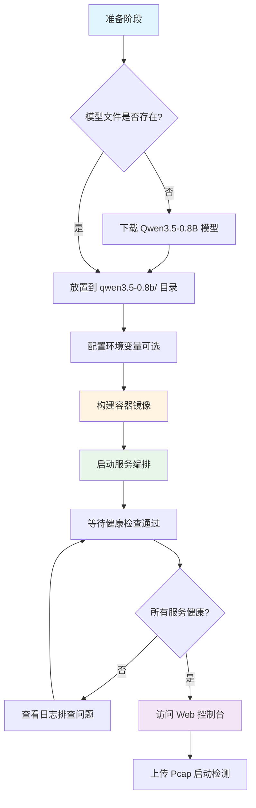

部署探微 (Tanwei) 系统需要在边缘计算环境中搭建四容器微服务架构，每个容器承担特定职责：LLM 推理引擎提供威胁定性能力，SVM 过滤服务实现微秒级初筛，Agent-Loop 作为核心大脑编排五阶段工作流，测试控制台提供可视化交互界面。系统设计遵循边缘计算资源约束原则，在 2.3GB 内存约束下实现本地闭环验证能力，支持离线环境部署，所有服务通过 Docker Compose 编排，启动后即可通过 Web 控制台上传 Pcap 文件启动威胁检测流程。

Sources: [docker-compose.yml](docker-compose.yml#L1-L166), [README.md](README.md#L19-L39)

## 环境要求与资源规划

系统运行需要满足硬件、软件、网络三方面的基础条件，根据部署场景（开发、测试、生产）合理规划资源配置，确保各容器在内存约束下稳定运行。

### 硬件要求

| 环境类型 | CPU 核心数 | 内存容量 | 磁盘空间 | 说明 |
|---------|-----------|---------|---------|------|
| 开发环境 | 2 核 | 4 GB | 10 GB | 基本运行，仅启动核心服务 |
| 测试环境 | 4 核 | 8 GB | 20 GB | 推荐配置，支持并发测试 |
| 生产环境 | 4 核+ | 8 GB+ | 50 GB | 根据负载调整，建议 SSD 存储 |

**内存分配策略**：四个容器总内存约束为 2.3GB，其中 LLM 服务占用 1GB（峰值推理），Agent-Loop 占用 500MB（流重组+分词），SVM 过滤服务占用 300MB（模型加载），测试控制台占用 512MB（前端静态资源+后端代理）。开发环境可通过降低上下文窗口（CTX_SIZE）和推理线程（THREADS）进一步压缩内存占用。

Sources: [docs/references/deployment.md](docs/references/deployment.md#L20-L26), [docker-compose.yml](docker-compose.yml#L28-L42)

### 软件要求

| 软件组件 | 最低版本 | 推荐版本 | 用途说明 |
|---------|---------|---------|---------|
| Docker | 20.10 | 24.0+ | 容器运行时环境 |
| Docker Compose | 2.0 | 2.20+ | 多容器编排工具 |
| Linux Kernel | 4.18 | 5.10+ | 支持 cgroups v2 和网络命名空间 |

**关键依赖**：LLM 服务基于 llama.cpp 构建，需要从源码编译 server 模式可执行文件，编译时需启用 `-DLLAMA_BUILD_SERVER=ON` 选项。SVM 和 Agent 服务依赖 Python 3.10 运行时，使用 `python:3.10-slim` 基础镜像减少磁盘占用。测试控制台前端使用 Node.js 20 Alpine 镜像构建，生成静态文件后通过 FastAPI 后端提供访问服务。

Sources: [docs/references/deployment.md](docs/references/deployment.md#L29-L35), [llm-service/Dockerfile](llm-service/Dockerfile#L4-L22), [svm-filter-service/Dockerfile](svm-filter-service/Dockerfile#L5-L11)

### 网络要求

| 端口映射 | 容器服务 | 协议类型 | 访问方式 |
|---------|---------|---------|---------|
| 3000 → 8000 | edge-test-console | HTTP | Web 控制台唯一入口 |
| 8001 | svm-filter-service | HTTP | 内部服务调用 |
| 8002 | agent-loop | HTTP | 内部服务调用 |
| 8080 | llm-service | HTTP | 内部服务调用 |

**网络拓扑**：所有容器连接至 `tanwei-internal` 桥接网络，内部通信通过容器名解析（如 `http://llm-service:8080`）。测试控制台端口 3000 对外暴露，作为唯一入口接收用户请求，内部服务禁止外部直接访问，遵循单向调用约束：`edge-test-console → agent-loop → svm-filter-service` 和 `agent-loop → llm-service`。

Sources: [docker-compose.yml](docker-compose.yml#L156-L159), [README.md](README.md#L125-L133)

## 前置准备与文件获取

部署前需要准备边缘模型文件、训练数据集、测试流量样本三类核心资源，这些文件未包含在代码仓库中，需从外部源下载或生成。

### 模型文件准备

系统使用 Qwen3.5-0.8B INT4 量化模型作为边缘推理基座，模型文件需放置在 `qwen3.5-0.8b/` 目录下，文件大小约 508MB，支持 CPU 纯推理模式。

**下载步骤**：
```bash
# 创建模型目录
mkdir -p qwen3.5-0.8b

# 从 ModelScope 下载 Q4_K_M 量化版本
# 访问地址: https://www.modelscope.cn/models/unsloth/Qwen3.5-0.8B-GGUF
# 下载文件: Qwen3.5-0.8B-Q4_K_M.gguf

# 验证文件完整性
ls -lh qwen3.5-0.8b/Qwen3.5-0.8B-Q4_K_M.gguf
# 预期大小: 约 508MB
```

**模型加载配置**：Docker Compose 通过卷挂载将宿主机模型目录映射到容器内 `/models` 路径，启动参数指定上下文窗口为 2048 Token、推理线程为 2、禁用 GPU 加速（`--n-gpu-layers 0`），确保在资源约束环境下稳定运行。

Sources: [README.md](README.md#L50-L59), [docker-compose.yml](docker-compose.yml#L17-L26)

### 训练数据集准备

SVM 过滤服务需要预训练模型，训练脚本支持从多个数据集加载样本：DAPT-2020、CSIC-2010、ISCX-Botnet-2014、USTC-TFC-2016，数据集应放置在 `data/tran_data/TrafficLLM_Datasets/` 目录下。

**数据集目录结构**：
```
data/tran_data/TrafficLLM_Datasets/
├── dapt-2020/
│   └── dapt-2020_detection_packet_train.json
├── csic-2010/
│   └── csic-2010_detection_packet_train.json
├── iscx-botnet-2014/
│   └── iscx-botnet_detection_packet_train.json
└── ustc-tfc-2016/
    └── ustc-tfc-2016_detection_packet_train.json
```

**标签映射规则**：训练脚本将原始标签映射为二分类，`NORMAL_LABELS` 包含 `normal, benign, irc, bittorrent` 等 14 种正常流量标签，`ANOMALY_LABELS` 包含 `apt, malicious, virut, neris, zeus` 等 14 种异常流量标签，训练时每个数据集最多加载 15000 个样本以平衡训练速度与模型泛化能力。

Sources: [svm-filter-service/models/train_svm.py](svm-filter-service/models/train_svm.py#L147-L195), [svm-filter-service/models/train_svm.py](svm-filter-service/models/train_svm.py#L33-L44)

### 测试流量样本

系统提供三个演示用 Pcap 文件，位于 `data/test_traffic/` 目录：DC-2 靶机流量、AI 攻击流量、永恒之蓝漏洞利用流量，测试控制台启动时会自动加载 `demo_show/` 目录下的样本文件用于快速演示。

**样本文件说明**：
- `DC-2_靶机.pcapng`：渗透测试靶机流量，包含 Web 应用攻击
- `DC-2_ai攻击.pcapng`：AI 辅助攻击流量，用于测试高级威胁检测
- `永恒之蓝.pcapng`：SMB 漏洞利用流量，验证已知威胁识别能力

Sources: [get_dir_structure(data)](data), [edge-test-console/Dockerfile](edge-test-console/Dockerfile#L39-L42)

## 部署流程详解

部署过程分为本地开发、生产环境、离线环境、Kubernetes 四种场景，根据实际需求选择合适方案。以下流程图展示了本地部署的完整步骤：



Sources: [docs/references/deployment.md](docs/references/deployment.md#L47-L105), [README.md](README.md#L62-L84)

### 本地开发环境部署

开发环境部署适用于快速验证功能，使用默认配置即可启动所有服务，整个流程在 5 分钟内完成。

**步骤 1：模型文件验证**
```bash
# 进入项目根目录
cd /root/anxun

# 验证模型文件存在
ls -lh qwen3.5-0.8b/Qwen3.5-0.8B-Q4_K_M.gguf
# 输出应显示文件大小约 508MB
```

**步骤 2：构建容器镜像**
```bash
# 构建所有服务镜像（首次部署需要 --no-cache）
docker-compose build --no-cache

# 查看构建产物
docker images | grep tanwei
# 应显示 tanwei_llm-service, tanwei_svm-filter-service 等镜像
```

构建过程分为四个阶段：LLM 服务从 Ubuntu 22.04 源码编译 llama.cpp server 模式；SVM 服务安装 scikit-learn 和 FastAPI 依赖；Agent 服务安装 scapy 和网络工具包；测试控制台分两阶段构建，先用 Node.js 编译前端静态文件，再打包到 Python 后端镜像。

Sources: [docs/references/deployment.md](docs/references/deployment.md#L79-L92), [llm-service/Dockerfile](llm-service/Dockerfile#L1-L51), [edge-test-console/Dockerfile](edge-test-console/Dockerfile#L1-L62)

**步骤 3：启动服务编排**
```bash
# 后台启动所有容器
docker-compose up -d

# 查看启动状态
docker-compose ps
# 确认所有容器状态为 "healthy" 或 "running"

# 实时查看启动日志
docker-compose logs -f
# 按 Ctrl+C 退出日志查看
```

启动顺序遵循依赖约束：LLM 服务和 SVM 服务先启动，通过健康检查后（约 60 秒和 10 秒），Agent 服务才开始启动，最后启动测试控制台。如果健康检查失败，容器会自动重启 3 次，超过重试次数后停止。

Sources: [docker-compose.yml](docker-compose.yml#L98-L117), [docker-compose.yml](docker-compose.yml#L134-L151)

**步骤 4：验证服务状态**
```bash
# 健康检查端点测试
curl -s http://localhost:8080/health | jq
# 返回: {"status": "healthy", "service": "llm-service"}

curl -s http://localhost:8001/health | jq
# 返回: {"status": "healthy", "service": "svm-filter-service"}

curl -s http://localhost:8002/health | jq
# 返回: {"status": "healthy", "service": "agent-loop", "version": "1.0.0"}

curl -s http://localhost:3000/health | jq
# 返回: {"status": "healthy"}

# 访问 Web 控制台
# 浏览器打开: http://localhost:3000
```

健康检查脚本通过 curl 访问各服务的 `/health` 端点，LLM 服务检查 llama-server 进程响应，SVM 和 Agent 服务检查 FastAPI 应用状态，测试控制台检查前端静态文件和后端代理连接。所有健康检查返回 HTTP 200 表示服务就绪。

Sources: [docs/references/deployment.md](docs/references/deployment.md#L96-L105), [llm-service/healthcheck.sh](llm-service/healthcheck.sh#L1-L17)

### 生产环境部署

生产环境需要优化系统参数、配置资源限制、启用日志轮转，确保服务稳定性和可观测性。

**系统参数优化**：
```bash
# 增加文件描述符限制
cat >> /etc/security/limits.conf << EOF
* soft nofile 65535
* hard nofile 65535
EOF

# 优化内核网络参数
cat >> /etc/sysctl.conf << EOF
net.core.somaxconn = 65535
net.ipv4.tcp_max_syn_backlog = 65535
vm.swappiness = 10
EOF

sysctl -p
```

系统优化提高并发处理能力，避免文件描述符耗尽导致服务不可用。Docker daemon 也需配置日志驱动为 json-file，限制单个日志文件 100MB，最多保留 3 个文件，防止日志占用过多磁盘空间。

Sources: [docs/references/deployment.md](docs/references/deployment.md#L111-L158)

**生产配置覆盖**：创建 `docker-compose.prod.yml` 覆盖默认配置，启用 `restart: always` 策略，增加内存预留值，配置日志轮转。

```yaml
# docker-compose.prod.yml 核心配置
services:
  llm-service:
    restart: always
    deploy:
      resources:
        limits:
          memory: 2G
        reservations:
          memory: 1G
    logging:
      driver: "json-file"
      options:
        max-size: "50m"
        max-file: "5"
```

启动生产环境使用覆盖文件：`docker-compose -f docker-compose.yml -f docker-compose.prod.yml up -d`，Docker Compose 会合并两个配置文件的参数，生产配置优先级更高。

Sources: [docs/references/deployment.md](docs/references/deployment.md#L162-L230)

### 离线环境部署

离线部署适用于无法连接外网的生产环境，需要在有网络的机器上预先构建镜像，打包传输到目标环境。

**在有网环境准备**：
```bash
# 拉取基础镜像
docker pull ghcr.io/ggerganov/llama.cpp:server
docker pull python:3.10-slim
docker pull node:20-alpine

# 构建项目镜像
cd /root/anxun
docker-compose build

# 导出镜像为 tar 文件
docker save -o tanwei-images.tar \
  ghcr.io/ggerganov/llama.cpp:server \
  python:3.10-slim \
  node:20-alpine \
  tanwei_llm-service \
  tanwei_svm-filter-service \
  tanwei_agent-loop \
  tanwei_edge-test-console

# 打包项目文件（排除构建缓存）
tar -czvf tanwei-project.tar.gz \
  /root/anxun \
  --exclude='*.venv' \
  --exclude='*/__pycache__' \
  --exclude='*/node_modules'
```

**在离线环境部署**：
```bash
# 解压项目文件
tar -xzvf tanwei-project.tar.gz -C /

# 导入镜像
docker load -i tanwei-images.tar

# 验证镜像完整性
docker images | grep tanwei

# 启动服务
cd /root/anxun
docker-compose up -d
```

离线部署需要注意模型文件（508MB）和训练数据集（约 2GB）的传输，这些文件不包含在镜像中，需要单独复制到目标机器的对应目录。

Sources: [docs/references/deployment.md](docs/references/deployment.md#L234-L285)

### Kubernetes 部署

Kubernetes 部署适合大规模生产环境，通过 ConfigMap 管理配置，Deployment 管理副本，Service 提供服务发现。

**核心资源定义**：
```yaml
# namespace.yaml
apiVersion: v1
kind: Namespace
metadata:
  name: tanwei

---
# configmap.yaml
apiVersion: v1
kind: ConfigMap
metadata:
  name: tanwei-config
  namespace: tanwei
data:
  SVM_SERVICE_URL: "http://svm-filter-service:8001"
  LLM_SERVICE_URL: "http://llm-service:8080"
  MAX_TIME_WINDOW: "60"
  MAX_PACKET_COUNT: "10"
  MAX_TOKEN_LENGTH: "690"
  LOG_LEVEL: "INFO"
```

Kubernetes 部署需要为每个服务创建 Deployment 和 Service 资源，LLM 服务需要挂载 hostPath 卷访问模型文件，Agent 服务需要挂载 PVC 存储上传的 Pcap 文件。建议使用 Helm Chart 简化部署流程，将镜像版本、资源配置、环境变量参数化。

Sources: [docs/references/deployment.md](docs/references/deployment.md#L289-L386)

## 配置参数详解

系统通过环境变量配置各服务参数，支持调整资源限制、工作流参数、日志级别等，以下表格列出所有可配置项。

### 环境变量配置表

| 服务 | 变量名 | 默认值 | 说明 | 取值范围 |
|-----|-------|-------|------|---------|
| llm-service | CTX_SIZE | 2048 | LLM 上下文窗口大小 | 512-4096 |
| llm-service | THREADS | 2 | 推理线程数 | 1-4 |
| llm-service | N_GPU_LAYERS | 0 | GPU 加速层数 | 0（CPU）或 35（GPU） |
| agent-loop | SVM_SERVICE_URL | http://svm-filter-service:8001 | SVM 服务地址 | 容器内网络地址 |
| agent-loop | LLM_SERVICE_URL | http://llm-service:8080 | LLM 服务地址 | 容器内网络地址 |
| agent-loop | MAX_TIME_WINDOW | 60 | 流重组时间窗口（秒） | 10-120 |
| agent-loop | MAX_PACKET_COUNT | 10 | 流重组包数量上限 | 5-20 |
| agent-loop | MAX_TOKEN_LENGTH | 690 | Token 序列最大长度 | 256-1024 |
| svm-filter-service | SVM_MODEL_PATH | /app/models/svm_model.pkl | SVM 模型文件路径 | 容器内文件路径 |
| 全局 | LOG_LEVEL | INFO | 日志级别 | DEBUG/INFO/WARNING/ERROR |
| 全局 | LOG_FORMAT | console | 日志格式 | console/json |

**参数调优建议**：开发环境使用默认配置即可，生产环境根据实际负载调整：增加 `CTX_SIZE` 提升长序列推理能力（需要更多内存），减少 `MAX_TIME_WINDOW` 和 `MAX_PACKET_COUNT` 加快检测速度（可能降低准确率），设置 `LOG_FORMAT=json` 便于日志采集分析。

Sources: [docker-compose.yml](docker-compose.yml#L91-L97), [agent-loop/app/main.py](agent-loop/app/main.py#L88-L94), [svm-filter-service/app/main.py](svm-filter-service/app/main.py#L35-L36)

### 资源限制配置

Docker Compose 通过 `deploy.resources` 段配置内存限制，以下表格对比开发和生产环境的资源配置。

| 服务 | 开发环境限制 | 生产环境限制 | 生产环境预留 | 说明 |
|-----|------------|------------|------------|------|
| llm-service | 1GB | 2GB | 1GB | 推理峰值时占用较高 |
| svm-filter-service | 300MB | 512MB | 256MB | 模型加载后内存稳定 |
| agent-loop | 500MB | 1GB | 512MB | 流重组时临时占用 |
| edge-test-console | 512MB | 512MB | 256MB | 前端静态文件占用少 |

**内存限制原理**：Docker 通过 cgroups 限制容器内存使用，当进程尝试分配超过限制的内存时，OOM Killer 会终止容器进程。预留值确保容器启动时获得足够的内存，避免因宿主机内存竞争导致服务不稳定。

Sources: [docker-compose.yml](docker-compose.yml#L27-L32), [docs/references/deployment.md](docs/references/deployment.md#L171-L224)

## 运维操作手册

日常运维包括服务启停、日志查看、性能监控、故障排查、版本升级等操作，掌握这些命令能够快速响应线上问题。

### 服务管理命令

| 操作场景 | 命令 | 说明 |
|---------|-----|------|
| 启动所有服务 | `docker-compose up -d` | 后台启动所有容器 |
| 停止所有服务 | `docker-compose down` | 停止并移除容器 |
| 重启单个服务 | `docker-compose restart agent-loop` | 仅重启指定服务 |
| 查看服务状态 | `docker-compose ps` | 显示容器运行状态和健康检查结果 |
| 查看资源占用 | `docker stats` | 实时显示 CPU、内存、网络 IO |
| 进入容器调试 | `docker-compose exec agent-loop bash` | 进入容器内部执行命令 |

**日志查看技巧**：
```bash
# 查看所有服务最近 100 行日志
docker-compose logs --tail=100

# 实时跟踪特定服务日志
docker-compose logs -f agent-loop

# 查看最近 1 小时的日志
docker-compose logs --since=1h

# 过滤包含关键词的日志
docker-compose logs agent-loop | grep ERROR
```

日志格式支持 console 和 json 两种模式，console 模式带颜色和格式化，适合终端查看；json 模式输出结构化日志，适合 ELK 等日志平台采集。通过 `LOG_LEVEL` 环境变量控制日志详细程度，生产环境建议设置为 INFO，调试时可设置为 DEBUG。

Sources: [docs/references/deployment.md](docs/references/deployment.md#L428-L453), [agent-loop/app/main.py](agent-loop/app/main.py#L39-L78)

### 故障排查流程

当服务启动失败或运行异常时，按以下步骤定位问题：

**步骤 1：检查容器状态**
```bash
docker-compose ps
# 查看容器的 State 和 Health 字段
# State 为 "exited" 表示容器已退出
# Health 为 "unhealthy" 表示健康检查失败
```

**步骤 2：查看容器日志**
```bash
# 查看退出容器的日志
docker-compose logs agent-loop

# 如果容器立即退出，查看启动命令
docker-compose config | grep -A 10 agent-loop
```

**步骤 3：检查资源使用**
```bash
# 查看容器内存占用
docker stats --no-stream

# 如果内存占用接近限制值，增加内存配置
# 在 docker-compose.yml 中调整 deploy.resources.limits.memory
```

**步骤 4：验证网络连通性**
```bash
# 进入 agent-loop 容器测试 SVM 服务连接
docker-compose exec agent-loop curl http://svm-filter-service:8001/health

# 测试 LLM 服务连接
docker-compose exec agent-loop curl http://llm-service:8080/health
```

常见问题包括：模型文件缺失导致 LLM 服务启动失败、SVM 模型未训练导致过滤服务异常、内存不足触发 OOM Killer、网络地址解析失败导致服务间调用超时。

Sources: [docs/references/deployment.md](docs/references/deployment.md#L428-L453), [svm-filter-service/app/main.py](svm-filter-service/app/main.py#L154-L167)

### 版本升级流程

升级系统版本需要备份数据、拉取代码、重建镜像、重启服务，整个流程约 10 分钟。

```bash
# 1. 备份上传的 Pcap 文件
docker-compose exec agent-loop tar -czvf /tmp/uploads.tar.gz /app/uploads
docker cp tanwei-agent-loop:/tmp/uploads.tar.gz ./uploads-backup.tar.gz

# 2. 拉取最新代码
git pull origin main

# 3. 重新构建镜像（如果 Dockerfile 或依赖变更）
docker-compose build

# 4. 重启服务（使用新镜像）
docker-compose up -d

# 5. 验证服务状态
docker-compose ps
curl http://localhost:3000/health

# 6. 检查日志确认无错误
docker-compose logs --tail=50
```

升级过程中上传的文件保存在容器卷中，不会被删除。如果数据库或模型文件结构变更，需要参考版本说明执行数据迁移脚本。

Sources: [docs/references/deployment.md](docs/references/deployment.md#L457-L474)

## 性能调优建议

根据实际使用场景调整配置参数，在资源约束下获得最佳性能表现，以下针对不同瓶颈提供调优方案。

### LLM 推理性能优化

| 优化目标 | 配置调整 | 预期效果 | 适用场景 |
|---------|---------|---------|---------|
| 加快推理速度 | `THREADS=4` | 推理延迟降低 30% | CPU 核心数充足 |
| 提升长序列能力 | `CTX_SIZE=4096` | 支持更长 Token 序列 | 复杂攻击场景 |
| 启用 GPU 加速 | `N_GPU_LAYERS=35` | 推理延迟降低 70% | 有 GPU 资源 |

**推理延迟分析**：Qwen3.5-0.8B Q4_K_M 量化模型在 2 核 CPU 上推理约 200 Token/秒，处理 690 Token 序列需要 3-4 秒。如果对延迟敏感，可减少 `MAX_TOKEN_LENGTH` 到 512，或增加推理线程到 4（需要 4 核 CPU）。有 GPU 环境时，设置 `N_GPU_LAYERS=35` 启用全部层 GPU 加速，推理速度提升至 800+ Token/秒。

Sources: [docs/references/deployment.md](docs/references/deployment.md#L392-L400), [docker-compose.yml](docker-compose.yml#L19-L26)

### Agent 工作流优化

Agent-Loop 服务的流重组和分词阶段可通过调整参数优化，在准确率和速度之间取得平衡。

| 参数 | 默认值 | 优化值 | 影响 |
|-----|-------|-------|------|
| MAX_TIME_WINDOW | 60s | 30s | 减少等待时间，可能遗漏长连接攻击 |
| MAX_PACKET_COUNT | 10 | 5 | 减少处理数据量，降低特征完整度 |
| MAX_TOKEN_LENGTH | 690 | 512 | 减少推理时间，可能截断关键信息 |

**调优原则**：时间窗口和包数量参数影响流重组的完整度，建议保持默认值以获得最佳检测效果。如果流量模式简单（如扫描行为），可适当减少参数加快处理速度。Token 长度参数直接影响 LLM 推理时间，在资源紧张时可优先调整此项。

Sources: [docs/references/deployment.md](docs/references/deployment.md#L402-L410), [agent-loop/app/main.py](agent-loop/app/main.py#L88-L94)

### SVM 模型优化

SVM 过滤服务的准确率取决于训练数据和模型参数，支持使用自有数据集重新训练模型。

```bash
# 进入 SVM 服务容器
docker-compose exec svm-filter-service bash

# 使用 TrafficLLM 数据集训练新模型
python models/train_svm.py \
  --data /path/to/TrafficLLM_Datasets \
  --output /app/models/saved/svm_model.pkl \
  --max-samples 15000

# 验证新模型性能
python models/train_svm.py --test /app/models/saved/svm_model.pkl

# 退出容器后重启服务
docker-compose restart svm-filter-service
```

训练脚本会生成线性 SVM 模型（LinearSVC）和标准化器，模型大小约 2MB，推理延迟低于 1ms。建议使用多样化的数据集训练，覆盖正常流量和各类攻击样本，模型会自动保存到 `/app/models/saved/` 目录并在服务重启后加载。

Sources: [docs/references/deployment.md](docs/references/deployment.md#L412-L424), [svm-filter-service/models/train_svm.py](svm-filter-service/models/train_svm.py#L1-L20)

## 下一步阅读

完成部署后，建议按照以下顺序深入学习系统架构和服务细节：

- [四容器拓扑与微服务架构](4-si-rong-qi-tuo-bu-yu-wei-fu-wu-jia-gou)：理解各服务职责边界与通信约束
- [五阶段检测工作流](5-wu-jie-duan-jian-ce-gong-zuo-liu)：掌握从 Pcap 上传到威胁输出的完整流程
- [服务间 API 接口规范](14-fu-wu-jian-api-jie-kou-gui-fan)：了解各服务的 API 端点和数据格式
- [SVM 过滤服务与微秒级推理](8-svm-guo-lu-fu-wu-yu-wei-miao-ji-tui-li)：深入 SVM 模型训练与优化
- [LLM 推理服务与边缘模型部署](9-llm-tui-li-fu-wu-yu-bian-yuan-mo-xing-bu-shu)：学习边缘模型选择与量化方法