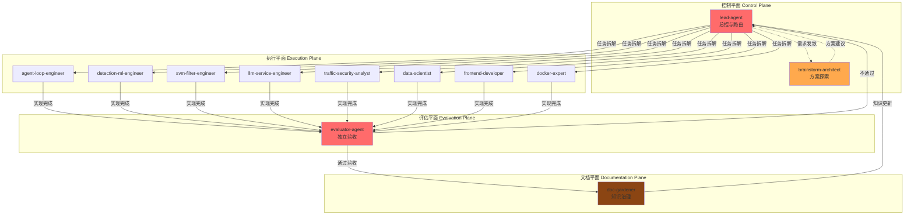
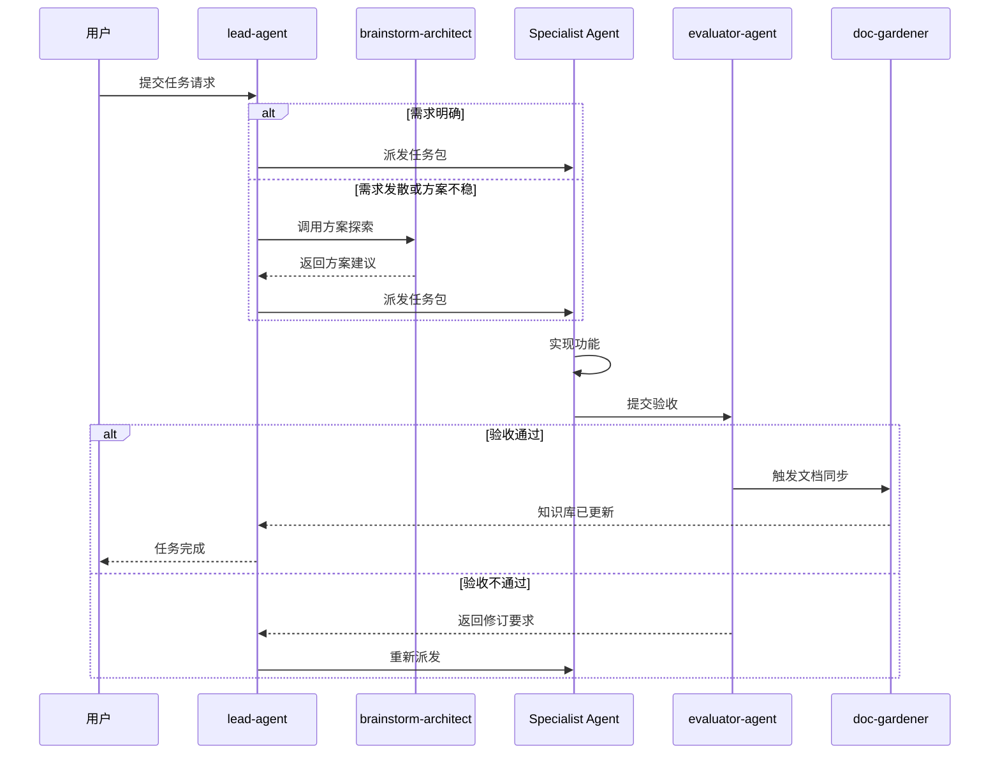
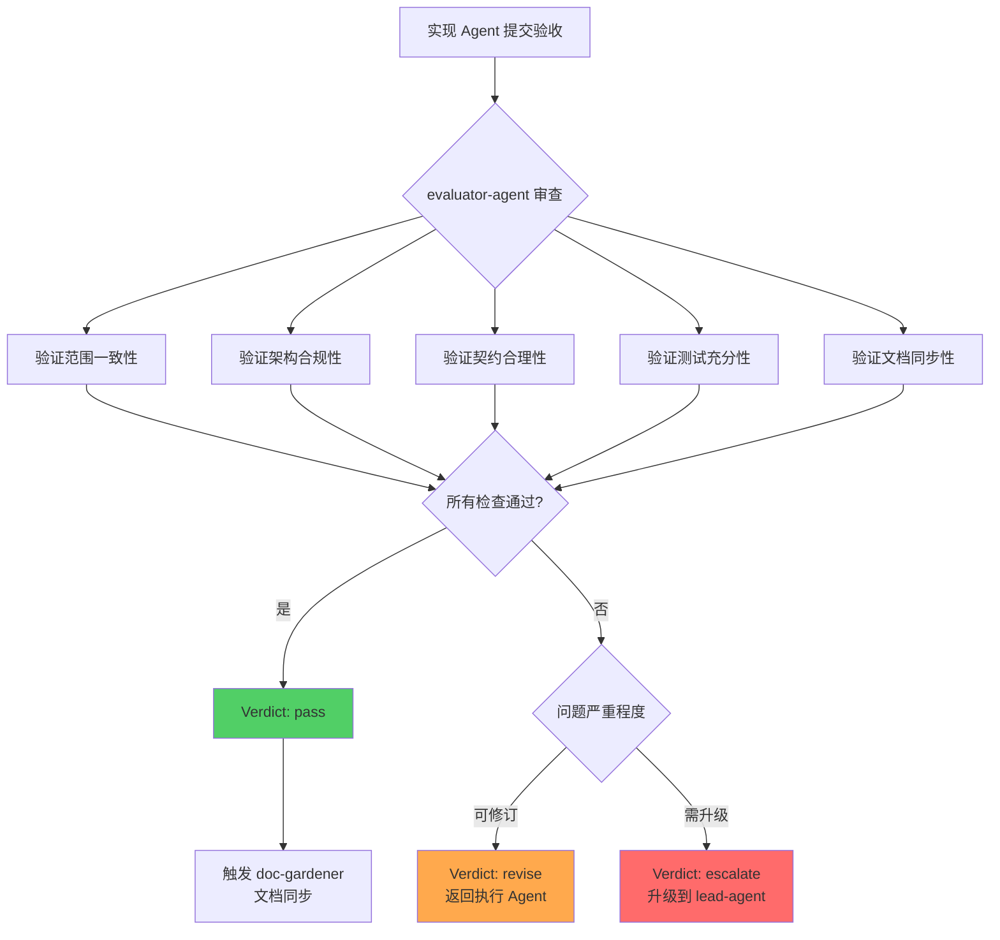

本页深入解析探微项目的 Agent Harness 协作体系，这套体系基于 OpenAI 的 Harness Engineering 原则构建，通过分层角色设计、强制交接机制和独立验收流程，确保多 Agent 协作的可靠性与知识沉淀的完整性。这套工作流的核心价值在于将人类意图转化为可执行的精细化任务，同时通过制度化的知识治理防止架构腐化和文档漂移。

Sources: [harness-engineering.md](docs/references/harness-engineering.md#L1-L60), [agent-harness.md](docs/references/agent-harness.md#L1-L79)

## 核心原则与设计哲学

探微项目的 Agent Harness 遵循五大原则：**Humans steer, Agents execute** —— 人类掌控方向，Agent 负责执行；**Repository knowledge is the system of record** —— 仓库知识是唯一真值源，所有架构决策、约束和规范都必须以仓库文件形式存在；**Evaluation must be independent from implementation** —— 验收必须独立于实现，防止自我批准和虚假完成；**Architecture and taste should be enforced mechanically** —— 架构和品味应通过机制强制执行，而非依赖记忆或自觉；**Repeated failures should tighten the harness** —— 重复失败应强化 Harness 而非单纯重试，将失败转化为新的文档、检查或工具。这些原则共同构成了一个自我进化的协作框架，确保 Agent 团队能够持续交付高质量成果。

Sources: [harness-engineering.md](docs/references/harness-engineering.md#L16-L24), [agent-operating-model.md](docs/design-docs/agent-operating-model.md#L10-L17)

## 四层架构设计

Agent Harness 采用分层架构组织不同职责的 Agent，每层各司其职形成清晰的权力边界与协作接口。控制平面包含 `lead-agent` 和 `brainstorm-architect`，负责任务拆解、路由决策和方案探索；执行平面由 8 个领域专家 Agent 组成，每个 Agent 拥有明确的服务所有权和修改边界；评估平面仅包含 `evaluator-agent`，专门负责独立验收和质量把关；文档平面由 `doc-gardener` 独占，负责知识库同步和计划生命周期管理。这种分层设计确保了权力制衡，避免了单一 Agent 权力过大或责任模糊。

Sources: [agent-operating-model.md](docs/design-docs/agent-operating-model.md#L19-L42)



## 默认工作流与强制交接

探微项目定义了标准化的 Agent 协作流程，确保每个任务都经历完整的生命周期。默认入口是 `lead-agent`，它负责将模糊的用户需求拆解为具有明确范围、约束和验收标准的任务包；当需求发散或方案不稳时，`lead-agent` 会先调用 `brainstorm-architect` 进行方案探索；任务包随后派发给对应的领域专家 Agent；实现完成后必须进入 `evaluator-agent` 进行独立验收；通过验收后触发 `doc-gardener` 更新知识库和计划状态；最后由 `lead-agent` 决定是否进入下一轮迭代。这套流程强制实现了实现与验收的分离，并通过文档同步环节确保仓库知识始终保持最新状态。

Sources: [agent-operating-model.md](docs/design-docs/agent-operating-model.md#L44-L57), [agent-harness.md](docs/references/agent-harness.md#L36-L45)



## 路由矩阵与触发规则

每个任务都会根据其性质路由到最合适的 Agent，探微项目定义了精确的路由矩阵。只有在任务天然单域且边界明确时，才允许绕过 `lead-agent` 直接点名执行 Agent，否则所有跨容器任务、计划拆解和 Harness 修订都必须经过 `lead-agent` 分发。这套路由机制确保了复杂任务能够得到合理的拆解和分配，同时为简单任务保留了快速通道。

Sources: [agent-harness.md](docs/references/agent-harness.md#L28-L35)

| 场景 | 默认 Agent | 服务所有权 | 典型任务 |
|------|------------|------------|----------|
| 跨容器任务、计划拆解、harness 修订 | `lead-agent` | 控制面治理 | 任务拆解、路由决策、Harness 维护 |
| 方案比较、优化建议、定期扫描 | `brainstorm-architect` | 方案探索 | 技术债扫描、架构优化建议 |
| `agent-loop/` 编排与服务契约 | `agent-loop-engineer` | 编排服务 | 五阶段工作流维护、服务契约管理 |
| SVM 训练、特征工程、离线评估 | `detection-ml-engineer` | 离线模型 | 模型训练、特征工程、Artifact 评估 |
| `svm-filter-service/` 在线推理 | `svm-filter-engineer` | 在线推理 | 推理服务优化、性能调优 |
| `llm-service/` 推理服务与输出契约 | `llm-service-engineer` | LLM 服务 | 模型部署、提示词工程 |
| 流量语义、标签、误报漏报分析 | `traffic-security-analyst` | 流量分析 | 安全分析、标签策略 |
| 数据分析、实验设计、统计对比 | `data-scientist` | 数据科学 | 实验设计、统计分析 |
| `edge-test-console/` 前端与其控制台后端 | `frontend-developer` | 前端应用 | 界面开发、可视化实现 |
| Dockerfile、compose、运行边界 | `docker-expert` | 容器配置 | 部署优化、容器编排 |
| 独立验收 | `evaluator-agent` | 质量把关 | 实现验收、架构验证 |
| 文档同步、计划归档、技术债记录 | `doc-gardener` | 知识治理 | 文档更新、计划维护 |

## 任务包结构与最小输入

每个执行 Agent 接单时都必须接收结构化的任务包，这套标准化的输入格式确保了信息传递的完整性和可追溯性。任务包包含四个必填字段：**task** 明确要完成什么工作；**scope** 界定允许修改哪些目录或服务，防止越权修改；**constraints** 列出不可突破的架构、性能、依赖和安全红线；**acceptance** 定义需要提交什么完成证据，使验收有据可依。这种结构化的任务定义方式消除了模糊性，使每个 Agent 都能清晰地理解自己的职责边界和成功标准。

Sources: [agent-operating-model.md](docs/design-docs/agent-operating-model.md#L59-L65), [lead-agent.md](.claude/agents/lead-agent.md#L29-L50)

```markdown
### 任务包模板

**Owner**: `agent-name`

**Task**: 要完成什么工作（一句话说明核心目标）

**Scope**: 允许修改哪些文件或目录（明确边界）

**Constraints**: 不可突破的红线（架构约束、性能要求、依赖限制、安全要求）

**Acceptance**: 需要提交什么完成证据（测试结果、API 契约、文档更新、风险说明）
```

## 独立验收与质量门控

`evaluator-agent` 是探微项目质量保证体系的核心，它独立于实现 Agent 之外，专门负责防止自我批准和虚假完成。验收过程遵循严格的标准：验证范围是否与任务包一致，架构是否符合项目约束，契约变更是否合理，测试证据是否充分，文档是否同步更新。验收结果分为三级：**pass** 表示通过验收可进入文档同步；**revise** 表示需要返回执行 Agent 修订；**escalate** 表示问题严重需要升级到 `lead-agent` 处理。关键的是，`evaluator-agent` 在验收过程中不得同时承担实现职责，确保了评估的独立性和公正性。

Sources: [evaluator-agent.md](.claude/agents/evaluator-agent.md#L1-L80), [agent-operating-model.md](docs/design-docs/agent-operating-model.md#L72-L78)



## 文档治理与知识沉淀

`doc-gardener` 承担着探微项目知识系统的治理职责，确保仓库作为系统记录的真实性。当行为、架构、工作流、计划或 Harness 文档发生变化时，必须通过 `doc-gardener` 将知识库拉回同步状态。文档治理遵循最小修改原则：只更新恢复真相所需的最小连贯文档集，避免过度重构或泛化。文档系统分为四个层次：`CLAUDE.md` 仅保留地图和红线约束；`docs/design-docs/` 存放架构、边界和核心原则；`docs/exec-plans/` 管理当前计划、归档计划和技术债；`docs/references/` 提供 Agent 可直接消费的操作手册。这套分层文档体系确保了知识的渐进展开和精确定位。

Sources: [doc-gardener.md](.claude/agents/doc-gardener.md#L1-L58), [agent-harness.md](docs/references/agent-harness.md#L60-L71)

## 持久化记忆系统

每个 Agent 都拥有独立的持久化记忆系统，存储在 `.claude/agent-memory/<agent-name>/` 目录下。记忆分为四种类型：**user** 记录用户的角色、偏好和知识背景；**feedback** 记录用户的纠正和确认，形成行为指南；**project** 记录项目进展、决策和约束的临时信息；**reference** 记录外部系统的指针。关键原则是仓库文件永远是真值源，记忆只是补充上下文，不能替代仓库文档。记忆系统遵循严格的保存协议：每条记忆独立成文件，通过 `MEMORY.md` 索引，保持简洁和可检索性。

Sources: [lead-agent.md](.claude/agents/lead-agent.md#L99-L200)

| 记忆类型 | 用途 | 保存时机 | 示例 |
|---------|------|---------|------|
| **user** | 用户画像、偏好、知识背景 | 学习到用户的任何细节时 | "用户是数据科学家，首次接触 React 前端" |
| **feedback** | 行为指导和纠正 | 用户纠正或确认非显而易见的做法时 | "集成测试必须使用真实数据库而非模拟" |
| **project** | 项目进展、决策、约束 | 了解谁在做什么、为什么、何时完成时 | "2026-03-05 开始冻结非关键合并" |
| **reference** | 外部系统指针 | 发现外部系统资源及其用途时 | "Pipeline bugs 在 Linear 项目 INGEST 中追踪" |

## 异常处理与升级机制

探微项目的 Agent Harness 定义了明确的异常处理规则，确保复杂情况能够得到正确处理。跨多个服务或跨多个角色的任务必须由 `lead-agent` 拆解，避免单一 Agent 负担过重；实现 Agent 不得自我验收，必须通过独立的 `evaluator-agent`；行为改变但文档未更新视为未完成，必须触发 `doc-gardener`；同类错误反复出现时必须补充 Harness，而非继续裸重试。这套升级机制确保了系统能够从失败中学习，不断强化自身的约束和检查能力。

Sources: [agent-operating-model.md](docs/design-docs/agent-operating-model.md#L67-L78)

## 周期性维护任务

探微项目建议定期触发两类维护任务，保持仓库的健康状态。`brainstorm-architect` 负责扫描技术债、重复失败模式、文档漂移热点，并提出优化建议，这类扫描能够发现潜在问题并提供改进方向；`doc-gardener` 负责清理过时文档、更新计划状态、补齐新沉淀的仓库知识，确保知识库与实际实现保持一致。这两类任务共同构成了系统的自我维护能力，防止技术债累积和知识腐化。

Sources: [agent-harness.md](docs/references/agent-harness.md#L73-L79)

## 实践案例：跨服务功能开发

假设用户请求"添加一个新的检测阶段用于分析 DNS 流量"，这涉及多个服务的修改，应遵循完整的 Harness 工作流。首先，`lead-agent` 接收请求后进行任务拆解：识别涉及的服务包括 `agent-loop`（编排层）、`svm-filter-service`（特征提取）和 `llm-service`（推理）；定义每个 Agent 的任务包、范围和约束；明确验收标准需要端到端测试和文档更新。任务包随后派发给 `agent-loop-engineer` 负责编排逻辑，`detection-ml-engineer` 负责 DNS 特征工程，`llm-service-engineer` 负责提示词调整。实现完成后，`evaluator-agent` 验证架构合规性、契约一致性和测试覆盖，确保五阶段工作流未被破坏且资源红线未被突破。通过验收后，`doc-gardener` 更新架构文档、API 规范和执行计划，完成知识沉淀。

Sources: [agent-operating-model.md](docs/design-docs/agent-operating-model.md#L44-L57)

## 最佳实践与反模式警示

成功的 Agent Harness 协作需要遵循若干最佳实践。始终从 `lead-agent` 开始，除非任务天然单域且边界明确；每个任务包都必须包含完整的 task、scope、constraints 和 acceptance 字段；实现完成后立即进入 `evaluator-agent`，不要跳过独立验收环节；行为变化后立即触发 `doc-gardener`，防止文档漂移；重复失败时优先补充 Harness 而非继续重试。需要避免的反模式包括：实现 Agent 自我验收、绕过 `lead-agent` 直接处理跨服务任务、文档未更新就宣布完成、对同一失败无休止重试而不改进 Harness。这些反模式会破坏协作的可靠性和知识的完整性。

Sources: [agent-harness.md](docs/references/agent-harness.md#L36-L45), [harness-engineering.md](docs/references/harness-engineering.md#L43-L50)

## 下一步学习

掌握了 Agent Harness 协作工作流后，建议继续阅读以下页面以深入理解系统架构和具体实现：[四容器拓扑与微服务架构](4-si-rong-qi-tuo-bu-yu-wei-fu-wu-jia-gou) 了解各服务的拓扑关系；[Agent-Loop 主控服务与工作流编排](7-agent-loop-zhu-kong-fu-wu-yu-gong-zuo-liu-bian-pai) 理解编排层的实现细节；[服务间 API 接口规范](14-fu-wu-jian-api-jie-kou-gui-fan) 掌握服务契约的定义标准；[部署指南与环境配置](15-bu-shu-zhi-nan-yu-huan-jing-pei-zhi) 了解如何在生产环境中应用这些工作流。