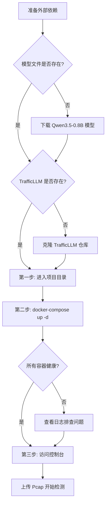
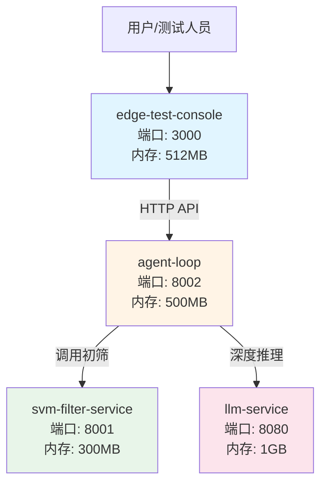

探微作为边缘智能体本地闭环验证平台，采用四容器微服务架构实现威胁检测与带宽压降，本指南将引导您在 15 分钟内完成从环境准备到系统运行的全流程部署。系统核心价值在于通过四级漏斗过滤机制，将原始流量转换为 JSON 威胁情报，实现 70% 以上的带宽压降，所有推理均在边缘设备本地完成，无需云端依赖。Sources: [README.md](README.md#L1-L31), [docker-compose.yml](docker-compose.yml#L1-L10)

## 环境要求与前置条件

部署探微系统前需要满足硬件、软件和网络三方面的基本要求，这些限制条件来源于边缘设备的物理约束和四容器微服务架构的资源隔离策略。

### 硬件要求

| 环境 | CPU | 内存 | 磁盘 | 适用场景 |
|------|-----|------|------|----------|
| 开发环境 | 2 核 | 4 GB | 10 GB | 基本功能验证 |
| 测试环境 | 4 核 | 8 GB | 20 GB | 性能测试与负载评估 |
| 生产环境 | 4 核+ | 8 GB+ | 50 GB | 实际流量处理 |

Sources: [deployment.md](docs/references/deployment.md#L19-L26)

### 软件要求

| 软件 | 最低版本 | 推荐版本 | 验证命令 |
|------|----------|----------|----------|
| Docker | 20.10 | 24.0+ | `docker --version` |
| Docker Compose | 2.0 | 2.20+ | `docker-compose --version` |
| Linux Kernel | 4.18 | 5.10+ | `uname -r` |

Sources: [deployment.md](docs/references/deployment.md#L28-L33)

### 网络端口规划

四容器架构需要预留以下端口用于服务间通信和外部访问，确保防火墙规则允许相应端口的监听与连接。

| 端口 | 服务 | 协议 | 访问范围 |
|------|------|------|----------|
| 3000 | Web 控制台 | HTTP | 外部访问 |
| 8001 | SVM 过滤服务 | HTTP | 内部调用 |
| 8002 | Agent 主控服务 | HTTP | 内部调用 |
| 8080 | LLM 推理服务 | HTTP | 内部调用 |

Sources: [deployment.md](docs/references/deployment.md#L35-L41), [docker-compose.yml](docker-compose.yml#L17-L21)

## 外部依赖准备（第零步）

在正式部署前三步之前，必须完成两个关键外部依赖的准备：边缘推理模型文件和流量分词器库。这两个组件不属于 Git 仓库版本控制范围，需要独立下载并放置到指定目录。

### 模型文件下载与配置

探微系统使用 Qwen3.5-0.8B INT4 量化模型作为边缘推理引擎，该模型文件约 508MB，支持纯 CPU 推理并严格限制内存占用在 1GB 以内。

**下载地址**：
- ModelScope: `https://www.modelscope.cn/models/unsloth/Qwen3.5-0.8B-GGUF/file/view/master/Qwen3.5-0.8B-Q4_K_M.gguf`
- HuggingFace: `https://huggingface.co/second-state/Qwen3.5-0.8B-GGUF`

**目录结构要求**：
```
/root/anxun/
├── qwen3.5-0.8b/
│   └── Qwen3.5-0.8B-Q4_K_M.gguf  # 模型文件
```

Sources: [README.md](README.md#L46-L49), [docker-compose.yml](docker-compose.yml#L17-L21)

### TrafficLLM 分词器库

TrafficLLM 是流量跨模态对齐的关键依赖，用于将网络流量包转换为 LLM 可理解的 Token 序列。该库需要从官方仓库克隆到项目根目录。

**克隆命令**：
```bash
cd /root/anxun
git clone https://github.com/your-org/TrafficLLM.git TrafficLLM-master
```

Sources: [architecture.md](docs/design-docs/architecture.md#L83-L84), [docker-compose.yml](docker-compose.yml#L61-L62)

## 三步部署流程

完成外部依赖准备后，部署流程简化为三个标准步骤：进入项目目录、启动服务栈、访问控制台。Docker Compose 编排引擎将自动处理容器构建、网络配置和健康检查。



### 第一步：进入项目目录

确保当前工作目录位于项目根路径，所有后续命令均在此目录下执行。

```bash
cd /root/anxun
```

Sources: [README.md](README.md#L53-L54)

### 第二步：启动所有服务

使用 Docker Compose 一键启动四容器服务栈，编排引擎将按照依赖关系顺序启动：LLM 服务 → SVM 服务 → Agent 服务 → 控制台服务。

```bash
docker-compose up -d
```

**启动顺序说明**：
1. **llm-service**：优先启动，需要加载模型文件（约 30-60 秒）
2. **svm-filter-service**：加载预训练的 SVM 模型（约 10 秒）
3. **agent-loop**：依赖前两者健康检查通过后启动
4. **edge-test-console**：最后启动，提供用户交互界面

Sources: [README.md](README.md#L56-L57), [docker-compose.yml](docker-compose.yml#L102-L166)

### 第三步：访问 Web 控制台

服务启动完成后，通过浏览器访问测试控制台，这是系统的唯一用户入口。

```
http://localhost:3000
```

Sources: [README.md](README.md#L59-L62)

## 服务验证与健康检查

完成三步部署后，需要验证所有服务的运行状态和健康指标，确保四容器拓扑正常工作。

### 容器状态检查

```bash
# 查看所有容器运行状态
docker-compose ps

# 预期输出：所有容器状态为 "healthy" 或 "running"
```

Sources: [README.md](README.md#L65-L66)

### 端点健康检查

每个服务都暴露 `/health` 端点用于存活探针检查，可通过 curl 命令逐个验证。

```bash
# LLM 推理服务健康检查
curl http://localhost:8080/health

# SVM 过滤服务健康检查
curl http://localhost:8001/health

# Agent 主控服务健康检查
curl http://localhost:8002/health

# Web 控制台健康检查
curl http://localhost:3000/health
```

Sources: [README.md](README.md#L68-L73), [docker-compose.yml](docker-compose.yml#L23-L26)

### 查看服务日志

如遇启动失败或运行异常，可通过日志排查具体问题。

```bash
# 查看所有服务日志
docker-compose logs -f

# 查看特定服务日志
docker-compose logs -f llm-service
docker-compose logs -f agent-loop
```

Sources: [deployment.md](docs/references/deployment.md#L78-L81)

## 四容器架构概览

探微系统采用四容器微服务架构，每个容器承担特定职责并通过单向调用链形成漏斗式过滤管道。理解架构拓扑有助于排查部署问题和性能优化。



Sources: [architecture.md](docs/design-docs/architecture.md#L9-L32), [docker-compose.yml](docker-compose.yml#L11-L100)

### 容器职责与资源限制

| 容器名称 | 核心职责 | 内存限制 | 技术栈 |
|----------|----------|----------|--------|
| llm-service | 本地推理引擎，提供 Qwen3.5-0.8B API | 1GB | llama.cpp server (C/C++) |
| svm-filter-service | 前置过滤，微秒级二分类 | 300MB | FastAPI + scikit-learn |
| agent-loop | 主控大脑，五阶段工作流编排 | 500MB | FastAPI + scapy |
| edge-test-console | 用户界面与测试探针 | 512MB | React 18 + TypeScript |

Sources: [docker-compose.yml](docker-compose.yml#L11-L100), [README.md](README.md#L35-L40)

### 通信边界约束

系统采用严格的单向调用链设计，防止跨级调用绕过审计机制，这是边缘智能体安全架构的核心原则。

```
✅ 允许的调用路径：
edge-test-console → agent-loop → svm-filter-service
edge-test-console → agent-loop → llm-service

❌ 禁止的跨级调用：
edge-test-console → svm-filter-service  (绕过主控)
edge-test-console → llm-service         (绕过主控)
svm-filter-service → llm-service        (破坏漏斗结构)
```

Sources: [architecture.md](docs/design-docs/architecture.md#L45-L59)

## 常见问题与故障排查

部署过程中可能遇到的问题及其解决方案，涵盖模型加载、网络配置、资源限制等典型场景。

### 模型文件加载失败

**症状**：llm-service 容器反复重启，日志显示模型文件找不到

**排查步骤**：
```bash
# 1. 检查模型文件是否存在
ls -la /root/anxun/qwen3.5-0.8b/Qwen3.5-0.8B-Q4_K_M.gguf

# 2. 检查文件大小（应为约 508MB）
du -h /root/anxun/qwen3.5-0.8b/Qwen3.5-0.8B-Q4_K_M.gguf

# 3. 检查 Docker Compose 挂载配置
docker-compose config | grep -A 5 "volumes"
```

**解决方案**：确保模型文件路径正确且文件完整，必要时重新下载。

Sources: [docker-compose.yml](docker-compose.yml#L17-L21), [deployment.md](docs/references/deployment.md#L45-L50)

### 内存不足导致容器 OOM

**症状**：容器被强制终止，`docker-compose ps` 显示 Exit code 137

**排查步骤**：
```bash
# 查看容器内存使用情况
docker stats

# 检查系统总内存
free -h

# 检查 Docker 内存限制
docker-compose config | grep -A 3 "deploy"
```

**解决方案**：增加系统内存或降低容器的 `memory` 限制配置。

Sources: [deployment.md](docs/references/deployment.md#L19-L26), [docker-compose.yml](docker-compose.yml#L25-L28)

### 健康检查超时

**症状**：容器显示 "health: starting" 状态长时间不变化

**排查步骤**：
```bash
# 查看健康检查日志
docker inspect tanwei-llm-service | grep -A 10 "Health"

# 手动执行健康检查命令
docker exec tanwei-llm-service curl -f http://localhost:8080/health

# 延长健康检查等待时间（修改 docker-compose.yml）
# start_period: 90s  # 从 60s 增加到 90s
```

**解决方案**：首次启动模型加载较慢，可适当延长 `start_period` 配置。

Sources: [docker-compose.yml](docker-compose.yml#L23-L26), [deployment.md](docs/references/deployment.md#L75-L78)

### 端口冲突

**症状**：容器启动失败，报错 "port is already allocated"

**排查步骤**：
```bash
# 检查端口占用情况
netstat -tlnp | grep -E '3000|8001|8002|8080'

# 停止占用端口的进程
kill -9 <PID>

# 或修改 docker-compose.yml 中的端口映射
```

**解决方案**：停止冲突服务或修改端口映射配置。

Sources: [deployment.md](docs/references/deployment.md#L35-L41)

## 下一步阅读建议

完成快速部署后，建议按以下路径深入理解系统架构和工作原理：

| 学习目标 | 推荐阅读 | 预计时间 |
|----------|----------|----------|
| 理解演示流程与样本库 | [演示样本库使用](3-yan-shi-yang-ben-ku-shi-yong) | 10 分钟 |
| 深入架构设计原理 | [四容器拓扑与微服务架构](4-si-rong-qi-tuo-bu-yu-wei-fu-wu-jia-gou) | 20 分钟 |
| 掌握五阶段检测流程 | [五阶段检测工作流](5-wu-jie-duan-jian-ce-gong-zuo-liu) | 15 分钟 |
| API 接口开发参考 | [服务间 API 接口规范](14-fu-wu-jian-api-jie-kou-gui-fan) | 25 分钟 |