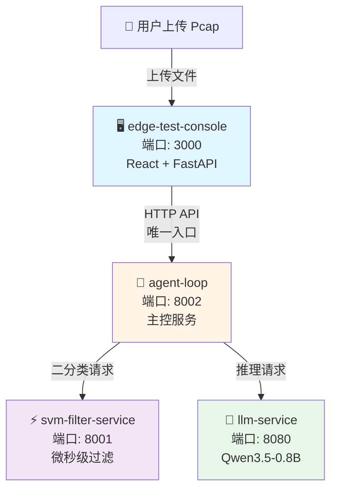
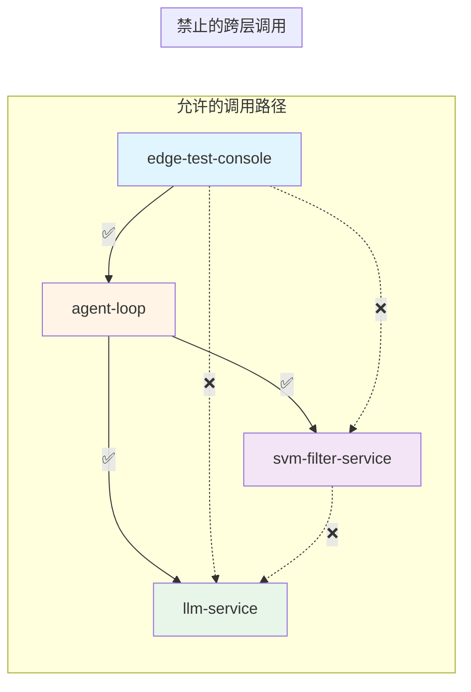

探微（Tanwei）系统采用**四容器微服务架构**，将边缘计算场景下的资源约束、安全边界与实时性要求深度融合。这套架构的核心设计理念是：**通过单向调用链确保审计完整性，通过漏斗式过滤实现资源效率最大化**，从而在边缘设备的有限算力下完成从原始流量到威胁情报的完整闭环。每个容器都承担特定的工程职责，形成清晰的责任边界与技术栈隔离。

Sources: [docker-compose.yml](docker-compose.yml#L1-L166)

## 架构全景与容器职责矩阵

在深入理解每个容器的技术细节之前，需要建立整体架构的空间认知。下图展示了四个容器如何通过**单向调用链**形成漏斗式处理流水线：边缘测试控制台作为唯一入口接收流量样本，主控服务（agent-loop）协调整个工作流，前置过滤服务（svm-filter-service）快速丢弃正常流量，LLM 推理引擎（llm-service）对可疑样本进行深度语义分析。这种拓扑结构确保了每个请求都经过完整的审计路径，同时通过**渐进式过滤**避免将宝贵的算力浪费在无害流量上。



Sources: [architecture.md](docs/design-docs/architecture.md#L11-L32)

## 四容器技术栈与资源规格

| 容器名称 | 核心职责 | 技术栈 | 内存上限 | 内存预留 | 暴露端口 | 关键配置 |
|---------|---------|--------|---------|---------|---------|---------|
| **llm-service** | LLM 推理引擎，提供本地化语义分析能力 | llama.cpp server (C/C++) | 1GB | 512MB | 8080 | ctx-size=2048, threads=2, Q4_K_M 量化 |
| **svm-filter-service** | 前置轻量级过滤器，微秒级二分类 | Python 3.10-slim + FastAPI + scikit-learn | 300MB | 128MB | 8001 | 32 维特征向量，线性 SVM 模型 |
| **agent-loop** | 主控服务，编排五阶段工作流 | Python 3.10-slim + FastAPI + scapy | 500MB | 256MB | 8002 | 时间窗口 60s，最大包数 10，Token 上限 690 |
| **edge-test-console** | 测试控制台与可视化界面 | React 18 (前端) + FastAPI (后端代理) | 512MB | 256MB | 3000 | 演示样本库支持，实时状态轮询 |

这套资源配置的设计哲学是**在边缘设备的资源约束下实现最大检测效能**：LLM 服务虽然需要 1GB 内存，但通过 llama.cpp 的纯 C/C++ 实现避免了 Python 解释器的开销；SVM 服务仅需 300MB 内存却承担了过滤 99% 正常流量的重任；主控服务的 500MB 内存需要同时处理流重组、特征提取与服务编排；测试控制台虽然是全栈应用，但前后端分离的架构使其能够充分利用容器资源。

Sources: [docker-compose.yml](docker-compose.yml#L11-L97)

## 通信边界约束与单向调用链

四容器架构的核心安全机制是**严格的单向调用链**，这不仅是技术实现细节，更是审计完整性的制度保障。所有外部请求必须经过统一入口，确保每个流量样本都经过主控服务的完整审计流程。下图清晰地展示了允许与禁止的调用路径，其中绿色实线表示合法的服务间通信，红色虚线表示被架构明确禁止的跨层调用。



**架构约束的核心逻辑**：测试控制台只能与主控服务通信，禁止直接调用 SVM 或 LLM 服务，这确保了所有流量样本都被主控服务记录和审计；SVM 服务与 LLM 服务之间不允许直接通信，避免了绕过主控协调的并行处理；主控服务作为唯一的中枢节点，负责编排整个五阶段工作流并维护完整的处理日志。这种拓扑结构虽然牺牲了一定的灵活性，但换来了**可预测的性能边界**和**完整的审计链路**。

Sources: [architecture.md](docs/design-docs/architecture.md#L47-L61)

## 容器启动顺序与健康检查机制

微服务架构的关键挑战之一是**服务依赖的正确编排**。探微系统通过 Docker Compose 的 `depends_on` 与 `healthcheck` 组合实现了优雅的启动顺序：LLM 服务首先启动并进行长达 60 秒的健康检查等待模型加载；SVM 服务并行启动并快速通过 10 秒的健康检查；当两个基础服务都进入健康状态后，主控服务才会启动并建立与它们的连接；最后测试控制台等待主控服务健康后启动。这种依赖链确保了系统在启动时不会出现连接失败或服务不可用的错误。

```yaml
# llm-service 启动配置示例
services:
  llm-service:
    healthcheck:
      test: ["CMD", "curl", "-f", "http://localhost:8080/health"]
      interval: 30s
      timeout: 10s
      start_period: 60s  # 允许 60 秒模型加载时间
      retries: 5
  
  agent-loop:
    depends_on:
      llm-service:
        condition: service_healthy  # 必须等待 LLM 服务健康
      svm-filter-service:
        condition: service_healthy  # 必须等待 SVM 服务健康
```

健康检查机制不仅服务于启动阶段，还在运行时提供**自动故障检测**。每个容器都配置了 30 秒间隔的健康检查，一旦某个服务连续失败超过重试次数，Docker 将根据 `restart: "no"` 策略停止容器（生产环境可配置为 `on-failure` 或 `always`），避免级联故障扩散到整个系统。

Sources: [docker-compose.yml](docker-compose.yml#L28-L37)

## LLM 服务：边缘推理的技术突破

llm-service 容器是整个架构的**技术亮点**，它在 1GB 内存约束下实现了本地化的 0.8B 参数模型推理。这得益于三个关键工程决策：**llama.cpp 的纯 C/C++ 实现**避免了 Python 解释器的内存开销（通常需要额外 200-400MB）；**Q4_K_M 量化**将模型体积压缩到原大小的约 25%，同时保持接近原始精度的推理质量；**ctx-size=2048 的上下文窗口**限制了推理时的 KV Cache 大小，确保内存消耗可预测。这种技术组合使得边缘设备能够运行原本需要 4GB 以上内存的大语言模型。

```
# llama.cpp server 启动参数解析
--model /models/Qwen3.5-0.8B-Q4_K_M.gguf  # 量化模型文件路径
--host 0.0.0.0                            # 监听所有网络接口
--port 8080                               # 服务端口
--ctx-size 2048                           # 上下文窗口大小（影响 KV Cache 内存）
--n-gpu-layers 0                          # 禁用 GPU 加速（边缘设备兼容性）
--threads 2                               # CPU 线程数
--memory-f32 0                            # 禁用 F32 内存格式，节省内存
```

容器构建采用了**多阶段构建**策略：第一阶段在 Ubuntu 22.04 环境中从源码编译 llama.cpp，确保可执行文件的架构兼容性；第二阶段仅复制编译产物和必要的运行时依赖（curl、ca-certificates），最终镜像体积控制在 200MB 以内。这种构建方式避免了在运行时镜像中保留编译工具链，既减少了安全攻击面，又降低了镜像拉取时间。

Sources: [Dockerfile](llm-service/Dockerfile#L1-L52), [docker-compose.yml](docker-compose.yml#L11-L37)

## SVM 过滤服务：微秒级漏斗的第一道防线

svm-filter-service 是整个架构的**性能瓶颈破解者**，它通过预先训练的线性 SVM 模型实现了微秒级的二分类推理。在五阶段工作流中，它承担着**过滤 99% 高置信度正常流量**的重任，只有那些被标记为可疑的流量才会进入 LLM 深度分析阶段。这种漏斗式设计使得系统在保持高召回率的同时，将昂贵的 LLM 推理资源集中在最有价值的样本上。

```python
# 32 维特征向量结构（来自 dataset-feature-engineering.md）
FEATURE_NAMES = [
    # A. 基础统计特征 (0-7)
    "avg_packet_len", "std_packet_len", "avg_ip_len", "std_ip_len",
    "avg_tcp_len", "std_tcp_len", "total_bytes", "avg_ttl",
    # B. 协议类型特征 (8-11)
    "ip_proto", "tcp_ratio", "udp_ratio", "other_proto_ratio",
    # C. TCP 行为特征 (12-19)
    "avg_window_size", "std_window_size", "syn_count", "ack_count",
    "push_count", "fin_count", "rst_count", "avg_hdr_len",
    # D. 时间特征 (20-23)
    "total_duration", "avg_inter_arrival", "std_inter_arrival", "packet_rate",
    # E. 端口特征 (24-27)
    "src_port_entropy", "dst_port_entropy", "well_known_port_ratio", "high_port_ratio",
    # F. 地址特征 (28-31)
    "unique_dst_ip_count", "internal_ip_ratio", "df_flag_ratio", "avg_ip_id"
]
```

服务的实现采用了**极简主义设计原则**：FastAPI 提供高性能的异步 HTTP 服务，joblib 加载预训练的 scikit-learn 模型，StandardScaler 进行特征归一化，整个推理链路在内存中完成，无需数据库或磁盘 I/O。API 响应模型明确规定了 `prediction`（0 或 1）、`label`（normal 或 anomaly）、`confidence`（0.0 到 1.0）和 `latency_ms`（毫秒级延迟）四个字段，使得服务消费者能够精确评估过滤结果。

Sources: [main.py](svm-filter-service/app/main.py#L82-L114), [main.py](svm-filter-service/app/main.py#L116-L123)

## 主控服务：五阶段工作流的编排中枢

agent-loop 容器是整个系统的**大脑**，它不仅负责接收测试控制台的流量样本，还编排着完整的五阶段检测工作流：**流重组 → 双重截断 → SVM 初筛 → 流量分词 → LLM 推理**。每个阶段都有明确的资源边界和输出约束，确保整个处理过程在边缘设备的算力和内存约束下可靠运行。主控服务通过 `flow_processor` 模块实现五元组流重组和特征提取，通过 `traffic_tokenizer` 模块将网络流量转换为 LLM 可理解的文本格式。

```python
# 核心配置参数（来自环境变量）
SVM_SERVICE_URL = os.environ.get("SVM_SERVICE_URL", "http://svm-filter-service:8001")
LLM_SERVICE_URL = os.environ.get("LLM_SERVICE_URL", "http://llm-service:8080")
MAX_TIME_WINDOW = int(os.environ.get("MAX_TIME_WINDOW", "60"))      # 时间窗口最大值
MAX_PACKET_COUNT = int(os.environ.get("MAX_PACKET_COUNT", "10"))    # 最大包数量
MAX_TOKEN_LENGTH = int(os.environ.get("MAX_TOKEN_LENGTH", "690"))   # Token 上限
```

主控服务的异步任务模型采用**内存字典存储**（`tasks: Dict[str, Task]`），通过 `task_id` 追踪每个检测任务的进度和状态。任务阶段枚举（`TaskStage`）明确定义了 `PENDING`、`FLOW_RECONSTRUCTION`、`SVM_FILTERING`、`LLM_INFERENCE`、`COMPLETED`、`FAILED` 六种状态，使得测试控制台能够通过 `/api/status/{task_id}` 端点实时查询处理进度。生产环境建议将任务状态迁移到 Redis 或数据库，以支持容器重启后的状态恢复。

Sources: [main.py](agent-loop/app/main.py#L48-L61), [main.py](agent-loop/app/main.py#L67-L88)

## 测试控制台：全栈可视化与演示样本库

edge-test-console 容器是系统的**用户界面层**，它采用前后端分离架构实现测试发包探针与 Demo 演示看板的融合。后端 FastAPI 服务承担两个核心职责：**静态资源托管**（将 React 构建产物作为静态文件服务）和**API 代理转发**（将文件上传请求转发给主控服务，并轮询任务状态）。前端 React 18 应用提供文件上传、实时进度展示和检测结果可视化界面。

```python
# 后端代理逻辑核心片段
async def process_detection(task_id: str, file_path: Path, original_size: int):
    # 第一阶段：流重组
    tasks[task_id]["stage"] = "flow_reconstruction"
    tasks[task_id]["progress"] = 10
    tasks[task_id]["message"] = "正在提取五元组、重组流"
    
    # 第二阶段：SVM 过滤
    tasks[task_id]["stage"] = "svm_filtering"
    tasks[task_id]["progress"] = 30
    tasks[task_id]["message"] = "SVM 初筛丢弃正常流量"
    
    # 调用主控服务并轮询状态
    response = requests.post(f"{AGENT_LOOP_URL}/api/detect", files=files, timeout=300)
```

控制台集成了**演示样本库**功能，支持从 `data/test_traffic/demo_show` 目录加载预置的 Pcap 文件。用户无需准备真实的流量样本，即可通过演示样本库快速体验完整的检测流程。后端通过 `DEMO_SAMPLES_DIR` 环境变量支持自定义样本库路径，并通过文件名规范化（`build_display_name` 函数）将文件名转换为可读的展示名称。

Sources: [main.py](edge-test-console/backend/app/main.py#L60-L85), [main.py](edge-test-console/backend/app/main.py#L156-L192)

## 网络隔离与资源配额策略

四容器架构通过 Docker 的**自定义网络**（`tanwei-internal`）实现服务发现和网络隔离。所有容器都连接到同一个桥接网络，允许通过容器名称（如 `http://svm-filter-service:8001`）进行服务间通信，同时避免了宿主机的端口冲突。网络配置中 `internal: false` 允许外部访问测试控制台的 3000 端口，这是唯一需要暴露给用户的服务入口。

资源配额采用 Docker Compose 的 `deploy.resources` 配置，为每个容器设置**内存限制**和**内存预留**。这种双层级配置确保了容器在正常情况下使用预留的内存资源，在负载高峰时可以扩展到限制值，但不会超过限制影响宿主机或其他容器。例如，LLM 服务预留 512MB 内存，在模型推理时可以扩展到 1GB，这为 KV Cache 和中间计算结果提供了缓冲空间。

Sources: [docker-compose.yml](docker-compose.yml#L99-L107)

## 数据输出约束与隐私保护

四容器架构在设计之初就明确了**数据输出边界**：允许输出五元组（源 IP、目的 IP、源端口、目的端口、协议）、标签、置信度、流元信息；严格禁止输出原始 Pcap 载荷、应用层内容、完整数据包十六进制。这种约束不仅是对隐私保护的承诺，也是对边缘设备存储资源的合理利用——检测结果仅包含结构化的元数据，避免存储大量原始流量数据。

在实现层面，`FlowProcessor` 类在提取五元组和特征后，丢弃原始数据包内容；`TrafficTokenizer` 将流量转换为 Token 序列时，通过 `MAX_TOKEN_LENGTH=690` 的硬编码限制避免生成超长文本；LLM 服务返回的分类结果仅包含类别标签和置信度，不包含推理过程中的中间表示。这些设计决策共同构成了**最小必要信息原则**的技术保障。

Sources: [architecture.md](docs/design-docs/architecture.md#L68-L78)

## 推荐阅读路径

理解四容器拓扑后，建议按照以下顺序深入探索系统的核心机制：

- **[五阶段检测工作流](5-wu-jie-duan-jian-ce-gong-zuo-liu)**：深入理解从原始流量到威胁情报的完整处理链路，包括流重组、双重截断、SVM 初筛、流量分词和 LLM 推理的详细技术实现
- **[Agent-Loop 主控服务与工作流编排](7-agent-loop-zhu-kong-fu-wu-yu-gong-zuo-liu-bian-pai)**：探索主控服务的异步任务模型、服务调用策略和错误处理机制
- **[SVM 过滤服务与微秒级推理](8-svm-guo-lu-fu-wu-yu-wei-miao-ji-tui-li)**：了解如何通过特征工程和模型优化实现边缘设备上的实时过滤
- **[通信边界约束与资源红线](6-tong-xin-bian-jie-yue-shu-yu-zi-yuan-hong-xian)**：系统性地理解单向调用链背后的安全考量和资源约束设计哲学