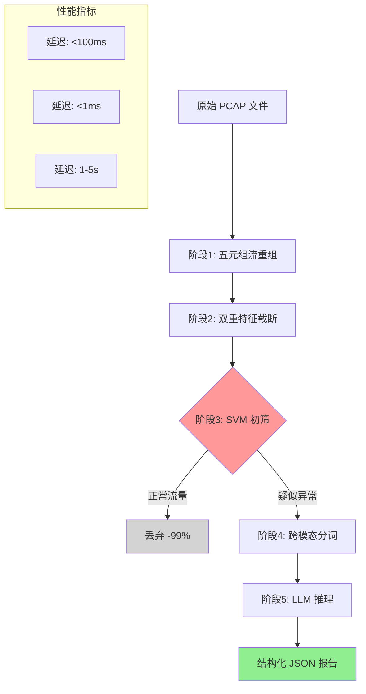

EdgeAgent采用**五阶段流水线架构**处理网络流量，通过逐层递进的检测策略实现"粗筛-细查"的智能过滤机制。该工作流将原始PCAP文件处理为结构化威胁报告，在保证检测精度的同时将带宽占用降低70-90%，是边缘智能终端的核心处理引擎。

## 工作流架构全景



**核心设计理念**：采用漏斗式过滤策略，在早期阶段以低成本快速剔除99%正常流量，仅将疑似异常流量送入后续深度分析环节，从而实现计算资源的高效利用。工作流执行逻辑定义在 `TaskStage` 枚举中，每个阶段具有明确的输入输出边界与性能指标约束。Sources: [main.py](agent-loop/app/main.py#L103-L110)

---

## 阶段1：五元组流重组

**流重组**阶段负责将离散的网络数据包按五元组重组为有状态的会话流，是整个工作流的数据预处理基石。该阶段采用流式读取策略处理PCAP文件，避免大文件加载导致的内存溢出。

### 核心处理逻辑

**五元组提取**：从每个数据包中提取源IP地址、目的IP地址、源端口、目的端口、协议类型五个关键字段，构建会话标识符。五元组数据结构定义为不可变对象，支持哈希计算以便作为字典键使用。Sources: [flow_processor.py](agent-loop/app/flow_processor.py#L54-L84)

**双向流归并**：通过标准化算法将双向通信归并为单一会话。规则是将较小的IP:Port组合统一放在五元组前端，例如 `192.168.1.100:54321 → 10.0.0.1:443` 与 `10.0.0.1:443 → 192.168.1.100:54321` 被识别为同一会话的两个方向。Sources: [flow_processor.py](agent-loop/app/flow_processor.py#L226-L242)

**流式处理防OOM**：使用Scapy的 `PcapReader` 流式读取数据包，逐包解析并归并到流字典中，而非一次性加载整个文件。这种设计使得系统可以处理GB级PCAP文件而不引发内存问题。Sources: [flow_processor.py](agent-loop/app/flow_processor.py#L261-L287)

### 数据包信息提取

每个数据包提取以下元信息存储到 `PacketInfo` 结构：

- **时间戳**：数据包捕获时间，用于计算流持续时间
- **包大小**：帧长度，用于统计特征计算
- **TCP标志位**：SYN、ACK、FIN、RST、PSH等标志，通过位运算解析
- **原始数据**：完整数据包字节序列，用于后续文本转换

Sources: [flow_processor.py](agent-loop/app/flow_processor.py#L88-L116)

### 输出成果

阶段1完成后，原始PCAP文件被转换为 `Flow` 对象列表，每个流包含完整的五元组信息、数据包序列、起止时间等元数据。该阶段设计为无状态处理，不进行任何过滤判断，确保数据完整性。Sources: [flow_processor.py](agent-loop/app/flow_processor.py#L118-L149)

---

## 阶段2：双重特征截断

**双重截断**是EdgeAgent资源保护机制的核心防线，通过时间窗口和包数量两个维度限制单个流的处理规模，防止恶意构造的超长流耗尽系统资源。该阶段在流重组过程中同步执行，具有零额外开销。

### 截断阈值配置

| 约束维度 | 阈值 | 设计依据 |
|---------|------|---------|
| 时间窗口 | ≤ 60秒 | 大多数网络攻击行为在60秒内即可显露特征 |
| 包数量 | ≤ 10个包 | 前期包已包含协议握手、会话建立等关键信息 |
| 单包长度 | ≤ 256字节 | 截断载荷长度，保留协议头即可 |

这些阈值通过环境变量配置，可在部署时根据实际场景调整。Sources: [flow_processor.py](agent-loop/app/flow_processor.py#L154-L162)

### 双重防线执行机制

**时间窗口防线**：对于每个数据包，检查其时间戳与流起始时间的差值，超过60秒则拒绝加入该流。这防止了攻击者通过慢速发送构造超长时间窗口的流。Sources: [flow_processor.py](agent-loop/app/flow_processor.py#L281-L285)

**包数量防线**：当流中已包含10个数据包时，后续到达的数据包直接跳过不记录。这一限制基于观察：TCP握手、HTTP请求头、DNS查询等关键信息通常在前几个包中完整呈现。Sources: [flow_processor.py](agent-loop/app/flow_processor.py#L282-L283)

**物理截断实现**：截断逻辑直接嵌入流重组循环中，通过 `continue` 语句提前终止处理，避免不必要的内存分配和特征计算开销。这种设计确保截断机制的执行成本趋近于零。Sources: [flow_processor.py](agent-loop/app/flow_processor.py#L280-L287)

### 截断后的流处理

对于已截断的流，系统调用 `truncate_flow` 方法进行二次确认和标准化处理，确保所有流符合双重约束。该方法采用防御性编程思想，即使流重组阶段未正确执行截断，也能在后续阶段补救。Sources: [flow_processor.py](agent-loop/app/flow_processor.py#L297-L332)

---

## 阶段3：SVM初筛调用

**SVM初筛**阶段使用轻量级机器学习模型对每条流进行快速二分类，以微秒级延迟剔除99%的正常流量，仅保留疑似异常流量进入后续深度分析。该阶段是整个工作流性价比最高的过滤环节。

### 32维特征向量提取

SVM模型使用精心设计的32维特征向量作为输入，涵盖网络流量的统计、协议、行为、时间、端口、地址六个维度。特征提取逻辑在 `extract_statistical_features` 方法中实现。Sources: [flow_processor.py](agent-loop/app/flow_processor.py#L334-L471)

| 特征类别 | 索引范围 | 核心特征 | 检测价值 |
|---------|---------|---------|---------|
| A. 基础统计 | 0-7 | 平均包长、标准差、总字节数、TTL | 反映流量规模与变化规律 |
| B. 协议类型 | 8-11 | IP协议号、TCP/UDP比例 | 区分协议行为模式 |
| C. TCP行为 | 12-19 | 窗口大小、标志位计数(SYN/ACK/FIN/RST/PSH) | 识别异常握手与连接模式 |
| D. 时间特征 | 20-23 | 流持续时间、到达间隔统计、包速率 | 检测时间异常行为 |
| E. 端口特征 | 24-27 | 源/目的端口熵值、知名端口比例 | 区分服务类型与扫描行为 |
| F. 地址特征 | 28-31 | 唯一目的IP数、内网IP比例、DF标志比例 | 识别地址异常分布 |

这些特征经过标准化处理后输入SVM模型，确保不同量纲的特征对分类结果具有均衡贡献。Sources: [svm-filter-service](svm-filter-service/app/main.py#L72-L88)

### SVM服务调用协议

Agent-Loop通过HTTP POST请求调用SVM服务，请求体包含完整的32维特征字典。服务接口规范如下：

```json
POST /api/classify
{
  "features": {
    "avg_packet_len": 512.5,
    "std_packet_len": 128.3,
    "syn_count": 1,
    "ack_count": 8,
    ...
  }
}
```

响应格式包含预测标签、置信度和推理延迟：

```json
{
  "prediction": 1,
  "label": "anomaly",
  "confidence": 0.87,
  "latency_ms": 0.15
}
```

Sources: [api_specs.md](docs/references/api_specs.md#L99-L161)

### 批量处理与进度更新

工作流对所有流执行批量SVM分类，每处理一条流更新任务进度（30% → 60%）。正常流量被计数并丢弃，异常流量连同其SVM置信度存入 `anomaly_flows` 列表供后续处理。这种设计实现了处理过程的可视化与可追踪。Sources: [main.py](agent-loop/app/main.py#L357-L386)

### 过滤效果

根据设计文档，SVM服务能够过滤**99%正常流量**，仅保留1%疑似异常流量进入LLM深度分析环节。这种粗筛策略大幅降低了后续阶段的计算压力，是工作流实现边缘部署的关键。Sources: [svm-filter-service](svm-filter-service/app/main.py#L57-L59)

---

## 阶段4：跨模态对齐与分词

**跨模态分词**阶段将网络流量从二进制格式转换为LLM可理解的文本序列，是连接传统网络安全分析与大语言模型推理的桥梁。该阶段遵循TrafficLLM的指令格式规范，确保生成的提示词与边缘模型训练数据对齐。

### 流量到文本的映射

**协议字段序列化**：`flow_to_text` 方法将每个数据包转换为键值对格式的文本描述，包含IP长度、协议类型、源/目的端口、TCP标志位等关键元信息。多个包之间使用 `|` 分隔，形成完整的流描述。Sources: [flow_processor.py](agent-loop/app/flow_processor.py#L473-L487)

**指令模板构建**：检测任务采用标准化的指令模板，包含任务描述、五元组元信息和待分类的包数据。模板设计参考TrafficLLM数据集格式，确保与Qwen3.5-0.8B模型的训练数据分布一致：

```
Analyze the following network traffic packet data. 
Classify as: Normal, Malware, Botnet, C&C, DDoS, Scan, or Other.

Five-tuple: Source: 192.168.1.100:54321, Destination: 10.0.0.1:443, Protocol: TCP

<packet>: ip.len: 512, ip.proto: TCP, tcp.srcport: 54321, tcp.dstport: 443, flags: 18 | ...

Classification:
```

Sources: [traffic_tokenizer.py](agent-loop/app/traffic_tokenizer.py#L116-L142)

### Token长度估算与截断

**启发式估算**：由于不依赖重型分词器，系统采用简化的Token估算算法：十六进制字符按2字符/Token计算，其他字符按4字符/Token计算。这种启发式方法在保持轻量级的同时提供了合理的估算精度。Sources: [traffic_tokenizer.py](agent-loop/app/traffic_tokenizer.py#L82-L94)

**Token截断保护**：当估算Token数超过690时，系统按比例截断文本内容，保留指令部分和五元组元信息。截断操作被记录并传递给下游阶段，便于监控和分析。Sources: [traffic_tokenizer.py](agent-loop/app/traffic_tokenizer.py#L96-L114)

### 输出格式

分词阶段输出三元组：`(提示词, Token数量估算, 是否被截断)`。这些信息被用于后续LLM推理请求的参数设置，以及最终JSON报告中的Token元信息记录。Sources: [traffic_tokenizer.py](agent-loop/app/traffic_tokenizer.py#L144-L164)

---

## 阶段5：LLM推理与JSON封装

**LLM推理**阶段使用Qwen3.5-0.8B边缘模型对分词后的流量进行深度语义分析，输出精细化的威胁分类标签。该阶段是工作流的最终检测环节，输出结构化JSON报告供上层应用使用。

### LLM服务调用

**推理参数配置**：调用llama.cpp server的 `/completion` 端点，请求参数包括提示词、最大生成Token数（默认32）、温度系数（0.1，确保输出稳定性）和停止符列表。Sources: [main.py](agent-loop/app/main.py#L223-L275)

```json
{
  "prompt": "<提示词内容>",
  "n_predict": 32,
  "temperature": 0.1,
  "stop": ["</s>", "\n\n", "Classification:", "<packet>:"]
}
```

**异步处理**：所有LLM调用通过 `httpx.AsyncClient` 异步执行，超时设置为30秒，防止单个推理请求阻塞整个工作流。异常情况被捕获并转换为标准化的HTTP 503错误响应。Sources: [main.py](agent-loop/app/main.py#L243-L274)

### 响应解析与标签提取

**关键词匹配策略**：`parse_llm_response` 方法定义了六大类威胁标签的关键词映射表，通过字符串匹配从LLM输出中提取分类结果。例如，检测到"malware"、"virus"、"trojan"等关键词则归类为Malware。Sources: [traffic_tokenizer.py](agent-loop/app/traffic_tokenizer.py#L166-L208)

| 分类标签 | 触发关键词 |
|---------|-----------|
| Malware | malware, malicious, virus, trojan, worm, ransomware |
| Botnet | botnet, bot, zombie, c&c, command and control |
| DDoS | ddos, dos, denial of service, flood |
| Scan | scan, scanner, reconnaissance, probe |
| Normal | normal, benign, legitimate, safe |
| Suspicious | other, unknown, suspicious |

**结构化输出**：解析后的结果包含主标签、次标签和原始响应片段，便于后续处理和审计。Sources: [traffic_tokenizer.py](agent-loop/app/traffic_tokenizer.py#L204-L208)

### JSON报告生成

**威胁信息封装**：每条异常流被封装为威胁对象，包含唯一标识符、五元组、分类结果（主标签、置信度、模型名称）、流元数据（起止时间、包数、字节数）和Token信息。Sources: [main.py](agent-loop/app/main.py#L418-L439)

**统计指标计算**：最终报告包含完整的处理统计，如总包数、总流数、正常流丢弃数、异常流检测数、SVM过滤率、带宽降低率等。带宽降低率通过对比原始PCAP文件大小与JSON输出大小计算得出，反映工作流的实际压缩效果。Sources: [main.py](agent-loop/app/main.py#L459-L495)

**元数据追踪**：报告顶部包含任务ID、时间戳、Agent版本、处理总耗时等元数据，支持结果溯源和性能分析。Sources: [main.py](agent-loop/app/main.py#L460-L465)

---

## 性能特征对比

各阶段的性能特征直接影响整体工作流的响应时间和资源消耗，以下表格总结了关键指标：

| 阶段 | 平均延迟 | 内存占用 | 主要瓶颈 | 过滤效果 |
|------|---------|---------|---------|---------|
| 1. 流重组 | <100ms | 流数量×流大小 | PCAP文件读取速度 | 无过滤 |
| 2. 双重截断 | ~0ms | 可忽略 | 无瓶颈 | 控制流规模 |
| 3. SVM初筛 | <1ms/流 | <300MB | HTTP调用开销 | 过滤99%正常流量 |
| 4. 跨模态分词 | <10ms/流 | <50MB | 文本序列化 | 无过滤 |
| 5. LLM推理 | 1-5s/异常流 | ~1GB | GPU/CPU推理速度 | 精细分类 |

**端到端性能**：对于包含150条流的典型PCAP文件，若SVM过滤后剩余2条异常流，总处理时间约为3-6秒（含LLM推理）。若全为正常流量，处理时间可压缩至200ms以内。

---

## 工作流执行示例

以下展示一个完整的五阶段处理流程，从原始PCAP到最终JSON报告：

**输入**：`suspicious_traffic.pcap`（1.5MB，包含500个数据包）

**阶段1输出**：重组为150条流，每条流包含3-10个包，时间跨度5-120秒

**阶段2输出**：所有流被截断至≤10个包、≤60秒时间窗口，无流因超限被丢弃

**阶段3输出**：SVM分类结果为148条正常流（丢弃）、2条疑似异常流（置信度0.85和0.92）

**阶段4输出**：2条异常流转换为Token序列，Token数分别为542和498，未触发截断

**阶段5输出**：

```json
{
  "meta": {
    "task_id": "a3f8b2e1-...",
    "timestamp": "2026-03-31T14:30:00Z",
    "agent_version": "1.0.0",
    "processing_time_ms": 4250
  },
  "statistics": {
    "total_packets": 500,
    "total_flows": 150,
    "normal_flows_dropped": 148,
    "anomaly_flows_detected": 2,
    "svm_filter_rate": "98.67%",
    "bandwidth_reduction": "78.5%"
  },
  "threats": [
    {
      "id": "threat-001",
      "five_tuple": {
        "src_ip": "192.168.1.100",
        "dst_ip": "10.0.0.1",
        "src_port": 54321,
        "dst_port": 443,
        "protocol": "TCP"
      },
      "classification": {
        "primary_label": "Malware",
        "confidence": 0.92,
        "model": "Qwen3.5-0.8B"
      },
      "flow_metadata": {
        "packet_count": 8,
        "byte_count": 4120,
        "avg_packet_size": 515.0
      },
      "token_info": {
        "token_count": 498,
        "truncated": false
      }
    }
  ],
  "metrics": {
    "original_pcap_size_bytes": 1572864,
    "json_output_size_bytes": 337690,
    "bandwidth_saved_percent": 78.5
  }
}
```

该示例展示了工作流的完整处理链条：从1.5MB的PCAP文件压缩至338KB的JSON报告，带宽节省78.5%，同时准确识别出威胁类型。

---

## 关键设计特性

**双重截断保护机制**：时间窗口与包数量双重约束构成资源保护的物理防线，防止恶意构造的超长流耗尽系统资源。这种设计在阶段1-2同步执行，零额外开销。

**智能流量过滤策略**：SVM阶段的99%过滤率大幅降低LLM推理负担，实现"粗筛-细查"的分级处理策略。正常流量在微秒级被丢弃，异常流量才进入秒级深度分析。

**跨模态语义对齐**：分词阶段严格遵循TrafficLLM指令格式，确保生成的提示词与边缘模型训练数据分布一致，提升推理准确性。

**可观测性设计**：每个阶段更新任务进度和状态，支持实时监控；最终报告包含完整的处理统计和元数据，便于审计和性能分析。

**边缘部署友好**：整个工作流设计为轻量级、无状态处理，适合在资源受限的边缘设备上运行。LLM服务使用Qwen3.5-0.8B量化模型，仅需1GB内存即可运行。

---

## 阅读建议

理解五阶段检测工作流后，建议继续阅读以下相关主题以构建完整的知识体系：

- **服务交互细节**：参阅[Agent-Loop 主控服务与工作流编排](7-agent-loop-zhu-kong-fu-wu-yu-gong-zuo-liu-bian-pai)，深入了解主控服务的实现机制与调度策略
- **SVM模型原理**：参阅[SVM 过滤服务与微秒级推理](8-svm-guo-lu-fu-wu-yu-wei-miao-ji-tui-li)，掌握32维特征向量的设计原理与模型训练方法
- **LLM推理优化**：参阅[LLM 推理服务与边缘模型部署](9-llm-tui-li-fu-wu-yu-bian-yuan-mo-xing-bu-shu)，了解Qwen3.5-0.8B模型的量化部署与推理加速技术
- **流量分词规范**：参阅[流量分词规范与双重截断保护](11-liu-liang-fen-ci-gui-fan-yu-shuang-zhong-jie-duan-bao-hu)，深入理解跨模态对齐的技术细节与TrafficLLM数据集格式
- **特征工程实践**：参阅[32 维特征向量设计](12-32-wei-te-zheng-xiang-liang-she-ji)，了解特征提取的数学原理与网络安全领域知识
- **API接口规范**：参阅[服务间 API 接口规范](14-fu-wu-jian-api-jie-kou-gui-fan)，获取完整的接口定义、错误码说明与调用示例