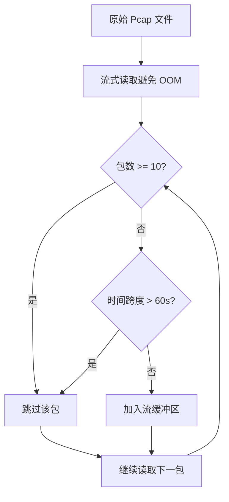

探微系统在边缘计算场景下建立了严格的通信边界与资源约束体系,这些约束并非简单的配置参数,而是源于物理部署环境的硬性限制与安全架构的主动设计。四容器微服务拓扑运行在内存仅 2-4GB 的边缘设备上,每一条边界约束都承载着系统稳定运行与数据安全的双重使命。理解这些红线的本质,是掌握整个系统架构设计哲学的关键起点。

## 物理资源约束与容器配额

边缘设备的物理资源稀缺性决定了容器化部署必须遵循严格的内存配额管理策略。Docker Compose 编排文件中为每个容器设定了资源限制(reservations 与 limits),这些数值经过精心计算,确保四个容器在峰值负载下的总内存消耗不超过宿主机的物理内存上限。LLM 推理引擎作为最消耗内存的服务,获得了 1GB 的内存上限,这源于 Qwen3.5-0.8B 模型在量化后的实际内存占用特征;SVM 过滤服务仅分配 300MB,因为 scikit-learn 的线性 SVM 模型与标准化器在内存中占用极小;Agent-Loop 主控服务分配 500MB,预留了足够的缓冲空间处理 Pcap 文件解析与流重组过程中的临时数据结构;测试控制台分配 512MB,主要为 React 前端构建产物与 FastAPI 后端代理提供运行空间。

| 容器名称 | 内存上限 | 内存预留 | 技术栈选择理由 |
|---------|-----------------|----------------------|--------------|
| llm-service | 1G | 512M | llama.cpp server 无需 PyTorch 运行时 |
| svm-filter-service | 300M | 128M | 线性 SVM 模型内存占用 < 10MB |
| agent-loop | 500M | 256M | scapy 流解析需临时缓冲区 |
| edge-test-console | 512M | 256M | React + FastAPI 代理层轻量化 |

这种内存配额分配遵循了边缘计算的核心设计原则:在有限的物理资源内实现最大化功能密度。每个容器都有明确的资源边界,任何试图突破这些边界的行为都会被 Docker 运行时强制限制,表现为 OOM(Out of Memory)错误。因此,系统架构中的每一层抽象都必须考虑内存效率——这正是系统禁止使用 PyTorch、TensorFlow、Pandas 等重型依赖的根本原因。这些库在初始化阶段就会占用数百兆内存,留给业务逻辑的空间几乎为零,而 llama.cpp server、scikit-learn、原生 Python 数据结构的组合,在保证功能完整性的同时,将内存占用压缩到极致。

Sources: [docker-compose.yml](docker-compose.yml#L39-L45), [core-beliefs.md](docs/design-docs/core-beliefs.md#L13-L17), [architecture.md](docs/design-docs/architecture.md#L29-L35)

## 通信拓扑的单向调用约束

四容器拓扑建立了一条严格单向的服务调用链,这种设计并非为了简化架构,而是为了建立清晰的安全边界与审计路径。测试控制台(edge-test-console)作为唯一面向用户的入口,接收 Pcap 文件上传请求;Agent-Loop 主控服务作为中央编排器,负责调用下游的 SVM 过滤服务与 LLM 推理服务;两个下游服务仅提供被动 API,不发起任何对上游或其他对等服务的调用。这种单向调用模式在 Docker 网络层面得到了物理隔离的支持——所有容器连接到同一个 bridge 网络(tanwei-internal),但服务发现机制确保只有符合调用链方向的请求能够成功路由。

```
[edge-test-console:3000] ──► [agent-loop:8002]           ✅ 允许
[agent-loop:8002] ──► [svm-filter-service:8001]          ✅ 允许
[agent-loop:8002] ──► [llm-service:8080]                 ✅ 允许

[edge-test-console] ──► [svm-filter-service]             ❌ 禁止绕过主控
[edge-test-console] ──► [llm-service]                    ❌ 禁止绕过主控
[svm-filter-service] ──► [llm-service]                   ❌ 禁止跨层调用
```

单向调用链的核心价值在于审计完整性。当用户通过测试控制台上传 Pcap 文件后,整个检测流程的每一次服务间通信都会被 Agent-Loop 记录在任务状态机中。如果允许测试控制台直接调用 SVM 服务或 LLM 服务,就会产生绕过主控审计的"暗流量",系统无法追踪完整的处理链路,也无法在发生异常时进行准确的故障定位。更重要的是,Agent-Loop 在调用下游服务前会进行参数校验与流量截断(详见下一节),如果允许绕过主控直接访问下游服务,就会破坏这些安全防护机制,将未经验证的原始数据直接送入推理引擎。

网络层面的隔离通过 Docker Compose 的内部网络配置实现。虽然 `internal: false` 参数允许外部访问测试控制台的 3000 端口,但 tanwei-internal 网络的作用域限制确保了只有加入该网络的容器才能相互通信。攻击者即使攻破了测试控制台,也无法直接向 SVM 服务或 LLM 服务发送请求,因为这两个服务没有暴露到宿主机网络栈,只能通过容器内部网络访问。这种"纵深防御"策略将攻击面压缩到最小。

Sources: [architecture.md](docs/design-docs/architecture.md#L42-L53), [docker-compose.yml](docker-compose.yml#L138-L142), [main.py](agent-loop/app/main.py#L87-L96)

## 服务间通信的超时边界

服务间通信的超时参数配置直接反映了物理约束与业务需求的平衡。Agent-Loop 调用 SVM 服务时设置了 5 秒超时(httpx.AsyncClient timeout=5.0),这个数值远大于 SVM 推理的实际延迟(设计目标 < 1ms),主要考虑到网络传输延迟、容器调度延迟以及可能的垃圾回收停顿。调用 LLM 服务时设置了 30 秒超时(timeout=30.0),这个数值同样远大于 LLM 推理的目标延迟(< 100ms),但必须为 Prompt 编码、Token 序列生成以及模型加载预热等环节预留足够时间。这些超时参数在边缘计算场景下是关键的设计参数——过短会导致误判服务不可用,过长会阻塞整个检测流水线,消耗有限的任务队列资源。

| 调用路径 | 超时设置 | 目标延迟 | 红线告警阈值 |
|---------|---------|---------|-------------|
| agent-loop → svm-filter-service | 5s | < 1ms | > 10ms |
| agent-loop → llm-service | 30s | < 100ms | > 500ms |
| edge-test-console → agent-loop | 无限制 | < 5s | > 30s 触发超时 |
| 端到端检测流程 | N/A | < 5s | > 30s 返回失败 |

超时机制在代码层面通过 httpx.AsyncClient 的 timeout 参数实现,当服务调用超时时会抛出 `httpx.TimeoutException` 异常,被主控流程捕获后转换为 HTTP 503 状态码返回给上游调用者。这种"快速失败"(Fail Fast)策略确保了系统不会因为单个服务的性能退化而拖垮整个调用链。更重要的是,超时异常会被记录在日志中,通过监控系统聚合后可以识别出性能热点与故障模式。例如,如果 SVM 服务的平均延迟从 0.15ms 突然跳升到 8ms,虽然仍在超时阈值内,但已经超过了红线告警阈值,需要运维人员介入检查模型加载状态或容器资源使用情况。

健康检查机制(Healthcheck)是超时边界之外的另一层防护。每个容器都配置了基于 curl 的健康检查命令,定期探测内部服务的可用性。Docker 引擎会根据健康检查结果自动重启不健康的容器,这种自愈能力在边缘设备的无人值守运行场景下尤为重要。例如,llm-service 的健康检查配置了 `start_period: 60s`,这是因为模型文件加载到内存需要一定时间,过早的健康检查会误判服务为不健康;而 svm-filter-service 的 `start_period` 仅为 10s,因为模型体积极小,几乎可以瞬间加载完成。

Sources: [main.py](agent-loop/app/main.py#L203-L232), [core-beliefs.md](docs/design-docs/core-beliefs.md#L42-L47), [docker-compose.yml](docker-compose.yml#L51-L59)

## 数据流的双重截断保护

流量数据处理流程中嵌入了双重截断机制,这是防御恶意构造 Pcap 文件攻击的核心防线。第一重截断在流重组阶段实施,基于时间窗口与包数量的硬性限制;第二重截断在 Token 化阶段实施,基于 Token 序列长度的约束。这两重截断形成了纵深防御体系,确保无论上游数据如何膨胀,下游服务的内存占用都在可控范围内。

第一重截断的参数源于对正常网络流量特征的统计分析。`MAX_TIME_WINDOW=60` 秒的时间窗口限制,意味着任何持续时间超过 60 秒的流都会被截断,只保留前 60 秒的数据包。这个数值基于一个关键观察:大多数恶意流量(botnet、DDoS、scan)的特征在前 60 秒内已经充分暴露,超过这个时间窗口的数据对于分类决策的边际贡献极低,但内存占用却呈线性增长。`MAX_PACKET_COUNT=10` 的包数量限制同理,前 10 个数据包已经包含了完整的协议握手信息与初始载荷特征,继续解析更多包只会增加内存压力而不会提升检测精度。这两个参数在 FlowProcessor 类的构造函数中初始化,并在 extract_flows 方法中实施物理截断——当流的包数达到 10 个或时间跨度超过 60 秒时,后续的数据包直接跳过记录,不再进入内存。



第二重截断在 TrafficTokenizer 中实施,基于 `MAX_TOKEN_LENGTH=690` 的 Token 长度限制。这个数值源于 LLM 推理引擎的上下文窗口限制——Qwen3.5-0.8B 模型在 llama.cpp server 模式下配置了 `ctx-size=2048`,但考虑到指令模板、五元组元信息与生成 Token 的空间预留,实际可用于流量数据的空间约在 690 Token 左右。TrafficTokenizer 在 tokenize_flow 方法中估算 Token 数量(使用启发式规则:英文文本约 4 字符/token,十六进制数据约 2 字符/token),如果超出限制则截断数据部分,保留完整的指令模板与元信息。这种截断策略确保了 LLM 服务不会因为输入过长而报错,也不会因为处理超长序列而消耗过多计算资源。

双重截断的设计体现了"资源预算"的架构思维。每个处理阶段都有明确的资源预算——流重组阶段的内存预算由包数量与时间窗口共同决定,Token 化阶段的计算预算由 Token 长度决定。当输入数据超出预算时,系统不是简单地报错,而是智能截断,在保证核心信息不丢失的前提下,强制将资源消耗限制在预算范围内。这种防御性设计在面对恶意构造的超长 Pcap 文件时尤为重要,攻击者无法通过注入海量数据来耗尽系统资源,因为截断机制会在早期阶段就阻断数据的增长。

Sources: [flow_processor.py](agent-loop/app/flow_processor.py#L75-L78), [traffic_tokenizer.py](agent-loop/app/traffic_tokenizer.py#L56-L66), [traffic-tokenization.md](docs/design-docs/traffic-tokenization.md#L11-L20), [main.py](agent-loop/app/main.py#L86-L88)

## 数据输出的安全边界

探微系统的输出数据经过严格的信息脱敏处理,确保原始 Pcap 载荷与应用层内容不会出现在任何对外输出的数据结构中。这种设计源于边缘计算场景下的数据安全合规要求——网络流量中可能包含敏感的业务数据(如用户密码、API 密钥、内部 IP 地址),如果将原始数据包的十六进制转储包含在输出 JSON 中,就会产生严重的数据泄露风险。

输出数据结构被限制为以下四类信息:五元组(源/目标 IP、源/目标端口、协议)、标签(Normal/Malware/Botnet 等)、置信度分数、流元信息(包数量、字节数、持续时间)。这些信息足以支撑威胁检测与审计需求,但完全不包含载荷层面的内容。例如,AnomalyFlow 数据类定义中,five_tuple 字段仅包含会话标识信息,label 字段包含分类结果,confidence 字段包含模型置信度,timestamp 字段包含检测时间,flow_metadata 字段包含统计特征(如包数量、字节数),token_info 字段包含 Token 化过程的元数据——所有这些字段都是经过抽象与聚合的元数据,而非原始字节流。

```python
@dataclass
class AnomalyFlow:
    five_tuple: dict          # 五元组标识
    label: str                # 分类标签
    confidence: float         # 置信度
    timestamp: str            # 检测时间
    flow_metadata: dict       # 统计元信息(包数、字节数)
    token_info: dict          # Token 化元数据(长度、截断状态)
```

这种信息脱敏策略在 FlowProcessor 的 flow_to_text 方法中得到了实施。该方法将流数据转换为文本格式时,仅提取协议头部字段(IP 头、TCP 头、UDP 头的关键字段),对于应用层载荷(payload)要么完全忽略,要么仅保留长度信息。TrafficTokenizer 在构建检测提示词时,同样遵循最小化信息披露原则——提示词中仅包含五元组与统计特征,不包含载荷数据的十六进制编码。这种设计虽然可能损失一部分检测精度(因为某些攻击特征隐藏在载荷中),但在边缘计算场景下,数据安全的优先级高于极致的检测性能。

模型文件的只读挂载是另一项关键的安全边界。Docker Compose 配置中,llm-service 的模型目录以只读模式挂载(`- ./qwen3.5-0.8b:/models:ro`),这意味着容器内的进程无法修改模型文件。这种配置防止了模型投毒攻击——攻击者即使获得了容器内的代码执行权限,也无法篡改模型权重或注入后门,因为文件系统层会拒绝所有写操作。类似地,SVM 模型目录也是只读挂载,确保机器学习管道的完整性。

Sources: [main.py](agent-loop/app/main.py#L83-L91), [core-beliefs.md](docs/design-docs/core-beliefs.md#L50-L54), [docker-compose.yml](docker-compose.yml#L19-L20), [architecture.md](docs/design-docs/architecture.md#L64-L68)

## 依赖约束与技术栈红线

系统对第三方依赖库的选择建立了严格的准入机制,这并非技术保守主义,而是基于内存占用与启动时间的理性权衡。边缘设备的容器启动时间直接影响系统的可用性——在设备重启或容器崩溃恢复的场景下,数分钟的依赖加载时间会导致检测服务的长时间不可用。因此,系统建立了"禁止依赖清单",任何试图引入这些库的代码提交都会在 Code Review 阶段被驳回。

禁止使用的依赖库主要分为三类:重型机器学习框架(PyTorch、TensorFlow)、数据分析工具(Pandas、NumPy 的完整安装,仅允许使用 NumPy 的核心子集)、自然语言处理管道(Transformers、Hugging Face Tokenizers)。PyTorch 的基础安装包体积约 800MB,运行时内存占用约 1GB,加上模型加载后的内存需求,一个 PyTorch 容器的内存消耗会立即超过 2GB 的物理内存上限,导致系统无法正常运行。TensorFlow 的内存占用同样惊人,即使是轻量级的 TensorFlow Lite 也需要数百兆的依赖库。

| 禁止依赖 | 内存占用 | 替代方案 | 技术理由 |
|---------|---------|---------|---------|
| torch/tensorflow | > 2GB | llama.cpp server | C/C++ 实现,内存占用 < 1GB |
| pandas | ~100MB | 原生 dict/list | 数据量小,不需要 DataFrame 抽象 |
| transformers | > 500MB | sentencepiece | 仅需分词功能,无需完整 NLP 管道 |
| scipy(完整版) | ~200MB | scikit-learn | 线性 SVM 仅需 sklearn 子集 |

允许使用的技术栈经过了内存占用的严格验证。FastAPI 作为 Web 框架,启动时内存占用约 50MB,显著低于 Django 或 Flask 的插件生态累积的内存开销。scapy 作为网络解析库,虽然是纯 Python 实现,但通过流式读取(PcapReader)避免了将整个 Pcap 文件加载到内存中。scikit-learn 的线性 SVM 模型训练后导出为 joblib 格式,文件大小通常 < 10MB,加载到内存后占用 < 50MB,完全符合边缘设备的资源约束。sentencepiece 作为分词器,仅提供 Token 序列的编码与解码功能,不包含神经网络模型,内存占用可以忽略不计。

这种依赖管理策略在 requirements.txt 文件中得到了固化。每个服务的依赖清单都极其精简,仅包含运行时必需的库。例如,agent-loop 的依赖包括 fastapi、uvicorn、httpx、scapy、pydantic、loguru、aiofiles,这些都是轻量级库,且依赖链较短,不会引入意外的传递性依赖。llm-service 的 Dockerfile 更是直接编译 llama.cpp 的 C/C++ 源码,生成单一的可执行文件,完全绕过了 Python 运行时与 pip 包管理的复杂性。

Sources: [core-beliefs.md](docs/design-docs/core-beliefs.md#L23-L38), [requirements.txt](agent-loop/requirements.txt), [Dockerfile](llm-service/Dockerfile#L6-L17)

## 性能红线的监控与告警

系统建立了多层性能指标监控体系,从微观的服务延迟到宏观的带宽压降率,每一项指标都有明确的目标值与红线告警阈值。这些指标不仅用于运维监控,更作为系统架构演进的质量门禁——任何代码变更如果导致性能指标恶化超过红线阈值,都会被自动拒绝合并到主分支。

SVM 过滤服务的推理延迟是最关键的性能指标之一。设计目标 < 1ms,红线告警阈值 > 10ms。这个指标直接反映了 SVM 模型的计算复杂度——线性 SVM 的推理时间复杂度为 O(n),其中 n 为特征维度(系统固定为 32 维),理论推理时间在微秒级别。如果实际延迟超过 10ms,通常意味着容器资源竞争(如 CPU 被其他进程抢占)或垃圾回收停顿(Java/Python 的 GC 暂停)。监控代码在 SVM 服务的 classify 端点中嵌入了时间测量逻辑,每次推理完成后将延迟数据写入日志,通过日志聚合系统计算 P95、P99 延迟分位数。

LLM 推理服务的延迟指标相对宽松,设计目标 < 100ms,红线告警阈值 > 500ms。这个数值考虑到了 LLM 推理的固有特性——即使是最轻量级的 0.8B 参数模型,单次推理也需要数十毫秒的计算时间。如果延迟超过 500ms,可能意味着模型未加载到内存(冷启动)、GPU 资源竞争(虽然系统配置了 CPU-only 推理,但 llama.cpp 仍会尝试使用 GPU 加速),或输入 Token 序列过长导致计算量激增。健康检查脚本(healthcheck.sh)会定期发送测试请求到 LLM 服务的 /completion 端点,测量响应时间并在超时后重启容器。

| 性能指标 | 目标值 | 红线告警 | 监控方式 | 异常处理 |
|---------|--------|---------|---------|---------|
| SVM 推理延迟 | < 1ms | > 10ms | 日志埋点 | 返回 503,触发容器重启 |
| LLM 推理延迟 | < 100ms | > 500ms | 健康检查 | 超时重试,失败后重启 |
| 端到端检测延迟 | < 5s | > 30s | 任务追踪 | 标记任务失败,清理资源 |
| 带宽压降率 | > 70% | < 50% | 统计聚合 | 触发告警,排查 SVM 模型 |

带宽压降率是系统价值的核心度量指标。探微系统的设计目标是过滤 99% 的正常流量,仅将 1% 的可疑流量上报到云端分析平台,从而降低边缘设备与云端之间的网络带宽消耗。带宽压降率的计算公式为 `(原始 Pcap 大小 - 输出 JSON 大小) / 原始 Pcap 大小`,理想情况下应 > 70%。如果压降率低于 50%,说明 SVM 模型的过滤能力退化,大量正常流量被误判为异常并上报,导致云端分析压力激增。这种情况下需要重新训练 SVM 模型,调整分类阈值,或检查特征提取逻辑是否存在 Bug。

性能指标的监控数据通过 loguru 的结构化日志输出,每条日志记录包含时间戳、日志级别、服务名称、函数名、行号与消息内容。在生产环境中,这些日志会被 Fluentd/Filebeat 采集并汇聚到 Elasticsearch/Loki 等日志聚合系统,通过 Grafana 等可视化工具构建实时仪表盘。告警规则基于 PromQL/LogQL 查询语言,当指标超过红线阈值时,通过 PagerDuty/钉钉等渠道通知运维人员。

Sources: [core-beliefs.md](docs/design-docs/core-beliefs.md#L42-L47), [main.py](svm-filter-service/app/main.py#L134-L143), [healthcheck.sh](llm-service/healthcheck.sh)

## 边界约束的架构价值

通信边界与资源红线的存在并非限制了系统的能力,而是赋予了系统在边缘计算场景下的生存能力。在一个内存仅有 2GB 的设备上运行完整的威胁检测流水线,同时保证毫秒级的响应延迟与 70% 以上的带宽压降率,这在没有严格边界约束的传统架构中是不可能实现的目标。每一个配置参数——从容器的内存配额到服务的超时阈值,从截断机制的数值到依赖库的准入规则——都是经过深思熟虑的设计决策,背后是对物理约束的尊重与对系统鲁棒性的追求。

这些边界约束也定义了系统的能力边界与演进路径。当业务需求要求提升检测精度时,不能简单地增加模型的参数量或引入更复杂的特征工程,因为这样做会突破内存红线;正确的演进路径是优化特征提取算法的效率,或者引入知识蒸馏等技术,在保持模型体积不变的前提下提升性能。当业务需求要求扩展输出数据的内容时,不能简单地包含更多原始数据,因为这样做会突破安全边界;正确的演进路径是设计更丰富的元数据结构,在不暴露原始载荷的前提下提供更细粒度的分析结果。

理解这些边界约束,是成为一名合格的探微系统架构师的第一步。接下来的章节将深入探讨每个核心服务模块的实现细节,展示这些边界约束如何在代码层面得到贯彻与执行。[Agent-Loop 主控服务与工作流编排](7-agent-loop-zhu-kong-fu-wu-yu-gong-zuo-liu-bian-pai)将揭示五阶段检测流水线的完整实现,[SVM 过滤服务与微秒级推理](8-svm-guo-lu-fu-wu-yu-wei-miao-ji-tui-li)将展示如何在 300MB 内存预算内实现高性能的分类器,[LLM 推理服务与边缘模型部署](9-llm-tui-li-fu-wu-yu-bian-yuan-mo-xing-bu-shu)将解释如何在 1GB 内存限制下运行大语言模型推理。每一章都是对边界约束的一次实践探索,帮助读者建立"在约束中创造价值"的架构思维。