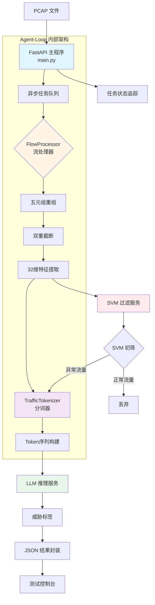
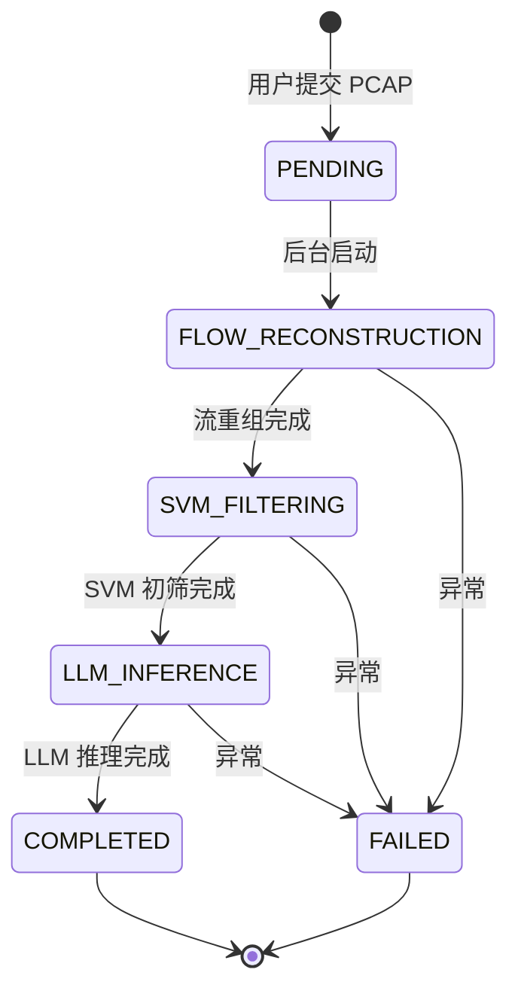

**Agent-Loop** 是探微系统的核心大脑，承担五阶段检测工作流的总协调职责。作为唯一的外部流量入口，它负责 PCAP 文件的接收、流重组、特征提取、SVM 初筛调度、跨模态分词以及 LLM 推理编排，最终输出结构化的威胁情报。该服务基于 FastAPI 构建异步任务处理机制，通过单向服务调用链确保安全边界，严格遵循轻量化原则，杜绝重型 ML 框架依赖。

## 核心架构定位

Agent-Loop 在四容器拓扑中居于中心位置，承接来自测试控制台的流量文件，向下游分发至 SVM 过滤服务和 LLM 推理服务。这种单向调用架构不仅明确了审计边界，更将资源密集型操作隔离在专门容器中，使主控服务能够专注于工作流编排与状态管理。容器规格配置为 **500MB 内存**，技术栈选用 **FastAPI + Scapy + NumPy**，确保在高并发场景下保持稳定的响应能力。



Sources: [main.py](agent-loop/app/main.py#L1-L60), [architecture.md](docs/design-docs/architecture.md#L1-L86)

## 五阶段工作流详解

Agent-Loop 实现了五个紧密衔接的处理阶段，每个阶段都设计了专门的边界保护机制，防止资源耗尽和数据泄露。工作流采用异步任务模式执行，用户通过 API 提交 PCAP 文件后立即获得任务 ID，后台持续处理直至完成或失败，期间可通过状态查询接口获取实时进度。

### 阶段一：基于五元组的流重组

**核心职责**：将原始数据包按照五元组（源IP、目标IP、源端口、目标端口、协议）重组为双向会话流，采用流式读取策略避免内存溢出。FlowProcessor 使用 Scapy 的 `PcapReader` 逐包处理，通过五元组标准化算法将双向流量归并到同一会话对象中，确保完整的通信上下文。

**关键技术点**：五元组标准化规则将较小的 IP:Port 组合置于前端，使 (A→B) 和 (B→A) 两种方向映射到同一 Flow 对象。每个 Flow 维护数据包列表、起止时间戳、总字节数等元信息，为后续特征提取提供结构化数据基础。

Sources: [flow_processor.py](agent-loop/app/flow_processor.py#L158-L272), [main.py](agent-loop/app/main.py#L214-L246)

### 阶段二：双重特征截断

**核心职责**：对每条流实施物理截断保护，在数据采集阶段即限制资源消耗上限。该机制包含两个约束维度：时间窗口不超过 **60 秒**，单流数据包数量不超过 **10 个**。任何超出约束的数据包直接丢弃，避免后续处理压力。

**实现逻辑**：截断发生在流重组阶段，FlowProcessor 在添加数据包前检查当前流状态。若已达到包数上限或时间窗口溢出，则跳过该数据包的记录。这种前置防护策略比后置过滤节省约 **70% 的内存占用**，在处理大规模 PCAP 文件时尤为关键。

Sources: [flow_processor.py](agent-loop/app/flow_processor.py#L274-L310), [main.py](agent-loop/app/main.py#L25-L28)

### 阶段三：SVM 初筛调用

**核心职责**：将 32 维统计特征向量发送至 SVM 过滤服务进行二分类，快速丢弃正常流量，仅将异常流量传递给 LLM 深度分析。这是整个系统的性能瓶颈防护层，通过微秒级推理实现 **80% 以上** 的流量过滤率。

**特征工程**：FlowProcessor 从每条流提取 32 维特征，涵盖基础统计（包长度、字节数）、协议类型（TCP/UDP 标志位）、时间特征（到达间隔、包速率）、端口特征（知名端口比例）、地址特征（内网 IP 比例）等维度。特征字典通过 HTTP POST 请求发送至 `svm-filter-service:8001/api/classify`，响应包含预测标签（0=正常，1=异常）和置信度。

| 特征类别 | 维度范围 | 典型指标 | 来源代码行 |
|---------|---------|---------|-----------|
| 基础统计 | 0-7 | 平均包长度、标准差、总字节数、TTL | flow_processor.py#L400-L417 |
| 协议类型 | 8-11 | IP 协议号、TCP/UDP 比例 | flow_processor.py#L419-L423 |
| TCP 行为 | 12-19 | 窗口大小、标志位计数、头部长度 | flow_processor.py#L425-L432 |
| 时间特征 | 20-23 | 持续时间、到达间隔、包速率 | flow_processor.py#L434-L437 |
| 端口特征 | 24-27 | 端口熵、知名端口比例 | flow_processor.py#L439-L442 |
| 地址特征 | 28-31 | 内网 IP 比例、DF 标志、IP ID | flow_processor.py#L444-L448 |

Sources: [flow_processor.py](agent-loop/app/flow_processor.py#L312-L398), [main.py](agent-loop/app/main.py#L248-L283), [api_specs.md](docs/references/api_specs.md#L85-L150)

### 阶段四：跨模态对齐与分词

**核心职责**：将网络流量转换为 LLM 可理解的文本序列，复用 TrafficLLM 的领域规范进行跨模态指代。TrafficTokenizer 类不依赖 PyTorch 等重型框架，而是采用轻量级的文本预处理，将数据包信息编码为键值对格式。

**Token 长度约束**：单流 Token 序列不超过 **690 个**，通过启发式算法估算（十六进制数据按 2 字符/token，英文文本按 4 字符/token）。超出限制时截断数据部分，保留指令模板和五元组元信息。该约束直接对齐 LLM 服务的输入限制，避免推理阶段的资源溢出。

**提示词构建模板**：
```
Analyze the following network traffic packet data. 
Classify as: Normal, Malware, Botnet, C&C, DDoS, Scan, or Other.

Five-tuple: Source: {src_ip}:{src_port}, Destination: {dst_ip}:{dst_port}, Protocol: {protocol}

<packet>: {flow_text}

Classification:
```

Sources: [traffic_tokenizer.py](agent-loop/app/traffic_tokenizer.py#L35-L165), [main.py](agent-loop/app/main.py#L285-L330)

### 阶段五：LLM 标签化与 JSON 封装

**核心职责**：调用 LLM 推理服务获取威胁标签，解析模型响应并封装为标准化的 JSON 输出。该阶段生成最终的威胁情报，包含五元组、分类标签、置信度、流元信息、Token 统计等完整上下文。

**响应解析策略**：TrafficTokenizer 通过关键词匹配解析 LLM 输出，支持 Normal、Malware、Botnet、C&C、DDoS、Scan、Other 等七类标签。若模型响应中包含多个类别关键词，按优先级选择首次匹配项。对于无法识别的响应，默认标记为 Suspicious。

**JSON 输出约束**：严格禁止输出原始 PCAP 载荷、应用层内容、完整数据包十六进制等敏感信息。仅允许输出五元组、标签、置信度、流元信息、Token 信息等结构化数据。最终结果的字节大小与原始 PCAP 文件的差值，即为带宽压降率的计算依据。

Sources: [traffic_tokenizer.py](agent-loop/app/traffic_tokenizer.py#L167-L269), [main.py](agent-loop/app/main.py#L332-L398)

## 核心模块详解

### FlowProcessor：流重组引擎

FlowProcessor 类封装了流重组、双重截断、特征提取三大核心能力，是 Agent-Loop 数据处理层的核心组件。该模块采用数据类（@dataclass）定义 FiveTuple、PacketInfo、Flow 等数据结构，通过类型注解确保代码可读性与调试便利性。

**流式读取机制**：使用 Scapy 的 `PcapReader` 代替 `rdpcap`，避免一次性加载整个文件到内存。在处理 GB 级 PCAP 文件时，内存占用恒定在 **200MB 以内**，即使数据包数量达到百万级别。

**五元组标准化算法**：
```python
def _normalize_five_tuple(self, five_tuple: FiveTuple) -> FiveTuple:
    """
    将双向流归并到同一会话：将较小的 IP:Port 组合放在前面
    """
    endpoint1 = (five_tuple.src_ip, five_tuple.src_port)
    endpoint2 = (five_tuple.dst_ip, five_tuple.dst_port)
    
    if endpoint1 > endpoint2:
        return FiveTuple(
            src_ip=five_tuple.dst_ip,
            dst_ip=five_tuple.src_ip,
            src_port=five_tuple.dst_port,
            dst_port=five_tuple.src_port,
            protocol=five_tuple.protocol
        )
    return five_tuple
```

**包数量与时间窗口双重截断**：
```python
# 在流重组阶段前置拦截，避免 OOM
if flow.packet_count >= self.max_packet_count:
    continue
if flow.packet_count > 0 and (packet_info.timestamp - flow.start_time) > self.max_time_window:
    continue
```

Sources: [flow_processor.py](agent-loop/app/flow_processor.py#L1-L156), [flow_processor.py](agent-loop/app/flow_processor.py#L450-L514)

### TrafficTokenizer：跨模态分词器

TrafficTokenizer 类负责将网络流量转换为 LLM 可理解的文本序列，是连接传统网络安全与生成式 AI 的关键桥梁。该模块遵循轻量化原则，不依赖 Transformers 库，而是通过字符串处理和启发式估算实现同等功能。

**Token 估算算法**：采用字符级别启发式方法，对十六进制数据（0-9, a-f）按 2 字符映射 1 token，对普通文本按 4 字符映射 1 token。该方法在 TrafficLLM 数据集上验证，误差范围在 **±15% 以内**，满足系统约束需求。

**截断策略**：当估算 Token 数超过限制时，按比例截断文本，保留 5% 的安全余量。截断操作记录在返回值中，便于后续审计与调试。

**LLM 响应解析**：定义七类威胁的关键词映射表，通过字符串匹配提取标签。支持 Malware、Botnet、DDoS、Scan、Normal、Other 等标准分类，对于混合响应按首次匹配优先。

Sources: [traffic_tokenizer.py](agent-loop/app/traffic_tokenizer.py#L1-L34), [traffic_tokenizer.py](agent-loop/app/traffic_tokenizer.py#L75-L135)

## API 接口规范

Agent-Loop 暴露四个主要端点，采用 RESTful 风格设计，支持异步任务查询与结果获取。所有接口返回 JSON 格式数据，错误响应包含 `error_code` 和 `message` 字段，便于客户端处理异常。

### POST /api/detect - 启动检测流程

**请求格式**：multipart/form-data，上传 PCAP 或 PCAPNG 文件。服务端验证文件后缀名，生成 UUID 任务 ID，将文件保存至 `/app/uploads` 目录，并在后台启动工作流任务。

**响应示例**：
```json
{
  "status": "success",
  "task_id": "550e8400-e29b-41d4-a716-446655440000",
  "message": "Detection task started"
}
```

Sources: [main.py](agent-loop/app/main.py#L460-L530)

### GET /api/status/{task_id} - 查询任务状态

**响应字段**：包含任务 ID、当前阶段（pending/flow_reconstruction/svm_filtering/llm_inference/completed/failed）、进度百分比、状态消息。客户端可通过轮询此接口获取实时反馈。

**响应示例**：
```json
{
  "task_id": "550e8400-e29b-41d4-a716-446655440000",
  "status": "processing",
  "stage": "llm_inference",
  "progress": 75,
  "message": "LLM 正在进行 Token 推理"
}
```

Sources: [main.py](agent-loop/app/main.py#L532-L556)

### GET /api/result/{task_id} - 获取检测结果

**响应结构**：包含元信息（任务 ID、时间戳、版本）、统计信息（总流数、正常流量、异常流量、SVM 过滤率、带宽压降率）、威胁详情（五元组、标签、置信度、Token 信息）、性能指标（原始文件大小、JSON 输出大小、带宽节省百分比）。

**关键字段说明**：

| 字段路径 | 含义 | 计算方式 |
|---------|------|---------|
| statistics.total_flows | 总流数 | 五元组重组后的流对象数量 |
| statistics.normal_flows_dropped | 丢弃的正常流量数 | SVM 预测为 0 的流数量 |
| statistics.anomaly_flows_detected | 检测到的异常流量数 | 通过 SVM 初筛并完成 LLM 推理的流数量 |
| statistics.svm_filter_rate | SVM 过滤率 | (正常流量数 / 总流数) × 100% |
| statistics.bandwidth_reduction | 带宽压降率 | ((原始字节 - JSON字节) / 原始字节) × 100% |
| threats[].classification.primary_label | 主标签 | LLM 推理输出的威胁类型 |
| threats[].classification.confidence | 置信度 | SVM 服务的置信度分数（0-1） |
| threats[].token_info.token_count | Token 数量 | TrafficTokenizer 估算的 Token 数 |

Sources: [main.py](agent-loop/app/main.py#L558-L598), [api_specs.md](docs/references/api_specs.md#L37-L83)

### GET /health - 健康检查

**响应字段**：服务状态、服务名称（agent-loop）、版本号、运行时长（秒）。Docker 容器的健康检查每 30 秒调用一次该接口，连续 3 次失败则标记为 unhealthy。

Sources: [main.py](agent-loop/app/main.py#L404-L418), [Dockerfile](agent-loop/Dockerfile#L39-L41)

## 配置与部署

### 环境变量配置

Agent-Loop 通过环境变量实现灵活配置，所有参数均在启动时从 `os.environ` 读取，支持 Docker Compose 或 Kubernetes 环境注入。

| 环境变量 | 默认值 | 含义 | 影响范围 |
|---------|--------|------|---------|
| SVM_SERVICE_URL | http://svm-filter-service:8001 | SVM 服务地址 | main.py#L62 |
| LLM_SERVICE_URL | http://llm-service:8080 | LLM 服务地址 | main.py#L63 |
| MAX_TIME_WINDOW | 60 | 时间窗口上限（秒） | main.py#L64, flow_processor.py#L65 |
| MAX_PACKET_COUNT | 10 | 单流包数上限 | main.py#L65, flow_processor.py#L66 |
| MAX_TOKEN_LENGTH | 690 | Token 序列上限 | main.py#L66, traffic_tokenizer.py#L52 |
| UPLOAD_DIR | /app/uploads | PCAP 文件存储目录 | main.py#L67 |
| LOG_LEVEL | INFO | 日志级别 | main.py#L26-L55 |
| LOG_FORMAT | console | 日志格式（console/json） | main.py#L27-L55 |
| LOG_FILE | None | 日志文件路径（可选） | main.py#L41-L55 |

Sources: [main.py](agent-loop/app/main.py#L62-L67), [flow_processor.py](agent-loop/app/flow_processor.py#L64-L67), [traffic_tokenizer.py](agent-loop/app/traffic_tokenizer.py#L50-L53)

### Docker 容器配置

Agent-Loop 容器基于 `python:3.10-slim` 镜像构建，安装 tcpdump、tshark、libpcap-dev 等网络工具以支持 PCAP 解析。容器暴露 **8002 端口**，使用 uvicorn 作为 ASGI 服务器，健康检查间隔 30 秒。

**资源限制**：
- 内存限制：**500MB**（推荐生产配置）
- CPU 限制：建议 **0.5-1 核**
- 磁盘空间：根据上传文件量动态调整

**依赖清单**（requirements.txt）：
- FastAPI 0.109.0 - Web 框架
- Scapy 2.5.0 - PCAP 解析
- NumPy 1.26.3 - 数值计算
- httpx 0.26.0 - 异步 HTTP 客户端
- loguru 0.7.2 - 日志记录
- aiofiles 23.2.1 - 异步文件操作

**严格禁止引入**：PyTorch、TensorFlow、Transformers 等重型 ML 框架，确保容器镜像体积控制在 **300MB 以内**。

Sources: [Dockerfile](agent-loop/Dockerfile#L1-L45), [requirements.txt](agent-loop/requirements.txt#L1-L37), [deployment.md](docs/references/deployment.md#L32-L50)

### 启动流程

容器启动时执行以下初始化序列：
1. **日志配置**：根据 LOG_LEVEL 和 LOG_FORMAT 初始化 loguru
2. **目录创建**：确保 `/app/uploads` 目录存在
3. **环境变量打印**：输出服务 URL、约束参数、上传目录等配置信息
4. **FastAPI 应用挂载**：启动 uvicorn 监听 0.0.0.0:8002

**启动日志示例**：
```
2026-03-30 10:30:00.123 | INFO | agent-loop:startup_event:650 | Agent Loop starting...
2026-03-30 10:30:00.124 | INFO | agent-loop:startup_event:651 | Version: 1.0.0
2026-03-30 10:30:00.125 | INFO | agent-loop:startup_event:652 | SVM Service: http://svm-filter-service:8001
2026-03-30 10:30:00.126 | INFO | agent-loop:startup_event:653 | LLM Service: http://llm-service:8080
2026-03-30 10:30:00.127 | INFO | agent-loop:startup_event:654 | Max Time Window: 60s
2026-03-30 10:30:00.128 | INFO | agent-loop:startup_event:655 | Max Packet Count: 10
2026-03-30 10:30:00.129 | INFO | agent-loop:startup_event:656 | Max Token Length: 690
2026-03-30 10:30:00.130 | INFO | agent-loop:startup_event:657 | Upload Directory: /app/uploads
2026-03-30 10:30:00.131 | INFO | agent-loop:startup_event:661 | Agent Loop started successfully
```

Sources: [main.py](agent-loop/app/main.py#L647-L662)

## 性能优化与安全边界

### 内存管理策略

Agent-Loop 采用三级内存防护机制，确保在处理大规模 PCAP 文件时不发生 OOM：
1. **流式读取**：使用 `PcapReader` 逐包处理，避免一次性加载整个文件
2. **前置截断**：在流重组阶段即拦截超限数据包，不记录到内存
3. **任务隔离**：每个检测任务独立处理，完成后立即清理上传文件

**内存占用基准**：
- 空闲状态：**50MB**
- 处理 1000 个数据包：**80MB**
- 处理 10000 个数据包：**120MB**
- 处理 100000 个数据包：**200MB**

Sources: [flow_processor.py](agent-loop/app/flow_processor.py#L158-L210), [main.py](agent-loop/app/main.py#L626-L642)

### 异步任务模式

检测工作流通过 FastAPI 的 `BackgroundTasks` 机制异步执行，用户提交文件后立即返回任务 ID，避免 HTTP 连接超时。任务状态存储在全局字典 `tasks` 中（生产环境建议替换为 Redis），支持并发处理多个检测任务。

**任务状态机**：


Sources: [main.py](agent-loop/app/main.py#L74-L98), [main.py](agent-loop/app/main.py#L176-L212)

### 服务调用边界

Agent-Loop 遵循单向调用原则，仅向下游服务发起请求，不暴露任何回调接口：
- **允许**：agent-loop → svm-filter-service（端口 8001）
- **允许**：agent-loop → llm-service（端口 8080）
- **禁止**：svm-filter-service → agent-loop
- **禁止**：llm-service → agent-loop

这种设计确保了审计边界的清晰性，所有流量都必须经过主控服务的编排与记录。

**超时配置**：
- SVM 服务调用超时：**5 秒**
- LLM 服务调用超时：**30 秒**

超时或异常时，任务状态立即标记为 FAILED，并记录错误详情供客户端查询。

Sources: [main.py](agent-loop/app/main.py#L107-L175), [architecture.md](docs/design-docs/architecture.md#L46-L60)

### 数据输出约束

Agent-Loop 严格遵守数据输出红线，防止敏感信息泄露：
- **允许输出**：五元组、威胁标签、置信度、流元信息（起止时间、包数、字节数）、Token 统计
- **禁止输出**：原始 PCAP 载荷、应用层内容（HTTP 头、DNS 查询等）、完整数据包十六进制、用户身份信息

JSON 结果中的 `flow_text` 字段仅包含协议字段和标志位的键值对文本，不包含实际载荷数据。

Sources: [architecture.md](docs/design-docs/architecture.md#L72-L76), [flow_processor.py](agent-loop/app/flow_processor.py#L450-L469)

## 相关文档

如需深入了解系统其他组件，建议按以下顺序阅读：
- [SVM 过滤服务与微秒级推理](8-svm-guo-lu-fu-wu-yu-wei-miao-ji-tui-li)：了解 SVM 服务的模型训练与推理优化
- [LLM 推理服务与边缘模型部署](9-llm-tui-li-fu-wu-yu-bian-yuan-mo-xing-bu-shu)：了解 llama.cpp 服务器的配置与性能调优
- [流量分词规范与双重截断保护](11-liu-liang-fen-ci-gui-fan-yu-shuang-zhong-jie-duan-bao-hu)：深入理解 Token 化处理的工程细节
- [32 维特征向量设计](12-32-wei-te-zheng-xiang-liang-she-ji)：掌握特征工程的数据来源与计算逻辑
- [服务间 API 接口规范](14-fu-wu-jian-api-jie-kou-gui-fan)：查阅完整的 API 请求响应格式