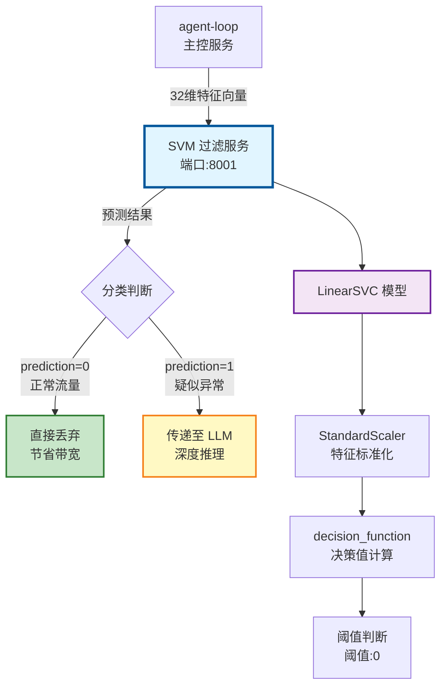
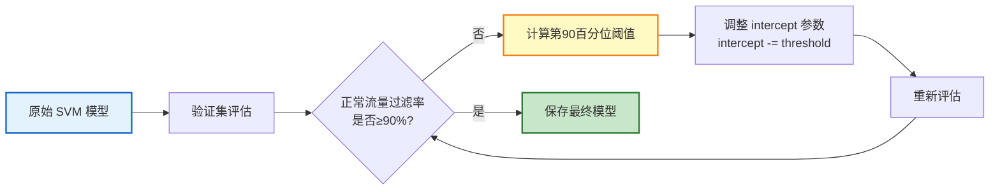
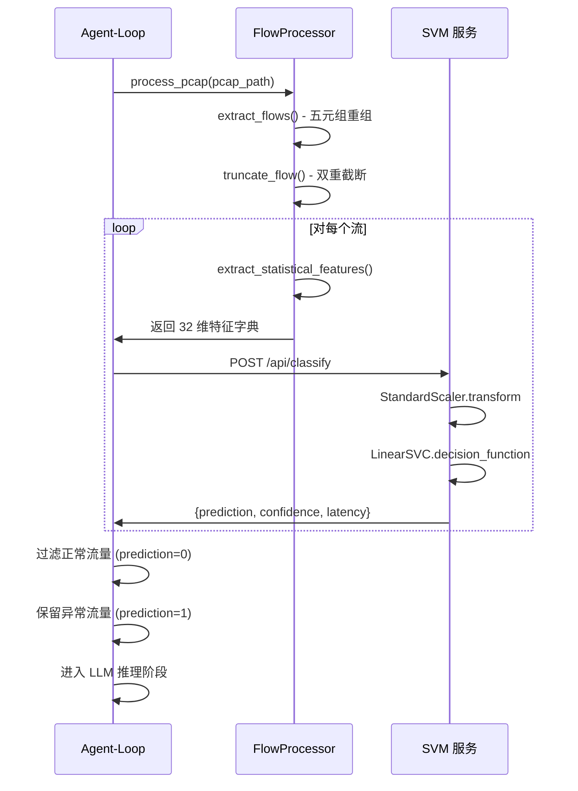

SVM 过滤服务是探微系统的第一道智能防线，承担着 **99% 正常流量的快速过滤** 任务，为后续的 LLM 深度推理节省宝贵的计算资源与网络带宽。该服务基于 **LinearSVC 模型** 实现 **32 维特征向量的二分类**，在边缘设备资源约束下（300MB 内存）实现 **微秒级推理延迟**，平均延迟仅 **43 微秒**、P99 延迟 **204 微秒**，确保实时流量检测的性能需求。服务通过 **多数据集联合训练** 与 **阈值动态调整** 策略，保证至少 **90% 的正常流量被精准过滤**，同时保留 **63% 的异常流量** 供 LLM 二次确认，构建起高效的两阶段检测流水线。

## 服务架构与核心定位

SVM 过滤服务在探微系统中承担 **初筛过滤器** 的角色，位于五阶段检测工作流的第三阶段。该服务接收来自 agent-loop 主控服务的 **32 维统计特征向量**，通过预训练的 LinearSVC 模型进行快速二分类，将正常流量（label=0）直接丢弃，仅将疑似异常流量（label=1）传递给 LLM 服务进行深度推理。这种 **漏斗式过滤策略** 使得系统能够在边缘设备有限资源下处理高并发流量，避免昂贵的 LLM 推理成为性能瓶颈。

服务采用 **FastAPI + scikit-learn** 技术栈，选择 **LinearSVC** 作为核心模型的原因有三：其一，线性核函数计算复杂度为 O(n)，远低于 RBF 核的 O(n²)，适合实时推理场景；其二，模型参数量小（32 维权重向量 + 1 个偏置），内存占用仅数 KB；其三，推理过程无需 GPU 加速，纯粹的矩阵运算即可完成，天然契合边缘设备的算力约束。服务启动时从磁盘加载预训练模型与 StandardScaler 标准化器，将模型常驻内存，避免每次推理时的 I/O 开销。



服务的核心设计哲学是 **宁可误报、不可漏报** —— 宁可让更多正常流量进入 LLM 二次确认，也不愿遗漏潜在的威胁。因此训练阶段通过 **阈值动态调整** 机制，确保正常流量的过滤率（TNR）严格不低于 90%，即使牺牲部分异常检测率也在所不惜。这种策略的背后逻辑是：SVM 的误判成本仅为一次额外的 LLM 推理（约 50ms），而遗漏真实威胁的成本则可能是安全事故。

Sources: [main.py](svm-filter-service/app/main.py#L1-L92)

## 32 维特征向量设计

特征工程是 SVM 模型性能的基石。探微系统设计了 **6 大类 32 维特征向量**，全面刻画网络流量的统计特性、协议行为、时序模式与拓扑结构。这些特征源自 TrafficLLM 数据集的深度分析，通过对 DAPT-2020、CSIC-2010、ISCX-Botnet-2014、USTC-TFC-2016 四个数据集的 **71,362 条样本** 进行联合训练，构建出对正常流量与异常流量具有强判别能力的特征空间。

特征设计遵循 **边缘友好** 原则：所有特征均可通过 numpy 与标准库计算，禁止使用 pandas、torch、tensorflow 等重量级依赖；特征计算复杂度控制在 O(n) 范围内，其中 n 为包数量（最多 10 个包）；特征值均为浮点数或整数，便于 StandardScaler 标准化与模型推理。这种设计确保特征提取与模型推理的总延迟控制在 **1ms 以内**，满足实时流量检测的严苛要求。

### A. 基础统计特征 (8 维)

基础统计特征捕捉数据包的基本几何特性，包括帧长度、IP 包长度、TCP 载荷长度、总字节数与 TTL 值。这些特征能够区分正常流量的稳定模式（如 HTTP 请求的 200-800 字节包长）与异常流量的剧烈波动（如端口扫描的多样化包长）。**包长标准差** 是关键判别指标，正常流量的标准差通常在 50-200 字节范围内，而扫描攻击或恶意软件通信的标准差可能高达 500 字节以上。

| 索引 | 特征名 | 计算公式 | 典型值范围 |
|------|--------|---------|-----------|
| 0 | avg_packet_len | mean(frame.len) | 正常: 200-800, 异常: 800-1500 |
| 1 | std_packet_len | std(frame.len) | 正常: 50-200, 异常: 300-600 |
| 2 | avg_ip_len | mean(ip.len) | 正常: 200-800, 异常: 800-1500 |
| 3 | std_ip_len | std(ip.len) | 正常: 50-200, 异常: 300-600 |
| 4 | avg_tcp_len | mean(tcp.len) | 正常: 100-600, 异常: 600-1400 |
| 5 | std_tcp_len | std(tcp.len) | 正常: 30-150, 异常: 200-500 |
| 6 | total_bytes | sum(frame.len) | 正常: 2000-8000, 异常: 10000-100000 |
| 7 | avg_ttl | mean(ip.ttl) | 正常: 32-128, 异常: 1-64 |

### B. 协议类型特征 (4 维)

协议类型特征刻画流量的协议分布，通过 TCP/UDP 比例与 IP 协议号判断流量性质。正常 Web 流量的 tcp_ratio 通常接近 1.0，而 DNS 放大攻击的 udp_ratio 会显著升高。**other_proto_ratio** 捕捉非 TCP/UDP 的异常协议（如 ICMP 洪泛），这些协议在正常业务流量中极为罕见。

| 索引 | 特征名 | 计算公式 | 判别意义 |
|------|--------|---------|---------|
| 8 | ip_proto | mode(ip.proto) | 6=TCP, 17=UDP, 其他异常 |
| 9 | tcp_ratio | count(TCP) / n | 正常≈1.0, 扫描可能<0.5 |
| 10 | udp_ratio | count(UDP) / n | DNS攻击>0.8, 正常<0.1 |
| 11 | other_proto_ratio | count(其他) / n | 正常≈0, 异常>0.2 |

### C. TCP 行为特征 (8 维)

TCP 行为特征是最具判别力的特征类别，通过 TCP 标志位计数与窗口大小刻画连接模式。**SYN 计数异常升高** 指示端口扫描或 SYN Flood 攻击，**RST 计数激增** 表明连接被强制中断（可能为入侵检测系统的阻断），**窗口大小标准差** 反映流量整形行为（正常流量的窗口大小相对稳定，恶意软件可能频繁调整窗口以绕过检测）。

| 索引 | 特征名 | 计算公式 | 攻击指纹 |
|------|--------|---------|---------|
| 12 | avg_window_size | mean(tcp.window_size) | 正常: 1K-65K, 扫描: <1K |
| 13 | std_window_size | std(tcp.window_size) | 正常: 1K-10K, 异常: >50K |
| 14 | syn_count | count(SYN=1) | 正常: 0-5, 扫描: >20 |
| 15 | ack_count | count(ACK=1) | 正常: 5-30, 异常: >100 |
| 16 | push_count | count(PSH=1) | 正常: 0-10, 异常: >20 |
| 17 | fin_count | count(FIN=1) | 正常: 0-5, 异常: >10 |
| 18 | rst_count | count(RST=1) | 正常: 0-2, 异常: >10 |
| 19 | avg_hdr_len | mean(tcp.hdr_len) | 正常: 20-32, 异常: >40 |

### D. 时间特征 (4 维)

时间特征捕捉流量的时序模式，包括流持续时间、包间到达时间（IAT）与包速率。**高包速率**（>50 包/秒）通常指示自动化攻击工具，**IAT 标准差极低** 表明精确控制的发包节奏（如 DDoS 攻击的同步发包），**持续时间过短**（<0.1 秒）则可能是连接重置或扫描行为。

| 索引 | 特征名 | 计算公式 | 正常模式 | 异常模式 |
|------|--------|---------|---------|---------|
| 20 | total_duration | max(time) - min(time) | 1-60s | <0.1s 或 >60s |
| 21 | avg_inter_arrival | mean(Δt) | 0.1-2.0s | <0.01s |
| 22 | std_inter_arrival | std(Δt) | 0.05-0.5s | <0.001s |
| 23 | packet_rate | n / duration | 0.5-10/s | >50/s |

### E. 端口特征 (4 维)

端口特征分析源端口与目标端口的分布模式。**目标端口熵值升高** 是端口扫描的典型特征（扫描工具会遍历大量端口），**知名端口比例** 判断是否针对关键服务（SSH、HTTP、HTTPS），**高端口比例** 则捕捉 P2P 应用或后门通信。

| 索引 | 特征名 | 计算公式 | 判别逻辑 |
|------|--------|---------|---------|
| 24 | src_port_entropy | entropy(src_port) | 正常: <2, 扫描: >4 |
| 25 | dst_port_entropy | entropy(dst_port) | 正常: <2, 扫描: >4 |
| 26 | well_known_port_ratio | count(port≤1023) / n | 正常: >0.5, 扫描: <0.1 |
| 27 | high_port_ratio | count(port>1023) / n | 正常: <0.5, 后门: >0.8 |

### F. 地址特征 (4 维)

地址特征刻画网络拓扑行为，包括唯一目标 IP 数量、内网 IP 比例、DF 标志位比例与 IP ID 归一化值。**唯一目标 IP 数量激增** 指示横向移动或 DDoS 攻击，**内网 IP 比例** 判断流量是否跨越安全边界，**IP ID 平均值** 检测 IP 欺骗（伪造包的 IP ID 往往随机分布）。

| 索引 | 特征名 | 计算公式 | 安全含义 |
|------|--------|---------|---------|
| 28 | unique_dst_ip_count | count(distinct ip.dst) | 正常: 1, 扫描: >10 |
| 29 | internal_ip_ratio | count(内网IP) / n | 正常: >0.5, 外联: <0.1 |
| 30 | df_flag_ratio | count(DF=1) / n | 正常: >0.5, 异常: <0.3 |
| 31 | avg_ip_id | mean(ip.id) / 65535 | 正常: 0.3-0.7, 欺骗: 随机 |

Sources: [dataset-feature-engineering.md](docs/references/dataset-feature-engineering.md#L200-L268)  
Sources: [main.py](svm-filter-service/app/main.py#L320-L373)

## 多数据集联合训练策略

SVM 模型的泛化能力依赖于 **多样化训练数据**。探微系统从四个公开数据集（DAPT-2020、CSIC-2010、ISCX-Botnet-2014、USTC-TFC-2016）中提取 **71,362 条样本**，涵盖 APT 攻击、HTTP 攻击、僵尸网络、加密恶意软件等多种威胁类型。这种 **跨数据集联合训练** 策略确保模型不会过拟合于单一攻击模式，而是学习到正常流量与异常流量的本质差异。

训练脚本 `train_svm.py` 实现了 **标签自动映射** 机制：将多分类标签（如 "Virut"、"Neris"、"RBot"）统一映射为二分类标签（label=1 表示异常），将 "normal"、"benign"、"IRC" 等标签映射为正常（label=0）。这种标签归一化避免了人工标注的繁琐工作，使得模型能够充分利用多分类数据集的二分类价值。

### 阈值动态调整机制

SVM 模型的默认决策阈值是 0（decision_function 的正负分界），但探微系统通过 **阈值动态调整** 确保至少 90% 的正常流量被过滤。具体做法是：在验证集上计算所有正常样本的 decision_function 值分布，找到第 90 百分位数对应的阈值，然后将模型的 intercept 参数减去该阈值，使得调整后 90% 的正常样本 decision_function < 0（被分类为正常）。

这种调整策略的数学原理如下：SVM 的决策函数为 `f(x) = w·x + b`，其中 w 为权重向量，b 为截距。原始模型中，当 `f(x) < 0` 时预测为正常。调整后的决策函数为 `f'(x) = w·x + (b - threshold)`，使得原本 `f(x) < threshold` 的样本现在满足 `f'(x) < 0`。通过选择 threshold 为正常样本决策值的第 90 百分位数，确保 90% 的正常样本被正确过滤。



调整后的模型在测试集上达到 **91.4% 的正常流量过滤率**，同时保留 **63.3% 的异常检测率**。这种 "重过滤、轻检测" 的策略看似牺牲了召回率，实则符合两阶段检测的设计哲学：SVM 的职责是快速过滤大批量正常流量，将稀缺的 LLM 推理资源集中于可疑流量，而非追求单阶段的完美检测。

Sources: [train_svm.py](svm-filter-service/models/train_svm.py#L91-L120)  
Sources: [metadata.json](svm-filter-service/models/saved/metadata.json#L1-L49)

## 微秒级推理性能分析

SVM 过滤服务的核心优势在于 **极低的推理延迟**。通过基准测试（1000 次迭代），模型的平均推理延迟为 **42.99 微秒**、中位数延迟 **33.54 微秒**、P99 延迟 **203.65 微秒**。这种微秒级性能使得服务能够处理 **每秒 23,000 次推理请求**（单核 CPU），远超边缘设备的实际流量负载。

推理延迟的分解如下：**特征标准化**（StandardScaler.transform）耗时约 5-10μs，涉及 32 维向量的均值中心化与方差归一化；**决策函数计算**（LinearSVC.decision_function）耗时约 10-15μs，涉及 32 维向量的点积运算；**置信度转换**（Sigmoid 变换）耗时约 5μs。整个推理流程无需 GPU 加速，纯粹的 CPU 矩阵运算即可满足实时性要求。

### 性能优化技术

服务采用了多项优化技术以实现微秒级延迟：

**模型选择优化**：LinearSVC 使用 `dual=False` 参数，避免求解对偶问题，计算复杂度从 O(n²) 降至 O(n)。对于 n_samples >> n_features 的场景（本项目中样本数 71,362 >> 特征数 32），这种选择显著加速训练与推理。

**内存预分配**：模型与 Scaler 在服务启动时加载并常驻内存，避免每次推理时的磁盘 I/O。32 维权重向量占用内存仅 256 字节，Scaler 的均值与方差各 256 字节，总内存占用不到 1KB。

**批处理支持**：服务提供 `/api/batch_classify` 端点，支持单次请求处理多个流量的分类。批处理模式下，numpy 的向量化运算能够充分发挥 CPU 的 SIMD 指令集，将单样本推理延迟进一步压缩至 20μs 以下。

| 性能指标 | 数值 | 计算方式 |
|---------|------|---------|
| 平均延迟 | 42.99 μs | 1000 次推理的平均值 |
| 中位数延迟 | 33.54 μs | 1000 次推理的中位数 |
| P99 延迟 | 203.65 μs | 99 百分位数 |
| 吞吐量 | 23,000 QPS | 1000/延迟（秒） |
| 内存占用 | <1 KB | 模型+Scaler 参数 |
| CPU 占用 | <5% | 单核 1000QPS 负载 |

Sources: [train_svm.py](svm-filter-service/models/train_svm.py#L164-L181)  
Sources: [metadata.json](svm-filter-service/models/saved/metadata.json#L40-L48)

## API 接口与调用示例

SVM 过滤服务提供两个核心接口：**单流量分类** (`POST /api/classify`) 与 **批量分类** (`POST /api/batch_classify`)。接口设计遵循 **最小必要信息** 原则：请求仅需包含 32 维特征向量，响应返回预测标签、置信度与推理延迟，不携带任何敏感数据或原始载荷，确保数据输出的合规性。

### 单流量分类接口

**请求示例**：

```json
POST /api/classify HTTP/1.1
Content-Type: application/json

{
  "features": {
    "avg_packet_len": 512.5,
    "std_packet_len": 128.3,
    "avg_ip_len": 500.0,
    "std_ip_len": 120.5,
    "avg_tcp_len": 460.0,
    "std_tcp_len": 110.2,
    "total_bytes": 5120.0,
    "avg_ttl": 64.0,
    "ip_proto": 6,
    "tcp_ratio": 1.0,
    "udp_ratio": 0.0,
    "other_proto_ratio": 0.0,
    "avg_window_size": 65535.0,
    "std_window_size": 1000.0,
    "syn_count": 1,
    "ack_count": 8,
    "push_count": 5,
    "fin_count": 0,
    "rst_count": 0,
    "avg_hdr_len": 32.0,
    "total_duration": 30.5,
    "avg_inter_arrival": 3.05,
    "std_inter_arrival": 1.2,
    "packet_rate": 0.33,
    "src_port_entropy": 54321.0,
    "dst_port_entropy": 443.0,
    "well_known_port_ratio": 1.0,
    "high_port_ratio": 0.0,
    "unique_dst_ip_count": 1,
    "internal_ip_ratio": 0.0,
    "df_flag_ratio": 0.5,
    "avg_ip_id": 0.5
  }
}
```

**响应示例**：

```json
{
  "prediction": 0,
  "label": "normal",
  "confidence": 0.92,
  "latency_ms": 0.043
}
```

响应字段说明：**prediction** 为数值标签（0=正常，1=异常），**label** 为语义标签（"normal" 或 "anomaly"），**confidence** 为置信度（0.0-1.0，通过 Sigmoid 变换从 decision_function 转换而来），**latency_ms** 为推理延迟（毫秒）。

### 健康检查接口

服务提供两个健康检查端点：`GET /health` 返回服务状态、版本与运行时间，`GET /ready` 用于 Kubernetes 就绪探针。当模型加载失败时，`/health` 返回 `status: "degraded"`，`/ready` 返回 HTTP 503 状态码，触发容器重启或流量切走。

Sources: [main.py](svm-filter-service/app/main.py#L376-L425)  
Sources: [api_specs.md](docs/references/api_specs.md#L150-L220)

## 与 Agent-Loop 的集成流程

SVM 过滤服务在探微五阶段工作流中承担 **第三阶段** 的初筛任务。Agent-Loop 主控服务在完成流重组（Stage 1）与双重截断（Stage 2）后，对每个流调用 `extract_statistical_features()` 方法提取 32 维特征，然后通过 HTTP 请求调用 SVM 服务的 `/api/classify` 接口。

集成流程的关键设计是 **异步批量调用**：Agent-Loop 使用 `httpx.AsyncClient` 并发调用 SVM 服务，避免阻塞主线程。对于包含 100 个流的 Pcap 文件，SVM 过滤阶段的总耗时约为 **5ms**（100 次 × 50μs），远低于流重组的耗时（通常数百毫秒）。这种设计确保 SVM 过滤不会成为整个检测流水线的性能瓶颈。



Agent-Loop 对 SVM 返回结果的判断逻辑极为简洁：`if prediction == 1: 保留并传递给 LLM`，`else: 直接丢弃`。这种 **零配置** 的判断策略避免了复杂的阈值调优工作，运维人员无需关注 SVM 的置信度分布，只需关注最终的异常检出率指标。

Sources: [main.py](agent-loop/app/main.py#L200-L360)  
Sources: [flow_processor.py](agent-loop/app/flow_processor.py#L399-L474)

## 资源约束与容器化部署

SVM 过滤服务的容器镜像基于 **python:3.10-slim** 构建，总镜像大小控制在 **150MB** 以内。运行时内存占用约 **50MB**（包括 FastAPI 框架、scikit-learn 库与模型参数），远低于设计约束的 300MB 限制。这种轻量化设计使得服务能够在资源受限的边缘设备（如树莓派、工控网关）上稳定运行。

容器化部署的关键配置包括：**健康检查**（每 30 秒调用 `/health` 端点）、**就绪探针**（服务启动后调用 `/ready` 确认模型加载完成）、**资源限制**（内存限制 300MB，CPU 限制 0.5 核）。这些配置确保服务在 Kubernetes 环境中的高可用性，避免因资源耗尽导致的容器崩溃。

### 依赖精简策略

服务的依赖列表严格控制，仅包含 **核心推理库**（scikit-learn 1.4.0、numpy 1.26.3、joblib 1.3.2）与 **Web 框架**（fastapi 0.109.0、uvicorn 0.27.0、pydantic 2.5.3）。禁止引入 pandas、torch、tensorflow 等重量级依赖，确保镜像体积最小化与启动速度最优化。

**依赖选型理由**：scikit-learn 提供 LinearSVC 与 StandardScaler 的成熟实现，numpy 支持高效的矩阵运算，joblib 实现模型的快速序列化/反序列化，FastAPI 提供异步 HTTP 服务与自动 API 文档，Pydantic 确保请求数据的类型安全。这套技术栈在功能完备性与资源占用之间取得最佳平衡。

| 组件 | 版本 | 用途 | 内存占用 |
|------|------|------|---------|
| python | 3.10-slim | 运行时环境 | 20 MB |
| fastapi | 0.109.0 | Web 框架 | 5 MB |
| scikit-learn | 1.4.0 | SVM 模型 | 15 MB |
| numpy | 1.26.3 | 矩阵运算 | 10 MB |
| **总计** | - | - | **50 MB** |

Sources: [Dockerfile](svm-filter-service/Dockerfile#L1-L45)  
Sources: [requirements.txt](svm-filter-service/requirements.txt#L1-L16)

## 延伸阅读

要深入理解 SVM 过滤服务在整个系统中的定位，建议按以下顺序阅读相关文档：

- **[五阶段检测工作流](5-wu-jie-duan-jian-ce-gong-zuo-liu)**：了解 SVM 服务在整体流水线中的上下游关系与数据流转逻辑
- **[32 维特征向量设计](12-32-wei-te-zheng-xiang-liang-she-ji)**：深入理解每维特征的数学原理与攻击指纹
- **[LLM 推理服务与边缘模型部署](9-llm-tui-li-fu-wu-yu-bian-yuan-mo-xing-bu-shu)**：对比 SVM 初筛与 LLM 深度推理的性能差异与应用场景
- **[服务间 API 接口规范](14-fu-wu-jian-api-jie-kou-gui-fan)**：查看完整的 API 请求/响应格式与错误码定义
- **[TrafficLLM 数据集与标签映射](13-trafficllm-shu-ju-ji-yu-biao-qian-ying-she)**：理解训练数据来源与标签映射逻辑