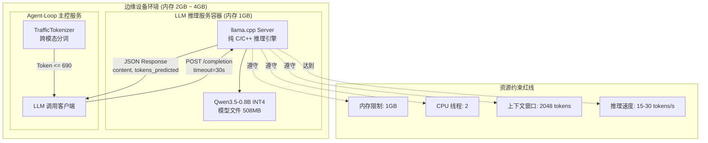
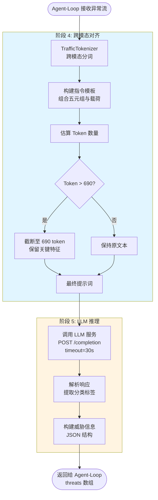

LLM 推理服务是探微系统五阶段检测工作流中的关键决策引擎，采用 **llama.cpp server** 作为推理引擎，运行 **Qwen3.5-0.8B INT4 量化模型**，在边缘设备的严苛资源约束下实现智能流量分类。该服务接收 Agent-Loop 传递的经过跨模态分词的流量文本，执行低延迟推理并返回威胁标签，为上游决策提供语义理解能力。

Sources: [README.md](llm-service/README.md#L1-L69), [Dockerfile](llm-service/Dockerfile#L1-L52)

## 技术架构与边缘适配原理

LLM 推理服务的核心设计理念是 **"最小依赖、极低资源"**，通过三项关键技术决策实现边缘部署可行性：

**纯 C/C++ 推理引擎**：采用 llama.cpp server 模式而非 PyTorch/Transformers，避免 2GB+ 的 Python ML 框架依赖链。llama.cpp 通过 GGUF 格式直接加载量化模型，运行时仅需标准 C 库和少量系统依赖，容器镜像精简至 200MB 级别。

**INT4 量化与模型尺寸控制**：Qwen3.5-0.8B-Q4_K_M.gguf 模型文件仅 508MB，采用 Q4_K_M 量化策略在精度与体积间取得平衡。相比 FP16 全精度模型（约 1.6GB），INT4 量化将内存占用降低 70%，同时保持流量分类任务的实用性。

**CPU 推理优化**：通过 `--n-gpu-layers 0` 强制 CPU 推理，适配边缘设备无 GPU 环境。llama.cpp 内置的 AVX2/AVX-512 向量化指令集优化，使 2 线程配置下仍能达到 15-30 tokens/s 的推理速度，满足实时检测需求。

Sources: [README.md](llm-service/README.md#L13-L24), [Dockerfile](llm-service/Dockerfile#L1-L52), [docker-compose.yml](docker-compose.yml#L15-L36)

以下架构图展示 LLM 推理服务在边缘部署环境中的核心组件交互：



## Docker 容器化部署方案

LLM 服务采用多阶段 Docker 构建，分离编译时与运行时依赖，生成轻量级生产镜像。构建流程分为两个阶段：**Builder 阶段**从源码编译 llama.cpp server，安装 git、cmake、build-essential 等构建工具；**Runtime 阶段**仅复制编译产物和必要的运行时依赖（curl、ca-certificates），最终镜像体积控制在 200MB 以内。

模型文件通过 Docker 卷以 **只读方式挂载**（`./qwen3.5-0.8b:/models:ro`），防止运行时篡改并支持模型热更新（无需重建镜像）。健康检查脚本 `healthcheck.sh` 通过 curl 探测 `/health` 端点，在 60 秒启动等待期后以 30 秒间隔监控服务可用性。

Sources: [Dockerfile](llm-service/Dockerfile#L1-L52), [healthcheck.sh](llm-service/healthcheck.sh#L1-L17), [docker-compose.yml](docker-compose.yml#L15-L36)

Docker Compose 配置中定义了严格的资源约束与服务依赖关系：

| 配置项 | 参数值 | 设计意图 |
|--------|--------|----------|
| 内存限制 | 1GB | 边缘设备总内存 2-4GB，预留空间给其他容器 |
| 内存预留 | 512MB | 确保模型加载阶段有足够内存 |
| 端口映射 | 8080:8080 | 仅内部网络访问，不对外暴露 |
| 启动命令 | `--threads 2` | 双线程并行推理，平衡性能与资源 |
| 健康检查 | 60s 启动等待 | 模型加载需 5-10 秒，预留缓冲 |

Sources: [docker-compose.yml](docker-compose.yml#L15-L36), [README.md](llm-service/README.md#L26-L42)

## API 接口规范与调用示例

LLM 服务暴露标准的 llama.cpp server API，支持文本补全、健康检查和模型属性查询三种操作。Agent-Loop 通过异步 HTTP 客户端调用 `/completion` 端点，请求体包含提示词、生成参数和停止词列表。

**文本补全接口** 是核心功能，接收经过跨模态分词的流量文本，返回分类标签。请求参数中 `temperature: 0.1` 保持极低随机性，确保分类结果稳定可复现；`n_predict: 32` 限制最大生成 32 个 token，覆盖流量分类任务的短文本输出特性；`stop` 数组定义四个停止词，避免模型生成无关内容。

Sources: [api_specs.md](docs/references/api_specs.md#L147-L187), [main.py](agent-loop/app/main.py#L206-L240)

以下表格展示 API 调用的关键参数与性能指标：

| 参数 | 类型 | 默认值 | 说明 |
|------|------|--------|------|
| prompt | string | 必填 | 经过分词的流量文本，包含五元组和十六进制载荷 |
| n_predict | int | 64 | 最大生成 token 数，流量分类通常 3-5 token 即可 |
| temperature | float | 0.1 | 低随机性确保输出稳定，避免同一流量分类不一致 |
| stop | array | ["</s>", "\n\n"] | 停止词列表，防止模型过度生成 |
| **响应字段** | | | |
| content | string | - | 生成的文本，如 "Malware Traffic" |
| tokens_evaluated | int | - | 提示词 token 数量 |
| tokens_predicted | int | - | 生成 token 数量 |
| timings.total_ms | float | - | 总推理时间（毫秒） |

Sources: [api_specs.md](docs/references/api_specs.md#L147-L187), [test_llm.py](llm-service/test_llm.py#L54-L80)

**实际调用示例** 展示流量分类场景的完整请求响应流程：

```bash
# 健康检查
curl http://localhost:8080/health
# 响应: {"status": "ok"}

# 流量分类请求
curl http://localhost:8080/completion \
  -H "Content-Type: application/json" \
  -d '{
    "prompt": "Analyze the following network traffic packet data. Classify as: Normal, Malware, Botnet, C&C, DDoS, Scan, or Other.\n\nFive-tuple: Source: 192.168.1.100:54321, Destination: 10.0.0.1:443, Protocol: TCP\n\n<packet>: 45000040123440004006a1b1c0a80164...\n\nClassification:",
    "n_predict": 32,
    "temperature": 0.1,
    "stop": ["</s>", "\n\n", "Classification:", "<packet>:"]
  }'

# 响应示例
{
  "content": "Malware",
  "tokens_evaluated": 156,
  "tokens_predicted": 3,
  "timings": {
    "prompt_ms": 45.2,
    "predicted_ms": 12.8,
    "total_ms": 58.0
  }
}
```

Sources: [test_llm.py](llm-service/test_llm.py#L82-L130), [README.md](llm-service/README.md#L44-L57)

## 工作流集成与跨模态分词

LLM 推理服务在五阶段检测工作流中位于第 4-5 阶段，仅处理被 SVM 过滤服务判定为异常的流量。这种漏斗式架构确保 LLM 资源集中在高价值样本上，避免正常流量消耗推理时间。

**跨模态分词流程** 由 TrafficTokenizer 模块完成，将二进制网络流量转换为 LLM 可理解的文本格式。分词器首先构建指令模板（`SIMPLE_INSTRUCTION`），引导模型理解分类任务；然后组合五元组元信息和十六进制编码的载荷数据；最后通过启发式算法估算 token 数量，必要时截断至 690 token 上限。

Sources: [main.py](agent-loop/app/main.py#L306-L430), [traffic_tokenizer.py](agent-loop/app/traffic_tokenizer.py#L1-L200)

Token 长度控制采用双重保护策略：**时间窗口截断**（<= 60 秒）和 **包数量截断**（<= 前 10 个包）在流重组阶段限制输入规模；**Token 长度截断**（<= 690）在分词阶段进一步压缩。这种设计确保提示词不会超出模型的 2048 token 上下文窗口，同时保留足够的流量特征供模型推理。

以下流程图展示 LLM 推理服务在五阶段工作流中的调用路径：



Sources: [main.py](agent-loop/app/main.py#L306-L430), [traffic_tokenizer.py](agent-loop/app/traffic_tokenizer.py#L100-L150), [traffic-tokenization.md](docs/design-docs/traffic-tokenization.md#L1-L64)

## 响应解析与标签映射

LLM 返回的文本响应经过 TrafficTokenizer 的 `parse_llm_response` 方法解析，将自然语言标签转换为结构化分类结果。解析器定义六类关键词映射表，覆盖常见威胁类型的多种表达方式：

| 标准标签 | 关键词列表 | 匹配逻辑 |
|----------|-----------|----------|
| Malware | malware, malicious, virus, trojan, worm, ransomware | 包含任一关键词即匹配 |
| Botnet | botnet, bot, zombie, c&c, command and control | 包含任一关键词即匹配 |
| DDoS | ddos, dos, denial of service, flood | 包含任一关键词即匹配 |
| Scan | scan, scanner, reconnaissance, probe, port scan | 包含任一关键词即匹配 |
| Normal | normal, benign, legitimate, safe | 包含任一关键词即匹配 |
| Other | other, unknown, suspicious | 兜底分类 |

解析过程首先将响应文本转换为小写，然后遍历关键词映射表进行模糊匹配。这种设计容忍模型输出的变体表达（如 "Malware Traffic" 匹配到 "Malware"），提升鲁棒性。解析后的标签存储在威胁信息的 `classification.primary_label` 字段中，供上游服务使用。

Sources: [traffic_tokenizer.py](agent-loop/app/traffic_tokenizer.py#L152-L200), [main.py](agent-loop/app/main.py#L400-L430)

## 性能优化与资源监控

LLM 推理服务的性能直接影响端到端检测延迟，系统通过三项机制确保实时性：**异步 HTTP 调用**（httpx.AsyncClient 非阻塞请求），**超时控制**（30 秒硬性超时），**资源隔离**（Docker cgroup 内存限制）。监控指标包括推理延迟、token 生成速率和服务可用性。

测试脚本 `test_llm.py` 提供完整的功能验证流程，覆盖健康检查、模型属性查询和文本补全三个场景。测试结果输出包含 token 数量统计和推理时间，便于性能基准对比。在标准边缘设备（2 核 CPU、2GB 内存）上，单次推理延迟通常在 50-150ms 范围内，满足设计目标（< 500ms 告警红线）。

Sources: [test_llm.py](llm-service/test_llm.py#L1-L130), [main.py](agent-loop/app/main.py#L206-L240), [core-beliefs.md](docs/design-docs/core-beliefs.md#L48-L59)

以下表格展示 LLM 推理服务的关键性能指标与红线阈值：

| 指标 | 目标值 | 告警红线 | 监控方式 |
|------|--------|----------|----------|
| 推理延迟 | < 100ms | > 500ms | httpx 响应时间 |
| 内存占用 | < 800MB | > 950MB | Docker stats |
| 服务可用性 | 99.9% | < 99% | 健康检查成功率 |
| Token 生成速率 | > 20 tokens/s | < 10 tokens/s | tokens_predicted / time |

Sources: [core-beliefs.md](docs/design-docs/core-beliefs.md#L48-L59), [healthcheck.sh](llm-service/healthcheck.sh#L1-L17)

## 相关文档

- **上游服务**：[SVM 过滤服务与微秒级推理](8-svm-guo-lu-fu-wu-yu-wei-miao-ji-tui-li) — 理解 LLM 为何只处理异常流量
- **调用方**：[Agent-Loop 主控服务与工作流编排](7-agent-loop-zhu-kong-fu-wu-yu-gong-zuo-liu-bian-pai) — 深入五阶段工作流逻辑
- **数据准备**：[流量分词规范与双重截断保护](11-liu-liang-fen-ci-gui-fan-yu-shuang-zhong-jie-duan-bao-hu) — 学习 Token 长度控制策略
- **接口规范**：[服务间 API 接口规范](14-fu-wu-jian-api-jie-kou-gui-fan) — 查看完整 API 定义